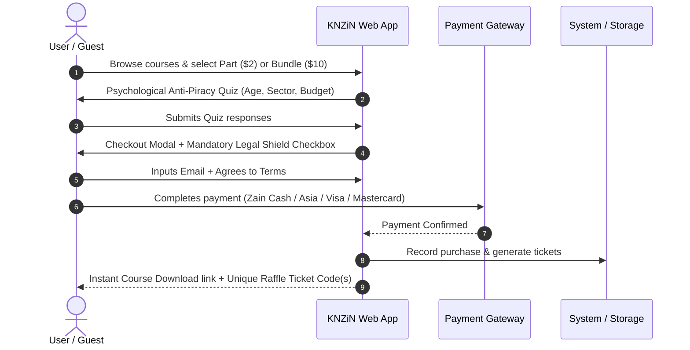
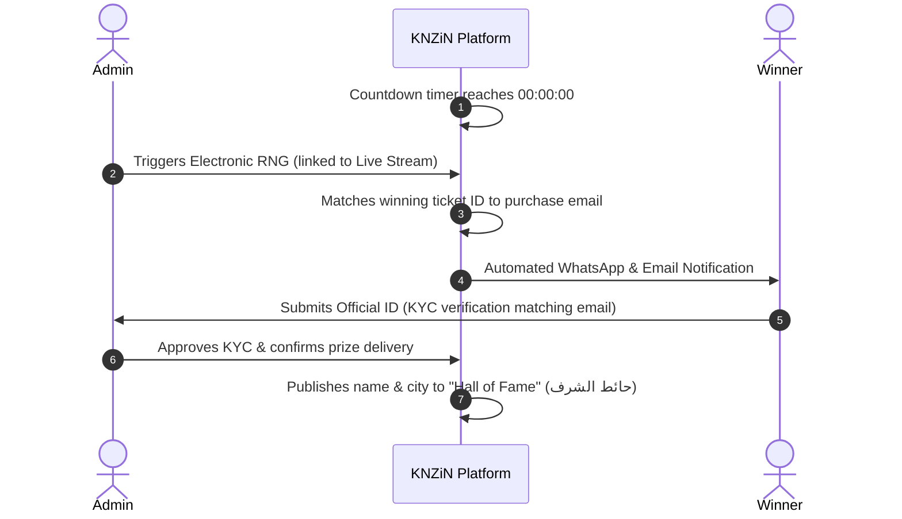

# KNZiN (كنزين) — Foundational Project Context & Specification
**Status:** Living Document / Foundational Source of Truth  
**Last Updated:** 2026-09-28  
**Scope:** Architecture, Business Rules, Functional Requirements, Technical Constraints, and Implementation Status

---

## 1. Project Overview & Vision

**KNZiN (كنزين)** is an Arabic-first educational and promotional raffle e-commerce platform targeting the Arab world, with initial launch focus on Iraq and regional scalability.

### Vision Statement
> *"نحن نؤمن بأن الشباب يحتاجون إلى المهارة ورأس المال معاً. لذلك، نحن نعلمك مهارات العمل الحر، ونمنحك فرصة لربح تمويل مشروعك في نفس الوقت."*  
> *(We believe youth need both skill and capital. Therefore, we teach you freelance and vocational skills, while giving you the chance to win funding for your project at the same time.)*

### Core Concept & Dual Engine
The platform fuses **micro-learning** with **high-stakes gamified promotional sweepstakes**:
1. **The Educational Engine (المحرك التعليمي / المالي):** Users buy focused digital micro-courses or practical vocational missions (e.g., Car Detailing, Freelance Graphic Design, Mobile Software Repair, Crypto & Trading, Financial Independence).
2. **The Promotional Raffle Engine (محرك السحوبات والتمويل):** Every purchase includes complimentary promotional draw tickets that enter the purchaser into automated, periodic cash and grand-prize draws (hourly, daily, monthly, and seasonal).

---

## 2. Problem Being Solved

1. **High Youth Unemployment & Lack of Capital:** Across Iraq and the MENA region, ambitious youth face double friction: traditional education doesn't teach modern monetizable skills, and traditional banks/grants do not provide micro-capital to start ventures.
2. **Low Engagement in Traditional Online Courses:** Completion rates for standard e-learning are notoriously low due to lack of immediate incentives.
3. **Legal & Social Stigma around Direct Lotteries:** Direct cash lotteries and gambling face severe legal and cultural barriers in Arab markets. KNZiN operates under a compliant **promotional model** where users pay solely for digital educational assets, receiving raffle entries strictly as free promotional gifts.

---

## 3. Project Goals & KPIs

- **Immediate Goal:** Launch a lightweight, ultra-responsive web application that converts mobile traffic into course purchases with zero friction.
- **Conversion Efficiency:** Sub-3-second load times on 3G/4G networks; frictionless guest checkout in less than 30 seconds.
- **Viral Growth:** Referral loop giving users a 40% co-prize share when referred friends win the grand prize.
- **Influencer Onboarding:** Dedicated self-service affiliate portal providing transparency into earnings and automated withdrawal tracking.

---

## 4. Target Users & System Roles

| Role | Description | Primary Needs |
| :--- | :--- | :--- |
| **Guest Visitor (زائر)** | Unregistered prospect browsing courses and live draws. | Instant browsing without login barriers, live social proof, simple checkout. |
| **Enrolled Student / Ticket Holder (متعلم / متسابق)** | Customer who purchased at least one course part. | Instant access to course materials (PDF/Audio/Video), verified ticket inventory, draw timer notifications. |
| **Affiliate / Influencer (المسوق / المشهور)** | Content creator or partner driving referral traffic via unique slugs. | Custom referral link, real-time analytics (clicks, sales, commission balance), withdrawal history. |
| **System Administrator (المدير / إدارة المنصة)** | Platform operator managing draws, courses, audits, and payouts. | Triggering electronic RNG draws, KYC verification, payout zeroing, fraud ban system, marketing pixel config. |

---

## 5. Core User Flows

### Flow 1: Course Discovery & Guest Purchase


### Flow 2: Live Draw & Winner Claim Flow


---

## 6. Functional Requirements

### FR-001: Header & Sticky HUD (Head-Up Display)
- Sticky top navigation containing:
  - Brand Logo (`KNZiN / كنزين`).
  - Active Ticket Counter (`تذاكري: X`) dynamically bound to the session/wallet.
  - Wallet Balance (`المحفظة: $X`) with instant top-up shortcut.
  - Live Social Proof Ticker (marquee) showing recent purchases and wins (e.g., *"أحمد من بغداد اشترى كورس غسل السيارات وحصل على تذكرة KNZ-782"*).
  - Language toggle button (AR / EN) switching document direction (`dir="rtl"` to `dir="ltr"`).

### FR-002: Hero Section & Grand Prize Countdown
- Eye-catching promotional banner showcasing the marquee prize (e.g., $50,000 Cash, iPhone 16 Pro Max, or 100 Million IQD).
- Live synchronizing countdown timer displaying `Days : Hours : Minutes : Seconds`.
- Single primary Call-To-Action (CTA) scrolling directly to Course Missions.

### FR-003: The Course & Mission Showcase (المحرك المالي)
- Grid display of vocational and online skill courses.
- Micro-Pricing Display:
  - **Single Part (جزء واحد):** **$2 USD (or ~2,000 IQD)** &rarr; Grants **1 Promotional Raffle Ticket**.
  - **Full Course Bundle (بكج كامل - 6 أجزاء):** **$10 USD** &rarr; Grants **15 Promotional Raffle Tickets** (bulk incentive: saves $2 and yields 2.5x tickets).
- Course details modal showing: syllabus outline, instructor bio, deliverable formats (PDF + 15-minute Audio notes + Unlisted YouTube video embeds).

### FR-004: Anti-Piracy Psychological Profiler (محرك التخصيص النفسي)
- Before the purchase checkout modal opens, a brief 3-step interactive questionnaire appears (Asking: Field of interest, weekly study hours, investment budget).
- After submission, a dynamic stamp appears: *"تم تخصيص هذه النسخة المبرمجة حصرياً لبياناتك الشخصية"* (This copy has been psychologically watermarked and customized to your profile).
- **Purpose:** Psychological deterrence against illegal re-distribution, rather than cumbersome DRM plugins.

### FR-005: Checkout & The Mandatory Legal Shield
- Supports **Guest Checkout** (requires only user's active email or phone).
- Optional one-click **Google Sign-In**.
- Payment selector supporting Iraqi & international gateways:
  - Zain Cash (زين كاش).
  - AsiaHawala / Supercell (آسيا حوالة).
  - Credit / Debit Card (Mastercard / Visa).
- **Mandatory Legal Shield Checkbox:** User cannot click "Confirm & Pay" without actively checking the terms.
  - Exact Legal Arabic Text:
    > **"أوافق على الشروط والأحكام وسياسة الخصوصية، وأقر بأنني أقوم بشراء محتوى رقمي تعليمي، وأن تذكرة السحب المرفقة هي هدية ترويجية مجانية غير مستردة أو قابلة للتبديل"**  
    *(I agree to the terms and conditions and privacy policy, and acknowledge that I am purchasing digital educational content, and that the attached draw ticket is a free, non-refundable, non-exchangeable promotional gift.)*

### FR-006: Arena of Draws (ساحة السحوبات)
- Cards displaying all draw categories:
  - **Hourly Draw (سحب ساعي):** Prize ~$100. *Ticket lifecycle: Expires immediately upon draw conclusion.*
  - **Daily Draw (سحب يومي):** Prize ~$50,000 / High-end gadgets. *Ticket lifecycle: Expires immediately upon draw conclusion.*
  - **Monthly Grand Draw (سحب شهري كنزين):** Prize up to $500,000 or brand-new vehicle. *Ticket lifecycle: Stays active all month across all eligible intermediate tiers.*
- Direct link to official YouTube Live broadcast where electronic draws are conducted transparently.

### FR-007: Hall of Fame & Social Proof (حائط الفائزين)
- Transparent record of past winners:
  - Winner Name & Governorate/City (e.g., علي الكرخي - بغداد).
  - Winning Ticket Serial Number (e.g., `#KNZ-9942`).
  - Prize Won + Date of Live Stream.
  - Video testimonial thumbnail / proof of delivery receipt.

### FR-008: Dual Viral Referral Engine (نظام الإحالة الذكي)
1. **Regular User Referral (حصة الصديق 40%):**
   - Every registered user gets a personal sharing link (e.g., `knzin.com/alifaraj` or `knzin.com/c/12?ref=USER_ID`).
   - If a friend joins via this link and wins the Grand Prize, the original referrer receives an automated **40% co-prize share** from the promotional fund.
2. **Influencer / Marketer Dashboard (لوحة المسوقين والمشاهير):**
   - 3 Real-time KPI Cards:
     1. Unpaid Balance / رصيد مستحق ($).
     2. Total Withdrawn / إجمالي مسحوب ($).
     3. Total Driven Sales / إجمالي مبيعات ($).
   - Campaign Tracking Table: Clicks, Conversions, Commission Earned per Course.
   - Payout History Table: Date, Transfer Method (Western Union, Zain Cash), Status.

### FR-009: Administration Operations Panel (لوحة تحكم الإدارة)
- **Affiliate Balance Settlement:**
  - Table of affiliate balances.
  - Action button: **"تسديد الدفعة (Mark as Paid)"**.
  - Modal prompt requesting Bank/Wire Transfer Reference Number &rarr; automatically zeroes out due balance and logs record in payout history.
- **Draw RNG Engine:**
  - Administrative trigger button to draw winning serials electronically with seed hashing.
- **Risk & Fraud Control (نظام الحظر):**
  - Instant blacklist by Email / IP / Phone number.
  - Automatically cancels all associated active raffle tickets upon chargeback or suspicious activity.
- **Tracking & Pixel Configuration:**
  - Native input fields for Meta Pixel (Facebook Pixel ID), Google Analytics 4 (GA4 G-Tag), and TikTok Pixel.

### FR-010: Notification Engine (تنبيهات المنصة)
- Automated email & WhatsApp dispatch for:
  - Ticket issuance and receipt confirmation.
  - Abandoned cart recovery (sending a reminder 2 hours post-drop).
  - Live draw start alerts (15 minutes prior to YouTube stream).
  - Winner notification with KYC verification instructions.
  - Unsubscribe link included in all marketing emails.

---

## 7. Business Rules & Financial Model

| Parameter | Standard Rule | Bundle Rule | Notes |
| :--- | :--- | :--- | :--- |
| **Pricing** | **$2 USD (2,000 IQD)** per single part | **$10 USD (10,000 IQD)** per 6-part full course | Subtitle typo in early prototype saying "$1" is superseded by canonical $2 rule. |
| **Ticket Allocation** | 1 Ticket per $2 Part | 15 Tickets per $10 Bundle | Bundles provide 2.5x ticket yield as a purchase incentive. |
| **Ticket Format** | Alphanumeric prefix + ID (e.g., `KNZ-A15-0921`) | Deterministic hashing or sequential alphanumeric string. |
| **Hourly Draw Expiry** | Expires immediately when hourly winner is announced. | Cannot be recycled into next hour. |
| **Daily Draw Expiry** | Expires immediately when daily winner is announced. | Cannot be recycled into next day. |
| **Monthly Draw Expiry** | Valid for 30 days from purchase across all monthly cycles. | Highest perceived value for buyers. |
| **Referral Commission** | 40% of grand prize co-allocated to referrer. | Terms state co-prize is funded by marketing pool, not deducted from winner. |
| **Affiliate Payout Minimum** | Configurable (Default: $50 USD) | Paid out via Zain Cash or Western Union. |

---

## 8. Technical Architecture & Tech Stack

### Current Implementation (Phase 1 Prototype)
The project currently exists as a zero-dependency, ultra-fast client-side application:
- **Core:** HTML5 + Vanilla JavaScript (ES6+).
- **Styling:** Tailwind CSS (loaded via official CDN v3.x) with custom color tokens.
- **Typography:** Google Fonts (`Tajawal:wght@400;500;700;800;900`).
- **Icons:** SVG inline and FontAwesome 6 CDN.
- **Storage:** Browser `localStorage` for demo state persistence (tickets, wallet balance, affiliate statistics).
- **Protocol Compatibility:** Fully functional via direct `file://` protocol execution as well as static HTTP servers.

### Recommended Production Stack (Phase 2 Roadmap)
- **Frontend:** Next.js (App Router) or Vite + Vanilla/React for optimal SEO and client hydration.
- **Backend / Database:** Supabase (PostgreSQL with Row Level Security) or Node.js / Express microservice.
- **Edge / Hosting:** Cloudflare Pages / Vercel with Cloudflare Turnstile for anti-bot protection.
- **Media Hosting:**
  - PDFs / Audio: AWS S3 or Cloudflare R2 with signed expiring URLs.
  - Video Lessons: Private/Unlisted YouTube playlist embeds with domain referer restrictions.

---

## 9. UI/UX Design System & Aesthetics

Ground truth visual identity established in primary project documentation:

### Color Palette
| Token | Hex Value | Role |
| :--- | :--- | :--- |
| **Primary Brand Blue** | `#1877F2` (Facebook Blue) | Primary CTA buttons, badges, active states, key icons. |
| **Deep Luxury Navy** | `#0B1E3A` | Headers, footer background, primary typography, card borders. |
| **Prize Gold** | `#F5B301` | Ticket counters, countdown timers, grand prize badges, trophies. |
| **Pure White** | `#FFFFFF` | Primary background, card containers, input fields. |
| **Soft Neutral Grey** | `#F3F4F6` / `#E5E7EB` | Page background canvas, dividers, inactive states. |
| **Success Emerald** | `#10B981` | Completed orders, winning notifications, active status pills. |

### Layout & Responsiveness
- **Mobile-First Layout:** Optimized for 375px mobile viewport (dominant traffic source from TikTok/Instagram ads).
- **Navigation:**
  - Mobile: Persistent sticky bottom bar with quick links to `[الرئيسية, الكورسات, تذاكري, السحوبات]`.
  - Desktop: Sticky top HUD bar with full dropdown menus and wallet shortcuts.
- **Direction:** Native `dir="rtl"` with dynamic CSS flip support on `[lang="en"]`.

---

## 10. Security, Risk Management & Legal Shielding

1. **Promotional Sweepstakes Legal Structure:**
   - Under international and Iraqi commercial statutes, combining a purchase with a lottery is categorized as gambling unless the purchase has standalone market value and the ticket is explicitly a zero-cost promotional gift.
   - The platform strictly enforces the legal checkbox before any transaction can be processed.
2. **Mandatory KYC for Prize Distribution:**
   - No prize exceeding $100 is disbursed without physical or digital submission of Government National ID (بطاقة وطنية / جواز سفر).
   - The recipient's legal name must match the billing profile or verified email used at the time of purchase.
3. **Automated Transaction Reconciliation:**
   - If payment gateway debits the user's mobile wallet but connection drops before callback redirection, an idempotent webhook verifies the transaction ID and retroactively credits tickets to the user's email.
4. **Anti-Fraud Ban Mechanism:**
   - Administrators can immediately blacklist fraudulent accounts, flagging any associated tickets as `VOID` in the public blockchain/draw registry.

---

## 11. Third-Party Integrations & External Services

| Service Type | Provider / Solution | Integration Purpose |
| :--- | :--- | :--- |
| **Mobile Wallet (Iraq)** | Zain Cash API (بوابة زين كاش) | Primary local payment method for 70%+ of Iraqi users. |
| **Alternative Wallet** | AsiaHawala / Supercell | Secondary Iraqi payment corridor. |
| **Card Payments** | Stripe / Tap Payments / Checkout.com | Regional and international Visa/Mastercard processing. |
| **Affiliate Payouts** | Western Union API / Zain Cash Bulk Disbursal | Remitting commission earnings to regional influencers. |
| **Video Delivery** | YouTube API (Unlisted Embeds) | Cost-free, high-bandwidth streaming for educational content. |
| **Analytics & Ads** | Meta Pixel, Google Analytics 4, TikTok Pixel | Conversion tracking, retargeting abandoned carts. |
| **Communications** | WhatsApp Business API (Twilio/Infobip) + SendGrid | Instant delivery of tickets, KYC links, and live alerts. |

---

## 12. Confirmed Requirements vs. Assumptions vs. Open Questions

### A. Confirmed Requirements (Ground Truth)
- [x] Canonical product pricing: **$2 per single part**; **$10 per 6-part full course bundle**.
- [x] Ticket allocation: **1 ticket for $2**; **15 tickets for $10**.
- [x] Draw frequencies: Hourly ($100), Daily ($50,000), and Monthly ($500,000 / Vehicles).
- [x] Hourly and daily tickets expire immediately when that specific draw is held; monthly tickets remain valid all month.
- [x] 40% Co-Prize referral model for users whose invited friends win the grand prize.
- [x] Influencer dashboard with 3 distinct KPIs (Due Balance, Total Withdrawn, Total Sales).
- [x] Admin action to mark influencer balances as paid via wire transfer reference number, auto-zeroing their due balance.
- [x] Exact legal shield statement required as an active mandatory checkbox at checkout.
- [x] Guest checkout requiring only an email or phone number; Google Login as optional one-click auth.
- [x] Psychological anti-piracy quiz prior to purchase completion.

### B. Existing Decisions & Current State
- [x] `index.html` and `js/app.js` represent the completed client-side specification prototype.
- [x] The primary visual scheme for the web application is the **White / Facebook-Blue (`#1877F2`) / Navy (`#0B1E3A`) / Gold (`#F5B301`)** theme as defined in the master brief PDF.
- [x] Course topics include Car Detailing, Freelance Design, Phone Software Maintenance, Trading, and Financial Independence.

### C. Identified Inconsistencies & Resolutions
1. **$1 vs. $2 Price Discrepancy:**
   - *Issue:* `index.html` line 87 contains the subtitle *"تعلم مهارة حقيقية واشترك في السحب بدولار واحد"* ($1), and early mockup images (01–06) showed $1.
   - *Resolution:* Master PDF document (pages 3 and 5) and `constitution.md` unequivocally establish **$2 USD (2,000 IQD)** per part as canonical. The subtitle string is an artifact and will be updated to $2.
2. **Dark "KANZAIN" Theme vs. Light "KNZiN" Theme:**
   - *Issue:* Mockup images 07–17 depict a dark navy/black UI with "KANZAIN" branding, whereas Master PDF Page 1 explicitly commands a light Facebook-blue palette.
   - *Resolution:* The web platform follows the light Facebook-blue specification. The dark theme is preserved as a potential alternative or mobile app dark-mode preset.

### D. Assumptions
- **Currency Equivalency:** $1 USD is assumed pegged to ~1,000–1,320 IQD for local display rounding (commonly represented as $2 = 2,000 IQD or 3,000 IQD depending on official vs. market rate; UI currently displays 2,000 IQD).
- **Video DRM:** Educational videos hosted on YouTube Unlisted are assumed adequate for early-stage rollout, backed by the psychological quiz watermarking.
- **RNG Draw Live Audits:** Assumed that draws are executed via an electronic web RNG during live social media streams rather than an on-chain automated smart contract.

### E. Open Questions & Pending Decisions (Awaiting Client Confirmation)
1. **Local Payment Aggregator:** Which Iraqi aggregator will be contracted for Zain Cash & AsiaHawala (e.g., direct Zain Cash merchant API, Qi Card gateway, or a unified PSP like FastPay / Tap)?
2. **Dark Mode Toggle:** Should a dark-mode toggle (utilizing the dark navy mockups from images 07–17) be offered on the web app, or should the platform remain strictly light mode?
3. **Legal Entity Jurisdiction:** In which country/freezone will the operating company be incorporated to ensure compliance with digital e-commerce sweepstakes laws?
4. **WhatsApp Automation Provider:** Will Twilio or a local WhatsApp Cloud API gateway be used for Iraqi SMS/WhatsApp delivery?

---

## 13. Known Codebase Implementation Notes & Bugs

1. **Countdown Timer Bug in `js/app.js`:**
   - In `updateTimers()`, the hero countdown currently increments (`heroTime++`) instead of decrementing (`heroTime--`). This should be fixed so timers count down toward zero.
2. **Hero Subtitle Text in `index.html`:**
   - Subtitle on line 87 still reads *"بدولار واحد"* instead of *"بدولارين (2,000 د.ع)"*.
3. **Tasks Progress Alignment:**
   - Specification tasks `T002` through `T009` in `specs/001-knzin-ui/tasks.md` need their completion markers updated to reflect the full implementation present in `index.html`.

---

## 14. Target Database Schema & Entity-Relationship Model (Approved Backend Blueprint)

**Database Engine:** MySQL 8+ / MariaDB (InnoDB, `utf8mb4_unicode_ci`) with Redis 7+ Queues  
**Decision Ref:** `DEC-001`, `DEC-002`, `DEC-003`, `DEC-004` (in `DECISIONS.md`)

```
[users] 1 ----- 1 [wallets] 1 --< [wallet_transactions] (Immutable Ledger)
   |
   +-- 1 --< [kyc_verifications]
   |
   +-- 1 --< [orders] 1 --< [order_items] >-- 1 [courses] 1 --< [course_parts]
   |            |                                                    |
   |            +-- 1 --< [tickets] >-- 1 [draws]                    +-- 1 --< [anti_piracy_quizzes]
   |            |
   |            +-- 1 ----- 1 [payment_webhooks] (Idempotency)
   |
   +-- 1 ----- 1 [influencer_profiles] 1 --< [affiliate_payouts] (Western Union MTCN & Receipts)
   |                                     |
   +-- 1 --< [referral_attributions] >---+ (40% Prize Tracking)
```

### Approved Core Tables & Data Contracts

1. **Identity, Auth & Compliance:**
   - **`users`:** `id` (CHAR(36) UUID, PK), `name`, `email` (Unique), `phone` (Unique, Nullable), `password_hash` (Nullable for guest/OAuth), `provider` (email, google, guest), `role` (user, influencer, admin, auditor), `kyc_status` (unverified, pending, approved, rejected).
   - **`kyc_verifications`:** `id` (CHAR(36), PK), `user_id` (FK), `full_legal_name`, `id_document_type` (national_id, passport, driving_license), `id_number`, `document_front_path`, `document_back_path`, `selfie_with_id_path`, `status` (pending, approved, rejected), `rejection_reason`, `reviewed_by` (FK), `reviewed_at`.

2. **Fintech Dual-Ledger Financial System (Auditability + Blazing Speed):**
   - **`wallets`:** `id` (CHAR(36), PK), `user_id` (CHAR(36), FK, Unique), `currency` (CHAR(3), Default 'USD'), `current_balance_cents` (BIGINT, USD Cents), `pending_balance_cents` (BIGINT, Influencer payouts awaiting transfer), `version` (Optimistic Locking token). Atomically updated with `SELECT ... FOR UPDATE` DB row locks.
   - **`wallet_transactions`:** `id` (BIGINT UNSIGNED AUTO_INCREMENT, PK), `wallet_id` (FK), `type` (deposit, course_purchase, affiliate_earning, draw_prize, withdrawal_payout, admin_adjustment), `direction` (credit, debit), `amount_cents` (BIGINT), `balance_after_cents` (BIGINT snapshot), `currency` (CHAR(3)), `reference_type` (order, affiliate_payout, draw), `reference_id` (VARCHAR), `idempotency_key` (VARCHAR(100), Unique), `description` (VARCHAR).

3. **Courses & Content Protection:**
   - **`courses`:** `id` (CHAR(36), PK), `slug` (Unique), `title_ar`, `title_en`, `description_ar`, `cover_image_path`, `bundle_price_cents` (1000 = $10.00), `bundle_tickets_awarded` (15 promotional tickets), `is_published`.
   - **`course_parts`:** `id` (CHAR(36), PK), `course_id` (FK), `part_number` (1 to 6), `title_ar`, `price_cents` (200 = $2.00), `tickets_awarded` (1 promotional ticket), `video_type` (youtube_unlisted, direct_hls, audio), `video_url`, `pdf_resource_path`, `audio_resource_path`.
   - **`user_course_access`:** `id` (BIGINT AUTO_INCREMENT, PK), `user_id` (FK), `course_id` (FK), `course_part_id` (FK, Nullable for bundle), `access_type` (part, bundle), `unlocked_at`.
   - **`anti_piracy_quizzes`:** `id` (CHAR(36), PK), `course_part_id` (FK), `question_ar`, `options_json`, `correct_option_index`.

4. **Orders, Invoices & Payment Webhooks:**
   - **`orders`:** `id` (CHAR(36), PK), `order_number` (VARCHAR, Unique, e.g. `'KNZ-ORD-2026-0001'`), `user_id` (FK), `referrer_influencer_id` (FK, Nullable), `total_amount_cents` (INT, USD Cents), `currency` (CHAR(3)), `exchange_rate` (DECIMAL), `paid_amount_gateway` (BIGINT in IQD or gateway currency), `payment_method` (zain_cash, visa_mastercard, wallet, qi_card), `status` (pending, processing, completed, failed, refunded), `legal_terms_agreed` (BOOLEAN, True), `terms_agreed_ip`.
   - **`order_items`:** `id` (BIGINT AUTO_INCREMENT, PK), `order_id` (FK), `course_id` (FK), `course_part_id` (FK, Nullable), `item_type` (bundle, part), `price_cents` (INT), `promotional_tickets_granted` (INT - strictly free promotional gift).
   - **`payment_webhooks`:** `id` (BIGINT AUTO_INCREMENT, PK), `gateway` (zain_cash, stripe, qi_card), `gateway_transaction_id` (VARCHAR, Unique), `order_id` (FK), `raw_payload` (JSON), `status` (pending, processed, duplicate, failed), `processed_at`.

5. **Draws, Provably Fair Commit-Reveal & High-Scale Tickets:**
   - **`draws`:** `id` (CHAR(36), PK), `draw_code` (Unique, e.g. `'HOURLY-20260928-23'`), `tier` (hourly, daily, monthly), `title_ar`, `prize_amount_cents` (BIGINT), `starts_at`, `ends_at`, `status` (upcoming, active, drawing, completed, cancelled), `server_seed_hash` (SHA-256 pre-committed), `server_seed_revealed` (revealed post-draw), `client_seed` (external public entropy), `total_tickets_entered`, `winning_ticket_id` (FK, Nullable), `winning_user_id` (FK, Nullable).
   - **`tickets`:** `id` (BIGINT AUTO_INCREMENT, PK), `draw_id` (FK), `user_id` (FK), `order_id` (FK), `ticket_code` (VARCHAR, e.g. `'KNZ-A15-0928-8921'`), `ticket_number` (INT UNSIGNED, sequence 1..N in draw), `status` (active, won, expired), `expires_at`.
   - *High-Concurrency Minting:* Generated asynchronously via Redis queue (`GenerateTicketsJob`) with atomic sequence reservation (`INCRBY`) and bulk multi-row inserts to eliminate database deadlocks during countdown spikes.

6. **Influencers, Referrals & Western Union Payouts:**
   - **`influencer_profiles`:** `id` (CHAR(36), PK), `user_id` (FK, Unique), `referral_slug` (Unique, e.g. `'alifaraj'`), `commission_rate_draw` (40.00%), `total_clicks`, `total_sales_count`, `total_earned_cents`, `total_withdrawn_cents`, `western_union_receiver_name`, `western_union_phone`, `western_union_country`, `is_approved`.
   - **`referral_attributions`:** `id` (BIGINT AUTO_INCREMENT, PK), `referred_user_id` (FK, Unique), `influencer_id` (FK), `source_campaign`.
   - **`affiliate_payouts`:** `id` (CHAR(36), PK), `influencer_id` (FK), `amount_cents` (BIGINT), `currency` (CHAR(3)), `status` (requested, processing, paid, rejected), `receipt_image_path` (Western Union receipt upload), `mtcn_number` (Money Transfer Control Number), `processed_by_admin_id` (FK), `paid_at`.

---

## 15. Iraqi Payment Gateway Mechanics & Resilience Architecture

Due to variable 3G/4G connectivity in Iraq, the platform implements strict payment resilience:

### The "Dropped Connection" Resilience Protocol
```
[User App] --(Initiates Zain Cash Checkout)--> [Zain Cash Gateway]
      |                                              |
      |   (User completes USSD/PIN on phone)         |
      +---X (Network drops / Tab closed by user)     |
                                                     |
               [KNZiN Server Webhook Listener] <-----+ (Server-to-Server Callback)
                             |
             [Idempotent Payment Verification]
                             |
         [Issue Tickets & Auto-Send WhatsApp Receipt]
```

1. **Server-to-Server Webhook as Source of Truth:**
   - Front-end redirection is treated as cosmetic. The issuing of tickets and digital course unlocking relies **exclusively** on validated server-to-server gateway webhooks.
2. **Idempotency Guarantee:**
   - Every transaction payload contains a cryptographic idempotency key (`order_number + timestamp`). If Zain Cash retries the webhook, the database ignores duplicate credits.
3. **Manual Resolution Screen (Admin):**
   - If a customer contacts support claiming money was debited without ticket receipt, admin enters the gateway Transaction ID into the Admin Reconciliation Portal. The system queries the gateway API directly and auto-provisions tickets if confirmed paid.

---

## 16. Provably Fair Draw Mechanics & Trust Architecture

To eliminate accusations of bias, favoritism, or rigged draws, the platform uses an auditable, verifiable draw system:

1. **Pre-Draw Seed Commitment (Commit-Reveal):**
   - 1 hour prior to the draw, the server generates a cryptographically secure random string (`server_seed`).
   - The SHA-256 hash of this seed (`seed_hash = SHA256(server_seed)`) is posted publicly to the draw page and the YouTube Live description.
2. **Dynamic Client Entropy:**
   - At the moment of the draw, public external entropy is incorporated (e.g., the latest Bitcoin block hash or the live YouTube chat comment ID at 00:00).
3. **Public Verification:**
   - After the winning ticket is selected, the raw `server_seed` is revealed.
   - Any user can paste `server_seed` + `client_seed` + `total_tickets_list` into a standard open-source verification script to prove the winner was mathematically deterministic and unmanipulated.

---

## 17. Project File & Directory Architecture

A quick-navigation map for developers and AI agents working in this repository:

```
d:\Work Projects\Knzin Project/
├── PROJECT_CONTEXT.md          # Canonical single source of truth (this document)
├── index.html                  # Single-page prototype implementation (HUD, Hero, Courses, Draws, Checkout)
├── js/
│   └── app.js                  # Frontend state machine, modals, countdowns, localStorage persistence
├── Project info/               # Source client materials
│   ├── تفاصيل مشروع KNZiN 💰.pdf  # 14-page master client brief & business logic
│   └── *.jpeg (17 files)       # UI/UX design mockups (01-06 Light, 07-17 Dark)
├── .specify/                   # Spec Kit specification framework configuration
│   └── memory/
│       └── constitution.md     # Governance constitution for coding agents & design rules
└── specs/
    └── 001-knzin-ui/           # Spec-driven development artifacts
        ├── spec.md             # Functional requirements & acceptance criteria
        ├── plan.md             # Execution plan & architectural decisions
        └── tasks.md            # Action item checklist & progress tracking
```

---

## 18. Phased Engineering Roadmap (From Prototype to Scale)

### Phase 1: Prototype Completion & UI Polish (Current)
- [x] Complete single-page layout matching master design brief.
- [ ] Fix countdown timer increment bug in `js/app.js` (`heroTime++` -> `heroTime--`).
- [ ] Update hero subtitle text in `index.html` from "$1" to "$2 (2,000 IQD)".
- [ ] Align `specs/001-knzin-ui/tasks.md` task completion markers.

### Phase 2: Full-Stack Architecture & Persistence (Approved: Next.js + Laravel 11 + MySQL 8+)
- [ ] Plan API contracts & Next.js frontend component tree architecture.
- [ ] Backend API service in Laravel 11 (Sanctum authentication for Google OAuth2, email, and guest tokens).
- [ ] Implement approved MySQL 8+ schema (16 tables, dual-ledger wallet, Redis queue worker for ticket minting).
- [ ] Secure educational digital assets (S3/Cloudflare R2 pre-signed URLs with 15-minute expirations).

### Phase 3: Financial & Notification Integrations
- [ ] Integrate Zain Cash Iraqi Merchant API (merchant credentials, redirection, webhook handler).
- [ ] Integrate AsiaHawala and International Card gateway (Tap/Stripe).
- [ ] Connect WhatsApp Cloud API / Twilio for automated ticket receipts and live draw reminders.
- [ ] Implement Provably Fair SHA-256 draw verifier calculator on the website.

### Phase 4: Production Hardening & Regional Expansion
- [ ] Deploy to Cloudflare Pages with edge caching and Turnstile anti-bot protection.
- [ ] Launch PWA (Progressive Web App) manifest for offline access to purchased audio/PDF courses.
- [ ] Expand currency switchers and local payment corridors for GCC, Egypt, and Jordan.

---
*This document serves as the absolute baseline specification for all future feature development, refactoring, API integration, and AI coding agent tasks for the KNZiN project.*

