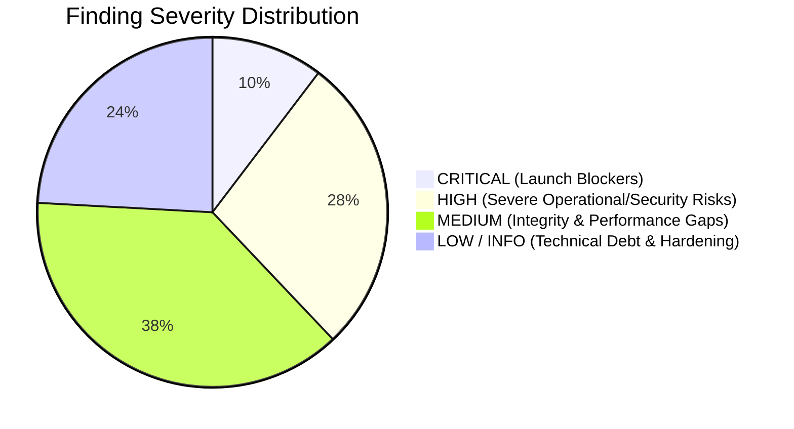
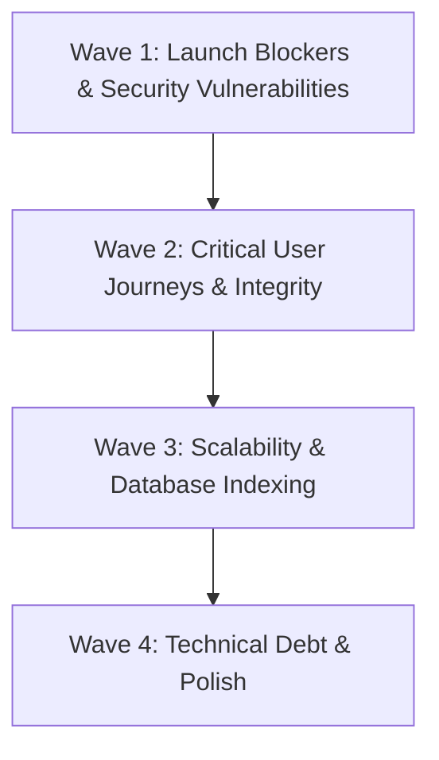

# KNZiN Production Readiness, Security & Scalability Audit — Final Master Report

**Project**: KNZiN Educational Platform & Promotional Draw System  
**Audit Scope**: Full Read-Only Inspection across Frontend, Backend, Database, Infrastructure & Security  
**Audit Date**: 2026-10-05  
**Audit Status**: **COMPLETED**  
**Final Production Verdict**: **NOT READY FOR PRODUCTION (REMEDIATION REQUIRED BEFORE LAUNCH)**  

---

## 1. Executive Verdict & Risk Overview

The KNZiN application contains an exceptionally strong, mathematically disciplined core in its financial ledger, dual-approval workflows, atomic sequence allocation, and administrative capability isolation. All **509 automated tests (161 frontend, 348 backend)** are passing cleanly.

However, a rigorous production-readiness, security, and scalability inspection reveals **29 verified issues**, including **3 CRITICAL** and **8 HIGH** severity vulnerabilities and architectural bottlenecks that would cause immediate operational failure, security compromise, or denial of service under concurrent production conditions.

### Overall Finding Distribution

### High-Level Summary by Architectural Layer

| Layer | Files Audited | Passing Tests | Critical | High | Medium | Low/Info | Total |
| :--- | :--- | :--- | :--- | :--- | :--- | :--- | :--- |
| **Frontend UI/UX** | 272 files | 161 passed | 1 | 3 | 3 | 4 | **11** |
| **Backend & APIs** | 363 files | 348 passed | 2 | 2 | 4 | 3 | **11** |
| **Database & Migrations**| 38 migrations | Verified schema | 0 | 1 | 2 | 1 | **4** |
| **Security & Infra** | Config / Env | Complete | 0 | 2 | 2 | 0 | **4** |
| **TOTALS** | **847 files** | **509 passed** | **3** | **8** | **11** | **7** | **29** |

---

## 2. Complete Audit Findings Matrix (PROD-001 to PROD-029)

| ID | Sev | Layer | Title | Root Cause Summary | Impact |
| :--- | :--- | :--- | :--- | :--- | :--- |
| **PROD-001** | **CRIT** | Frontend | Cleartext Sanctum Token in OAuth Callback URL | Transmitted via `?token=` parameter | Leaks in browser history, proxy logs, and Referer headers |
| **PROD-012** | **CRIT** | Backend | Google OAuth (Socialite) Completely Unimplemented | Backend throws 503 while UI presents Google login | Core advertised login path crashes for all real users |
| **PROD-013** | **CRIT** | Backend | Synchronous Unbounded Bulk Notification Dispatch | Loops `User::where('status', 'active')->get()` in HTTP request | Memory limit exhaustion and 504 timeouts on draw publish/broadcast |
| **PROD-002** | **HIGH** | Frontend | OrderSummaryPage Returns Fake 15-Ticket Order on Catch | Hardcoded mock order fallback inside `catch` block | Deceives customers into believing unpaid/failed orders succeeded |
| **PROD-003** | **HIGH** | Frontend | Hardcoded Mock Draws Displayed on API Errors | `useDraws` falls back to static iPhone/Cash mocks on 500/404 | Displays phantom prizes, dates, and fake winners to real visitors |
| **PROD-004** | **HIGH** | Frontend | Unauthenticated `/api/search` Route Calls OpenAI | Next.js server route lacks rate limiting or auth check | Denial of Wallet risk through automated OpenAI credit exhaustion |
| **PROD-014** | **HIGH** | Backend | Simulator Payment Gateway Active by Default | Default config `true` and accepted by `PaymentController` | Potential $0 fraudulent fulfillment if env variables drift |
| **PROD-017** | **HIGH** | Backend/UX | Winner KYC Notification Links to Non-Existent `/account/kyc` | Route does not exist in Next.js router | Draw winners encounter 404 dead end when claiming prizes |
| **PROD-018** | **HIGH** | Backend | Exponential N+1 Query Storm in Scheduled Commands | 5 queries per entitlement in loop; unindexed ticket scans | High-frequency database CPU spikes and connection pool starvation |
| **PROD-025** | **HIGH** | Database | `draw_winners` Stores Loose String Without Foreign Key | Serial stored as raw string without FK to `tickets` or `users` | Broken referential integrity; risks orphan winners that cannot claim prizes |
| **PROD-028** | **HIGH** | Infra | Production Default Fallbacks to `sync` Queue and `file` Sessions | `.env.example` defaults to non-distributed drivers | Multi-instance clustering fails; request stalls on background tasks |
| **PROD-005** | **MED** | Frontend | Paywall Bypass via Unlisted YouTube Iframe Video ID | Raw YouTube iframe in DOM exposes video ID | Users can extract unlisted video link, bypassing paywall & watermark |
| **PROD-006** | **MED** | Frontend | Video Watch Timer Increments While Paused in Iframe | Interval timer lacks player postMessage pause synchronization | Unearned 100% completion by leaving browser tab paused |
| **PROD-007** | **MED** | Frontend | Missing 401 Interceptor Leaves Zombie Authenticated State | `apiClient` does not catch 401 or purge stale localStorage tokens | Traps user in broken authenticated state without automated re-login |
| **PROD-015** | **MED** | Backend | Fragile Identity Verification (`auth_provider === 'google'` Workaround)| Email OTP users marked `google` to bypass verification checks | Data model corruption; breaks if provider string is normalized |
| **PROD-019** | **MED** | Backend | Unauthenticated Order Resource Exposes UUID & Predictable Access | `OrderResource` exposes internal `user_id`; guest access open | Information disclosure and guest order initiation enumeration |
| **PROD-021** | **MED** | Backend | Raw MP4 Served Instead of HLS & Direct URL Bypass | API advertises HLS format but streams raw MP4 | Playback buffering on slow networks; direct URL leaks bypass signing |
| **PROD-022** | **MED** | Backend | Unpaginated User Tickets Ledger API (`/api/v1/user/tickets`) | Loads all tickets in-memory with date math per row | Huge JSON payloads and slow rendering for power ticket holders |
| **PROD-023** | **MED** | Database | Non-Unique `email` on `users` Table Permitting Duplication | Schema only indexes email without unique constraint | Duplicate active rows for same email create non-deterministic lookups |
| **PROD-024** | **MED** | Database | Missing Composite Index on `lesson_progress` and `tickets(issued_at)`| Single-column indexes only on high-frequency query pairs | Unnecessary table scans on dashboard and cron evaluators |
| **PROD-027** | **MED** | Frontend | Next.js Image `remotePatterns` Restricts Exclusively to Unsplash | Only Unsplash configured in `next.config.ts` | Custom S3/CDN course covers, prizes, and receipts fail to render |
| **PROD-029** | **MED** | Backend | Public Read API Endpoints (Catalog, Draws, CMS) Lack Rate Limiting | No throttle middleware on public GET routes | Vulnerable to application-layer HTTP flooding and resource exhaustion |
| **PROD-008** | **LOW** | Frontend | Unpaid Order Creation Saves Purchased Parts to LocalStorage | Written immediately on pending order creation | Unpaid parts visually unlocked in local browser cache before payment |
| **PROD-009** | **LOW** | Frontend | Static Ground Hits Search Only Indexes 8 Hardcoded Courses | Static list in `searchService.ts` | Newly published admin courses invisible in client-side search |
| **PROD-010** | **LOW** | Frontend | Referral Cookie in Next.js Middleware Lacks `secure: true` | Cookie options omit secure flag | Referral tracking cookie transmitted over unencrypted HTTP |
| **PROD-011** | **INFO** | Frontend | Fallback Catalog Mock IDs Non-UUID Strings | Strings like `course-auto-detailing` | Causes UUID validation errors if passed to backend API |
| **PROD-016** | **LOW** | Backend | Missing `withoutOverlapping()` on Background Schedulers | Console routes omit overlapping guards on 3 commands | Concurrently executing cron tasks compete for database locks |
| **PROD-020** | **LOW** | Backend | Hardcoded Localhost Origins in Production CORS Configuration | `localhost:3000` remains in allowed origins array | Unnecessary CORS attack surface for local network requests |
| **PROD-026** | **LOW** | Database | Raw MySQL DDL Constraints Fragile Across DB Engines | Direct `ALTER TABLE ADD CONSTRAINT` statements | Migration rollback fragility across different database engines |

---

## 3. The 3 Production Launch Blockers (Must Fix Before Any Live Traffic)

### 1. PROD-001: Sanctum Token Cleartext Transmission in URL
- **Why it Blocks Launch**: In `frontend/src/app/[locale]/auth/callback/page.tsx`, the Sanctum bearer token is transmitted as a plain URL query parameter (`?token=1|abcdef...`). This token gives complete administrative or user control over the account. It is permanently logged in browser history, proxy server logs, and sent to any third-party resources via the HTTP `Referer` header.
- **Remediation**: Use temporary authorization codes or HttpOnly, Secure session cookies for token exchange.

### 2. PROD-012: Google OAuth (Socialite) Completely Missing
- **Why it Blocks Launch**: In `backend/app/Services/GoogleAuthService.php`, production calls throw an HTTP 503 exception because `laravel/socialite` is uninstalled. Real users clicking "تسجيل الدخول عبر Google" on the live site will experience immediate crashes.
- **Remediation**: Either install `laravel/socialite` and configure Google Cloud OAuth client credentials, OR remove the Google login button from the UI and operate purely on Email OTP.

### 3. PROD-013: Synchronous Bulk Notification Dispatch in Web Requests
- **Why it Blocks Launch**: In `DrawLifecycleService::publish`, `AdminCourseService`, and `AdminBroadcastController`, notifications to all active users are dispatched inside the web request thread. With 10,000 active users, a single draw publication attempts to execute 30,000 database operations and emails in one PHP request, triggering fatal memory exhaustion (`Allowed memory size exhausted`) or Nginx gateway timeouts (504).
- **Remediation**: Delegate bulk notification dispatch to chunked background queue jobs (`chunkById(500)`).

---

## 4. Prioritized Remediation Roadmap

To transition the repository from **NOT READY** to **PRODUCTION READY**, execute remediation in four sequential, risk-proportional waves:

### Wave 1: Security & Launch Blockers (Immediate Priority)
1. **PROD-001**: Remove Sanctum bearer token from URL query parameters.
2. **PROD-012**: Install Socialite or hide Google login in UI to enforce Email OTP.
3. **PROD-013**: Refactor bulk notification dispatch to chunked queue jobs.
4. **PROD-014**: Disable simulator payment gateway by default in production config.
5. **PROD-004**: Add IP rate limiting and CAPTCHA to `/api/search` route.

### Wave 2: Critical User Journeys & Financial Integrity
6. **PROD-017**: Create the `/[locale]/account/kyc` route so draw winners can claim prizes.
7. **PROD-002 & PROD-003**: Remove all fake/mock order and draw fallbacks from `catch` blocks.
8. **PROD-007**: Add 401 response interceptor to `apiClient` to auto-clear stale tokens.
9. **PROD-015**: Decouple `User::isVerified()` from `auth_provider === 'google'`.
10. **PROD-025**: Add `ticket_id` and `user_id` foreign keys to `draw_winners`.

### Wave 3: Scalability & Database Optimization
11. **PROD-018**: Eliminate N+1 query loops in `EvaluateMissionRemindersCommand` and `EvaluateDrawAlertsCommand`.
12. **PROD-022**: Add pagination to `/api/v1/user/tickets`.
13. **PROD-024**: Add composite index on `lesson_progress(user_id, course_id)` and leading index on `tickets(issued_at)`.
14. **PROD-028**: Configure Redis for queues, cache, and sessions in production environment.
15. **PROD-029**: Add global API throttling on public read routes.

### Wave 4: Technical Debt & Hardening
16. **PROD-005 & PROD-006**: Improve video player security or migrate to authenticated video streaming (e.g. Mux / Cloudflare Stream).
17. **PROD-019**: Sanitize `user_id` from public `OrderResource`.
18. **PROD-020**: Clean up allowed origins in `config/cors.php`.
19. **PROD-027**: Configure CDN hostnames in `next.config.ts`.
20. **PROD-016**: Append `withoutOverlapping()` to console scheduled tasks.

---

## 5. Artifact Reference Guide

Detailed individual stage audit reports have been compiled and persisted:

- **Frontend Inspection Report**: `docs/audit/FRONTEND_AUDIT_FINDINGS.md` (`PROD-001` through `PROD-011`)
- **Backend Inspection Report**: `docs/audit/BACKEND_AUDIT_FINDINGS.md` (`PROD-012` through `PROD-022`)
- **Database Inspection Report**: `docs/audit/DATABASE_AUDIT_FINDINGS.md` (`PROD-023` through `PROD-026`)
- **Security & Protection Report**: `docs/audit/SECURITY_AUDIT_FINDINGS.md` (`PROD-027` through `PROD-029`)
- **Local Dev vs Prod Performance Guide**: `docs/audit/LOCAL_DEV_PERFORMANCE_EXPLANATION.md`
