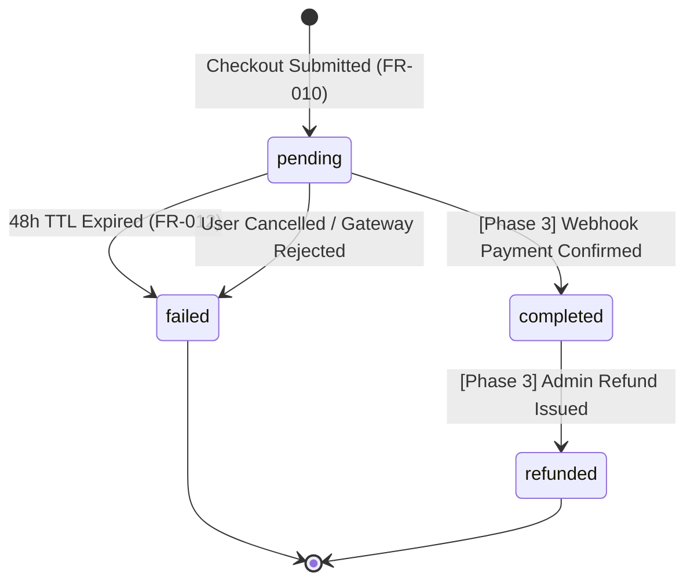

# Phase 1 Data Model: Auth, Catalog & Checkout (MVP Scope)

**Feature**: Auth, Catalog & Checkout  
**Branch**: `002-auth-catalog-checkout`  
**Date**: 2026-09-29  
**Engine**: MySQL 8.0+ / InnoDB / `utf8mb4_unicode_ci`  

---

## 1. Relational Entities Diagram

```mermaid
erDiagram
    users ||--o{ orders : "places"
    courses ||--o{ course_parts : "contains"
    courses ||--o{ order_items : "purchased_as_bundle"
    course_parts ||--o{ order_items : "purchased_as_part"
    orders ||--|{ order_items : "composed_of"

    users {
        uuid id PK
        string email
        string display_name
        string auth_provider
        string provider_id
        string avatar_url
        string status
        uuid merged_into_user_id FK
        timestamp email_verified_at
        timestamp created_at
        timestamp updated_at
    }

    courses {
        uuid id PK
        string slug UK
        string title_ar
        string title_en
        text description_ar
        text description_en
        string cover_image_url
        bigint bundle_price_cents
        int bundle_promotional_tickets
        string display_price_label
        boolean is_active
        timestamp created_at
        timestamp updated_at
    }

    course_parts {
        uuid id PK
        uuid course_id FK
        int part_number
        string title_ar
        string title_en
        text syllabus_ar
        text syllabus_en
        bigint part_price_cents
        int part_promotional_tickets
        string display_price_label
        json resource_types
        int duration_minutes
        boolean is_active
        timestamp created_at
        timestamp updated_at
    }

    orders {
        uuid id PK
        string order_number UK
        uuid user_id FK
        bigint total_amount_cents
        char(3) currency
        decimal(10,4) exchange_rate
        bigint paid_amount_gateway
        string display_price_label
        int promotional_tickets_granted
        string status
        string idempotency_key UK
        boolean legal_terms_agreed
        string terms_agreed_ip
        timestamp terms_agreed_at
        json quiz_answers
        timestamp quiz_completed_at
        timestamp expires_at
        timestamp created_at
        timestamp updated_at
    }

    order_items {
        bigint id PK
        uuid order_id FK
        uuid course_id FK
        uuid course_part_id FK
        string item_type
        bigint price_cents
        int promotional_tickets_granted
        timestamp created_at
        timestamp updated_at
    }
```

---

## 2. Table Specifications & Schema Definitions

### 2.1 Table: `users`
Represents customer identity (both unauthenticated guest buyers and authenticated Google accounts).

| Column Name | Data Type | Nullable | Default | Description & Validation |
| :--- | :--- | :--- | :--- | :--- |
| `id` | `CHAR(36)` (UUID) | No | (UUIDv4) | Primary Key. |
| `email` | `VARCHAR(255)` | No | - | User email. Must be lowercase, trimmed. Indexed. |
| `display_name` | `VARCHAR(100)` | Yes | `NULL` | Name from Google or generated guest label (e.g. "ضيف"). |
| `auth_provider` | `ENUM('guest', 'google')` | No | `'guest'` | Identity provider. |
| `provider_id` | `VARCHAR(255)` | Yes | `NULL` | Google `sub` identifier. Unique per provider. |
| `avatar_url` | `VARCHAR(500)` | Yes | `NULL` | URL to Google profile picture. |
| `status` | `ENUM('active', 'deactivated')`| No | `'active'` | Deactivated when merged into a verified account. |
| `merged_into_user_id` | `CHAR(36)` | Yes | `NULL` | FK -> `users.id`. Retains audit pointer to surviving record. |
| `email_verified_at` | `TIMESTAMP` | Yes | `NULL` | Non-null for Google accounts, null for guests. |
| `created_at` | `TIMESTAMP` | No | `CURRENT_TIMESTAMP` | Creation timestamp. |
| `updated_at` | `TIMESTAMP` | No | `CURRENT_TIMESTAMP` | Last update. |

- **Indexes**:
  - `PRIMARY KEY (id)`
  - `INDEX idx_users_email (email)`
  - `UNIQUE KEY uq_users_provider (auth_provider, provider_id)`

---

### 2.2 Table: `courses`
Represents an educational curriculum offering a full 6-part bundle.

| Column Name | Data Type | Nullable | Default | Description & Validation |
| :--- | :--- | :--- | :--- | :--- |
| `id` | `CHAR(36)` (UUID) | No | (UUIDv4) | Primary Key. |
| `slug` | `VARCHAR(100)` | No | - | Unique URL slug (e.g. `'auto-detailing'`). |
| `title_ar` | `VARCHAR(255)` | No | - | Arabic course title. |
| `title_en` | `VARCHAR(255)` | No | - | English course title. |
| `description_ar` | `TEXT` | No | - | Arabic full syllabus and value description. |
| `description_en` | `TEXT` | No | - | English description. |
| `cover_image_url` | `VARCHAR(500)` | No | - | URL/path to responsive course cover image. |
| `bundle_price_cents` | `BIGINT` | No | `1000` | Full bundle price in USD cents ($10.00 = 1000). |
| `bundle_promotional_tickets` | `INT` | No | `15` | Complimentary promotional tickets granted with bundle. |
| `display_price_label` | `VARCHAR(50)` | No | `'13,000 IQD'` | Marketing display string for bundle (UI only). |
| `is_active` | `BOOLEAN` | No | `true` | Visibility toggle. |
| `created_at` | `TIMESTAMP` | No | `CURRENT_TIMESTAMP` | Creation timestamp. |
| `updated_at` | `TIMESTAMP` | No | `CURRENT_TIMESTAMP` | Last update. |

- **Indexes**:
  - `PRIMARY KEY (id)`
  - `UNIQUE KEY uq_courses_slug (slug)`
  - `INDEX idx_courses_active (is_active)`

---

### 2.3 Table: `course_parts`
Represents an individual modular chapter within a course available for standalone micro-purchase ($2).

| Column Name | Data Type | Nullable | Default | Description & Validation |
| :--- | :--- | :--- | :--- | :--- |
| `id` | `CHAR(36)` (UUID) | No | (UUIDv4) | Primary Key. |
| `course_id` | `CHAR(36)` | No | - | FK -> `courses.id` ON DELETE CASCADE. |
| `part_number` | `TINYINT UNSIGNED` | No | - | 1 to 6. |
| `title_ar` | `VARCHAR(255)` | No | - | Arabic part title. |
| `title_en` | `VARCHAR(255)` | No | - | English part title. |
| `syllabus_ar` | `TEXT` | No | - | Learning objectives outline in Arabic. |
| `syllabus_en` | `TEXT` | No | - | Learning objectives outline in English. |
| `part_price_cents` | `BIGINT` | No | `200` | Standalone part price in USD cents ($2.00 = 200). |
| `part_promotional_tickets` | `INT` | No | `1` | Complimentary promotional tickets granted with part. |
| `display_price_label` | `VARCHAR(50)` | No | `'2,000 IQD'` | Marketing display string for part (UI only). |
| `resource_types` | `JSON` | No | `["video", "pdf"]` | Array of available media types. |
| `duration_minutes` | `INT UNSIGNED` | No | `45` | Total video/audio length. |
| `is_active` | `BOOLEAN` | No | `true` | Visibility toggle. |
| `created_at` | `TIMESTAMP` | No | `CURRENT_TIMESTAMP` | Creation timestamp. |
| `updated_at` | `TIMESTAMP` | No | `CURRENT_TIMESTAMP` | Last update. |

- **Indexes**:
  - `PRIMARY KEY (id)`
  - `UNIQUE KEY uq_parts_course_part (course_id, part_number)`
  - `INDEX idx_parts_course (course_id)`

---

### 2.4 Table: `orders`
Represents educational purchase intent. In Phase 2 MVP, orders remain in `pending` status until Phase 3 webhooks are connected.

| Column Name | Data Type | Nullable | Default | Description & Validation |
| :--- | :--- | :--- | :--- | :--- |
| `id` | `CHAR(36)` (UUID) | No | (UUIDv4) | Primary Key. |
| `order_number` | `VARCHAR(32)` | No | - | Unique public reference (e.g. `'KNZ-ORD-2026-0001'`). |
| `user_id` | `CHAR(36)` | No | - | FK -> `users.id` ON DELETE RESTRICT. |
| `total_amount_cents`| `BIGINT` | No | - | Financial source of truth in USD cents (e.g. `200` or `1000`). |
| `currency` | `CHAR(3)` | No | `'USD'` | Financial currency code. |
| `exchange_rate` | `DECIMAL(10,4)` | No | `1.3100` | Frozen accounting rate at checkout creation. |
| `paid_amount_gateway`| `BIGINT` | No | - | Gateway capture amount in IQD (e.g. `2620` for $2.00). |
| `display_price_label`| `VARCHAR(50)` | No | - | Customer marketing label (e.g. `'2,000 IQD'`), display only. |
| `promotional_tickets_granted`| `INT` | No | `1` | Total promotional tickets recorded for this order. |
| `status` | `ENUM('pending', 'completed', 'failed', 'refunded')` | No | `'pending'` | Initial status is strictly `'pending'`. |
| `idempotency_key` | `VARCHAR(64)` | No | - | Unique client-generated UUID for 10-minute dedup window. |
| `legal_terms_agreed`| `BOOLEAN` | No | - | Must be strictly `true`. False/null rejected by server. |
| `terms_agreed_ip` | `VARCHAR(45)` | No | - | Client IPv4/IPv6 address at agreement time. |
| `terms_agreed_at` | `TIMESTAMP` | No | - | Timestamp of affirmative agreement. |
| `quiz_answers` | `JSON` | Yes | `NULL` | Stored 3-step questionnaire answers. |
| `quiz_completed_at`| `TIMESTAMP` | Yes | `NULL` | Completion timestamp of the last submitted quiz. |
| `expires_at` | `TIMESTAMP` | No | - | Auto-expiry set to `created_at + 48 hours`. |
| `created_at` | `TIMESTAMP` | No | `CURRENT_TIMESTAMP` | Creation timestamp. |
| `updated_at` | `TIMESTAMP` | No | `CURRENT_TIMESTAMP` | Last update. |

- **Indexes**:
  - `PRIMARY KEY (id)`
  - `UNIQUE KEY uq_orders_number (order_number)`
  - `UNIQUE KEY uq_orders_idempotency (idempotency_key)`
  - `INDEX idx_orders_user (user_id)`
  - `INDEX idx_orders_status_expires (status, expires_at)`

---

### 2.5 Table: `order_items`
Line item records for the purchased course bundle or individual part.

| Column Name | Data Type | Nullable | Default | Description & Validation |
| :--- | :--- | :--- | :--- | :--- |
| `id` | `BIGINT UNSIGNED` | No | AUTO_INC | Primary Key. |
| `order_id` | `CHAR(36)` | No | - | FK -> `orders.id` ON DELETE CASCADE. |
| `course_id` | `CHAR(36)` | No | - | FK -> `courses.id` ON DELETE RESTRICT. |
| `course_part_id` | `CHAR(36)` | Yes | `NULL` | FK -> `course_parts.id` ON DELETE RESTRICT. Null if bundle. |
| `item_type` | `ENUM('bundle', 'part')` | No | - | Type of educational asset. |
| `price_cents` | `BIGINT` | No | - | Minor units USD ($2.00 = `200`, $10.00 = `1000`). |
| `promotional_tickets_granted` | `INT` | No | - | 1 for part, 15 for bundle. |
| `created_at` | `TIMESTAMP` | No | `CURRENT_TIMESTAMP` | Creation timestamp. |
| `updated_at` | `TIMESTAMP` | No | `CURRENT_TIMESTAMP` | Last update. |

- **Indexes**:
  - `PRIMARY KEY (id)`
  - `INDEX idx_order_items_order (order_id)`
  - `INDEX idx_order_items_course (course_id)`

---

## 3. Order State Lifecycle & Transitions



### Invariants:
1. **Creation Invariant**: Every order MUST be created with `status = 'pending'`, `legal_terms_agreed = true`, valid IP address, and `expires_at = created_at + 48 hours`.
2. **Dedup Invariant**: Same `idempotency_key` submitted within 10 minutes returns original order; new insert blocked by database unique key.
3. **Immutability Invariant**: `total_amount_cents`, `currency`, `exchange_rate`, `paid_amount_gateway`, and `promotional_tickets_granted` can NEVER be modified once the order row is created.
4. **Expired Order Invariant**: Orders transitioning from `pending` &rarr; `failed` upon 48-hour expiration can NEVER mint promotional tickets and can NEVER mutate wallet ledgers.
