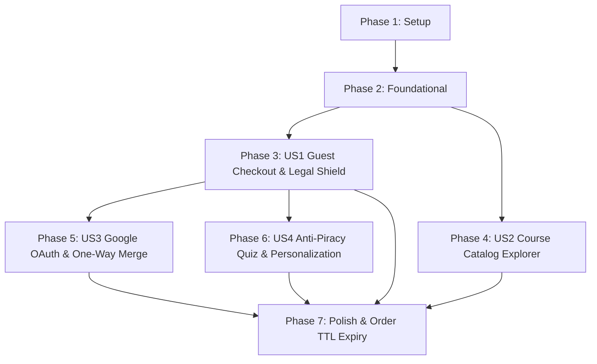

# Tasks: Auth, Catalog & Checkout (MVP Scope)

**Branch**: `002-auth-catalog-checkout` | **Date**: 2026-09-29 | **Spec**: [spec.md](file:///d:/Work%20Projects/Knzin%20Project/specs/002-auth-catalog-checkout/spec.md) | **Plan**: [plan.md](file:///d:/Work%20Projects/Knzin%20Project/specs/002-auth-catalog-checkout/plan.md)

---

## CRITICAL INVARIANTS & AGENT GUARDRAILS

> [!IMPORTANT]
> **Strict Rules for Implementation Agents**:
> 1. **SCOPE LOCK (NO PHASE-3 CODE)**: Orders stay in `pending` status. Do NOT implement payment gateway webhooks (Zain Cash, Qi Card, Visa), ticket serial minting (`KNZ-A15-...`), RNG draw algorithms, wallet dual-ledger balance updates, or affiliate Western Union payouts.
> 2. **CANONICAL LEGAL SHIELD VERBATIM**: Backend MUST strictly validate the exact canonical text: `"أوافق على الشروط والأحكام وسياسة الخصوصية، وأقر بأنني أقوم بشراء محتوى رقمي تعليمي، وأن تذكرة السحب المرفقة هي هدية ترويجية مجانية غير مستردة أو قابلة للتبديل"`. Never copy from `prototype/index.html` (frozen reference with deprecated short text). Mismatches must return HTTP 422 `ERR_LEGAL_SHIELD_MISMATCH`.
> 3. **FINTECH DUAL-CURRENCY INTEGRITY**: All currencies stored in `BIGINT` minor units (USD cents: $2.00 = 200, $10.00 = 1000). Zero floating-point math. `exchange_rate` frozen at `1.3100`. `paid_amount_gateway` stored as IQD integer (2,620 IQD for part, 13,100 IQD for bundle). `display_price_label` (`"2,000 IQD"` / `"13,000 IQD"`) is strictly display metadata and forbidden from mathematical calculations.
> 4. **PERMANENT UNIQUE IDEMPOTENCY & 48H TTL**: `idempotency_key` is a client-generated UUID under a permanent MySQL `UNIQUE` constraint (`uq_orders_idempotency`). Duplicate submissions replay the existing order with HTTP 200 OK. Redis provides 10-minute duplicate lock for rapid double-clicks. Pending orders carry a 48-hour TTL (`expires_at = created_at + 48 hours`).
> 5. **AUTH & ONE-WAY MERGE**: Guest checkout requires only valid email and issues a Sanctum token. Google OAuth includes a local dev-mock driver (`GOOGLE_AUTH_MOCK=true`) for deterministic testing. Merging is strictly one-way: unverified guest orders re-attribute to verified Google user; guest record deactivated. Verified accounts NEVER merge into unverified accounts.
> 6. **ANTI-PIRACY QUIZ**: 3-step questionnaire required in `CreateOrderRequest`; stored as JSON metadata on orders with client stamp `"تم تخصيص هذه النسخة المبرمجة حصرياً لبياناتك"`. Unlimited retakes before Confirm Order, last-wins; ZERO server scoring or grading.
> 7. **TECH STACK & STRUCTURE**: Frontend: Next.js 14+ App Router, TypeScript, Tailwind CSS, `next-intl` (Arabic RTL primary with Tajawal font, English LTR secondary). Backend: Laravel 11 REST API, MySQL 8+ (InnoDB, `utf8mb4_unicode_ci`), Redis 7+.

---

## Phase 1: Setup (Two-Tier Workspace & Configuration)

**Purpose**: Scaffolding the isolated `/backend` and `/frontend` project directories and core configuration files.

- [X] T001 Initialize backend Laravel 11 REST API project with PHP 8.2+ dependencies in backend/composer.json
- [X] T002 [P] Install and configure Laravel Sanctum for API token authentication in backend/config/sanctum.php
- [X] T003 [P] Configure Redis connection, cache, and queue drivers in backend/config/database.php and backend/.env.example
- [X] T004 Initialize frontend Next.js 14+ App Router project with TypeScript and Tailwind CSS in frontend/package.json
- [X] T005 [P] Configure next-intl bilingual routing and Google Fonts Tajawal typography in frontend/src/app/[locale]/layout.tsx
- [X] T006 [P] Create bilingual translation dictionaries for Arabic and English in frontend/messages/ar.json and frontend/messages/en.json
- [X] T007 [P] Configure TanStack React Query and base API client with JSend handling in frontend/src/lib/api-client.ts

---

## Phase 2: Foundational (Database Migrations, Seeders & Core Infrastructure)

**Purpose**: Core database schema, seed data, and shared API infrastructure that MUST be complete before ANY user story can run.

**⚠️ CRITICAL**: No user story implementation can begin until this phase is verified.

- [X] T008 Create users table migration with UUID primary key, status enum, merged_into_user_id FK, and email index in backend/database/migrations/2026_09_29_000001_create_users_table.php
- [X] T009 [P] Create courses table migration with UUID primary key, slug unique key, bundle_price_cents BIGINT, and bundle_promotional_tickets INT in backend/database/migrations/2026_09_29_000002_create_courses_table.php
- [X] T010 [P] Create course_parts table migration with UUID primary key, course_id FK, part_number, part_price_cents BIGINT, part_promotional_tickets INT, and resource_types JSON in backend/database/migrations/2026_09_29_000003_create_course_parts_table.php
- [X] T011 Create orders table migration with UUID primary key, order_number unique, user_id FK, total_amount_cents BIGINT, currency CHAR(3), exchange_rate DECIMAL(10,4), paid_amount_gateway BIGINT, display_price_label VARCHAR(50), promotional_tickets_granted INT, status enum, idempotency_key permanent unique key, legal_terms_agreed boolean, terms_agreed_ip VARCHAR(45), terms_agreed_at timestamp, quiz_answers JSON, quiz_completed_at timestamp, and expires_at timestamp in backend/database/migrations/2026_09_29_000004_create_orders_table.php
- [X] T012 Create order_items table migration with BIGINT PK, order_id FK, course_id FK, course_part_id nullable FK, item_type enum, price_cents BIGINT, and promotional_tickets_granted INT in backend/database/migrations/2026_09_29_000005_create_order_items_table.php
- [X] T013 Create Eloquent models and relationships for User, Course, CoursePart, Order, and OrderItem in backend/app/Models/
- [X] T014 Create CourseCatalogSeeder with authentic Iraqi vocational courses (Auto Detailing, Mobile Phone Repair, Freelance Design) with 6 parts each ($2/1 ticket) and full bundle ($10/15 tickets) in backend/database/seeders/CourseCatalogSeeder.php
- [X] T015 Create standardized JSend API response trait and base controller in backend/app/Http/Controllers/ApiController.php
- [X] T016 [P] Create shared Header HUD component displaying logo, stubbed ticket count, stubbed wallet balance, and social proof marquee in frontend/src/components/layout/HeaderHUD.tsx
- [X] T017 [P] Create bidirectional language toggle component switching between Arabic (dir="rtl") and English (dir="ltr") in frontend/src/components/layout/LanguageToggle.tsx

**Checkpoint**: Database migrated, seeders populated, and shared client HUD initialized. User story implementation can now begin.

---

## Phase 3: User Story 1 - Frictionless Guest Checkout & Canonical Legal Shield (Priority: P1) 🎯 MVP Core

**Goal**: An unauthenticated user can select a $2 course part or $10 bundle, enter their active email, affirmatively tick the canonical legal shield checkbox, and submit a pending order with dual-currency recording, 10-minute duplicate protection, and 48-hour auto-expiration.

**Independent Test**: Visit `/ar/courses/auto-detailing`, select Part 1 ($2), open checkout bottom-sheet, verify unticked legal checkbox, submit with email `guest@example.com`, and receive a created order in `pending` status with order reference number and frozen exchange rate amounts.

### Tests for User Story 1

- [X] T018 [P] [US1] Create backend feature test for canonical legal shield validation asserting exact Arabic verbatim match and HTTP 422 ERR_LEGAL_SHIELD_MISMATCH on modified strings in backend/tests/Feature/LegalShieldValidationTest.php
- [X] T019 [P] [US1] Create backend feature test for order idempotency asserting identical idempotency_key returns HTTP 200 with existing order and zero duplicate DB rows in backend/tests/Feature/OrderIdempotencyTest.php
- [X] T020 [P] [US1] Create backend feature test for dual-currency separation asserting total_amount_cents is USD integer, exchange_rate is 1.3100, and display_price_label is isolated in backend/tests/Feature/OrderDualCurrencyTest.php

### Implementation for User Story 1

- [X] T021 [US1] Implement CreateOrderRequest with strict canonical verbatim string validation, email format check, and mandatory quiz_answers validation in backend/app/Http/Requests/CreateOrderRequest.php
- [X] T022 [US1] Implement OrderService handling guest user resolution, frozen exchange rate calculation (1.3100), gateway amount conversion, idempotency deduplication with Redis lock, and pending order creation in backend/app/Services/OrderService.php
- [X] T023 [US1] Implement CheckoutController with POST /api/v1/checkout/orders and GET /api/v1/checkout/orders/{orderNumber} endpoints in backend/app/Http/Controllers/CheckoutController.php
- [X] T024 [P] [US1] Implement LegalShieldCheckbox component rendering exact canonical text with strictly non-pre-checked state and required validation in frontend/src/components/checkout/LegalShieldCheckbox.tsx
- [X] T025 [P] [US1] Implement CheckoutBottomSheet component with responsive mobile slide-up / desktop modal, item summary, email input, pricing breakdown, and submit button in frontend/src/components/checkout/CheckoutBottomSheet.tsx
- [X] T026 [US1] Implement OrderSummaryCard component rendering created order details, pending status badge, promotional tickets granted preview, and offline payment instructions in frontend/src/components/checkout/OrderSummaryCard.tsx
- [X] T027 [US1] Implement order summary page displaying confirmed pending order reference and offline cash guidance in frontend/src/app/[locale]/order-summary/[orderNumber]/page.tsx
- [X] T028 [US1] Integrate useCheckout hook connecting bottom-sheet submission to backend API with client-generated UUID idempotency key in frontend/src/hooks/useCheckout.ts

**Checkpoint**: User Story 1 is fully functional and independently testable end-to-end. Guest checkout creates valid `pending` orders with legal compliance.

---

## Phase 4: User Story 2 - Course Catalog & Micro-Pricing Explorer (Priority: P1)

**Goal**: Prospective students can browse practical vocational courses, view individual parts ($2 each / 1 ticket) versus full bundle ($10 / 15 tickets), inspect syllabus outlines, and toggle language between Arabic and English without layout shift.

**Independent Test**: Navigate to `/ar`, browse the course catalog grid, click into course details, verify parts 1 to 6 pricing and bundle savings ($2 savings + 2.5x tickets), and switch language to English to verify RTL-to-LTR mirroring.

### Tests for User Story 2

- [X] T029 [P] [US2] Create backend feature test for course catalog listing and detail endpoints asserting parts breakdown, pricing in cents, and ticket incentives in backend/tests/Feature/CatalogApiTest.php
- [X] T030 [P] [US2] Create frontend unit test for catalog pricing display and RTL layout mirroring in frontend/src/tests/CatalogDisplay.test.tsx

### Implementation for User Story 2

- [X] T031 [US2] Implement CourseResource and CoursePartResource formatting API output with parts breakdown and marketing display labels in backend/app/Http/Resources/CourseResource.php
- [X] T032 [US2] Implement CatalogController with GET /api/v1/catalog/courses and GET /api/v1/catalog/courses/{slug} endpoints in backend/app/Http/Controllers/CatalogController.php
- [X] T033 [P] [US2] Implement CourseCard component displaying cover image, Arabic/English title, bundle price ($10), and ticket incentive badge (15 tickets) in frontend/src/components/catalog/CourseCard.tsx
- [X] T034 [P] [US2] Implement CoursePartList component displaying modular parts 1 to 6 ($2 each / 1 ticket), duration, media types, and individual purchase triggers in frontend/src/components/catalog/CoursePartList.tsx
- [X] T035 [US2] Implement course detail page with complete curriculum syllabus and bundle-vs-part purchase triggers in frontend/src/app/[locale]/courses/[slug]/page.tsx
- [X] T036 [US2] Implement main catalog showcase page with responsive grid and live draw banner in frontend/src/app/[locale]/page.tsx
- [X] T037 [US2] Implement useCatalog hook with TanStack Query for cached server state and pre-fetching in frontend/src/hooks/useCatalog.ts

**Checkpoint**: User Stories 1 AND 2 are both fully functional and integrated. Visitors can explore catalog micro-pricing and seamlessly initiate checkout.

---

## Phase 5: User Story 3 - Social Google Authentication & One-Way Merge (Priority: P2)

**Goal**: Returning users can log in via Google with one click. If the Google email matches an existing guest identity, the system executes a strict one-way merge: re-attributing guest orders to the Google account, deactivating the guest record, and keeping verified accounts safe.

**Independent Test**: Create a guest order using `student@example.com`, trigger Google OAuth login with `mock_email=student@example.com`, and verify that the user profile reflects the verified Google account while the guest order is now attributed to the Google account.

### Tests for User Story 3

- [ ] T038 [P] [US3] Create backend feature test for one-way account merging asserting guest orders are re-attributed, guest record is deactivated, and verified accounts are never merged into unverified accounts in backend/tests/Feature/AuthMergeTest.php
- [ ] T039 [P] [US3] Create backend feature test for dev-mock Google OAuth driver asserting simulated login when GOOGLE_AUTH_MOCK=true in backend/tests/Feature/GoogleAuthMockTest.php

### Implementation for User Story 3

- [ ] T040 [US3] Implement AuthService with one-way guest-to-Google merge logic, guest token generation, and Google profile synchronization in backend/app/Services/AuthService.php
- [ ] T041 [US3] Implement AuthController with /api/v1/auth/guest, /api/v1/auth/google/redirect, /api/v1/auth/google/callback, /api/v1/auth/me, and /api/v1/auth/logout in backend/app/Http/Controllers/AuthController.php
- [ ] T042 [US3] Implement local Google OAuth dev-mock driver enabled via GOOGLE_AUTH_MOCK=true for testing without live Google Cloud credentials in backend/app/Services/GoogleAuthMockDriver.php
- [ ] T043 [P] [US3] Implement GoogleLoginButton component with one-click sign-in and loading state in frontend/src/components/auth/GoogleLoginButton.tsx
- [ ] T044 [US3] Implement useAuth hook and auth context managing Sanctum bearer tokens, user profile, and login/logout state in frontend/src/hooks/useAuth.ts
- [ ] T045 [US3] Integrate authenticated user profile and avatar display into Header HUD in frontend/src/components/layout/HeaderHUD.tsx

**Checkpoint**: User Stories 1, 2, and 3 are fully operational. Guest purchases seamlessly merge into Google profiles upon login.

---

## Phase 6: User Story 4 - Anti-Piracy Psychological Profiler & Personalization Stamp (Priority: P3)

**Goal**: Course purchasers complete a brief 3-step questionnaire prior to checkout (goal, study hours, level) with unlimited retakes before confirmation; completed answers bind to the pending order with a client personalization stamp, with zero server scoring.

**Independent Test**: Click "Buy Part 1", complete the 3 questionnaire steps, click retake to change answers, proceed to checkout, verify dynamic personalization badge (*"تم تخصيص هذه النسخة المبرمجة حصرياً لبياناتك"*), and submit order confirming `quiz_answers` JSON is stored.

### Tests for User Story 4

- [ ] T046 [P] [US4] Create frontend unit test for 3-step quiz flow asserting retake-before-confirm overwrites answers and renders personalization stamp in frontend/src/tests/AntiPiracyQuiz.test.tsx

### Implementation for User Story 4

- [ ] T047 [P] [US4] Implement QuizStep component rendering single-choice vocational goal, study commitment, and skill level options in frontend/src/components/quiz/QuizStep.tsx
- [ ] T048 [P] [US4] Implement AntiPiracyModal component managing 3-step progression, retake navigation, and completion state in frontend/src/components/quiz/AntiPiracyModal.tsx
- [ ] T049 [US4] Implement PersonalizationBadge component rendering dynamic personalization watermark text with customer details in frontend/src/components/quiz/PersonalizationBadge.tsx
- [ ] T050 [US4] Integrate anti-piracy quiz completion trigger before opening checkout bottom-sheet in frontend/src/hooks/useCheckout.ts

**Checkpoint**: All 4 user stories are fully implemented and integrated. The complete pre-purchase to pending order lifecycle is functional.

---

## Phase 7: Polish, Order TTL Expiry & Validation

**Purpose**: Scheduled auto-expiration of pending orders, quickstart end-to-end verification, and cross-cutting responsive polishing.

- [ ] T051 Implement artisan console command orders:expire-pending auto-expiring pending orders older than 48 hours to failed in backend/app/Console/Commands/ExpirePendingOrdersCommand.php
- [ ] T052 Register orders:expire-pending scheduled hourly run in backend/routes/console.php
- [ ] T053 [P] Verify responsive bottom-sheet and modal layout across mobile viewports (375px) to desktop (1920px) with zero horizontal overflow in frontend/src/app/globals.css
- [ ] T054 Execute and document all 5 validation scenarios from quickstart.md (Guest Checkout, Legal Shield Tamper, Idempotency Dedup, Google Merge, Dual-Currency) in specs/002-auth-catalog-checkout/quickstart.md

---

## Dependencies & Execution Order

### Phase Dependencies

- **Setup (Phase 1)**: No dependencies — can start immediately.
- **Foundational (Phase 2)**: Depends on Phase 1 — **BLOCKS all user stories**.
- **User Story 1 (Phase 3 - P1 MVP)**: Depends on Phase 2. Can be implemented and tested independently.
- **User Story 2 (Phase 4 - P1)**: Depends on Phase 2. Can run in parallel with US1.
- **User Story 3 (Phase 5 - P2)**: Depends on Phase 2 and US1 order schema.
- **User Story 4 (Phase 6 - P3)**: Depends on Phase 2 and US1 checkout bottom-sheet.
- **Polish (Phase 7)**: Depends on completion of all user stories.

### User Story Dependencies

---

## Parallel Execution Opportunities

- **Setup Phase (Phase 1)**: `T002`, `T003`, `T005`, `T006`, and `T007` can run concurrently across backend and frontend.
- **Foundational Phase (Phase 2)**: `T009`, `T010`, `T016`, and `T017` can run in parallel while core migrations and models are written.
- **User Story 1**: Tests `T018`, `T019`, and `T020` can run in parallel. Frontend components `T024` and `T025` can be built in parallel with backend `T021` and `T022`.
- **User Story 2**: Tests `T029` and `T030` can run in parallel. Components `T033` and `T034` can run in parallel.
- **User Story 3**: Tests `T038` and `T039` can run in parallel. Component `T043` can run in parallel with backend `T040`.
- **User Story 4**: Components `T047` and `T048` can run in parallel with `T046`.

---

## Implementation Strategy: MVP First

1. **Step 1**: Execute Phase 1 (Setup) and Phase 2 (Foundational) to establish the working database and API envelope.
2. **Step 2**: Execute Phase 3 (User Story 1 - Guest Checkout). **STOP and VALIDATE**: At this checkpoint, an unauthenticated user can purchase a course part with full legal shield validation. This is the working MVP.
3. **Step 3**: Execute Phase 4 (User Story 2 - Course Catalog) to provide full catalog navigation and micro-pricing breakdown.
4. **Step 4**: Execute Phase 5 (User Story 3 - Google OAuth) to enable one-way identity merge.
5. **Step 5**: Execute Phase 6 (User Story 4 - Anti-Piracy Quiz) to add psychological profiling before checkout.
6. **Step 6**: Execute Phase 7 (Polish & Validation) to verify 48-hour order expiration and run `quickstart.md` scenarios.
