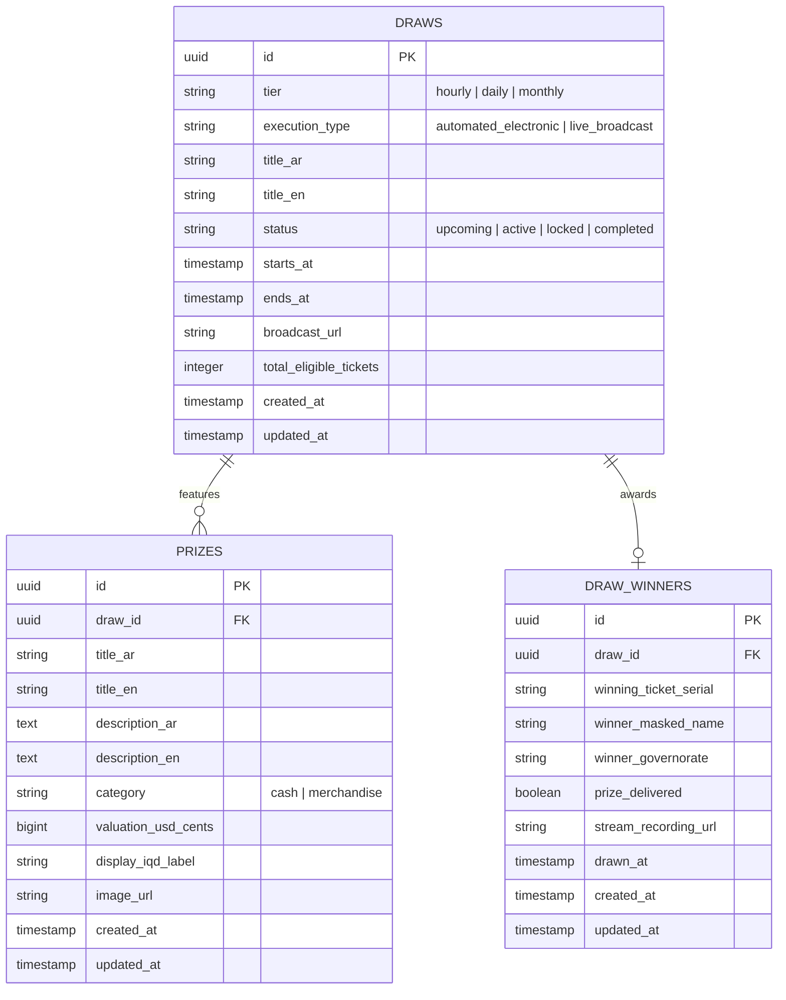

# Data Model: Arena of Draws & Promotional Countdowns

**Feature**: `003-draws-arena-countdown`  
**Date**: 2026-09-29  

---

## 1. Entity Relationship Diagram

---

## 2. Table Specifications

### 2.1 Table: `draws`
Stores the scheduled promotional sweepstakes events.

| Column | Type | Constraints | Description |
| :--- | :--- | :--- | :--- |
| `id` | `CHAR(36)` | `PRIMARY KEY` | Standard UUID v4 |
| `tier` | `ENUM` | `NOT NULL` | `'hourly'`, `'daily'`, `'monthly'` |
| `execution_type` | `ENUM` | `NOT NULL, DEFAULT 'automated_electronic'` | `'automated_electronic'`, `'live_broadcast'` |
| `title_ar` | `VARCHAR(150)` | `NOT NULL` | Display title in Arabic |
| `title_en` | `VARCHAR(150)` | `NOT NULL` | Display title in English |
| `status` | `ENUM` | `NOT NULL, DEFAULT 'upcoming'` | `'upcoming'`, `'active'`, `'locked'`, `'completed'` |
| `starts_at` | `TIMESTAMP` | `NOT NULL, INDEX` | Time when tickets qualify for this draw |
| `ends_at` | `TIMESTAMP` | `NOT NULL, INDEX` | Deadline when countdown reaches `00:00:00` |
| `broadcast_url` | `VARCHAR(255)` | `NULLABLE` | Official YouTube Live broadcast link |
| `total_eligible_tickets` | `INT UNSIGNED` | `DEFAULT 0` | Denormalized count of eligible tickets |
| `created_at` | `TIMESTAMP` | `NOT NULL` | Record creation timestamp |
| `updated_at` | `TIMESTAMP` | `NOT NULL` | Record update timestamp |

**Indexes:**
- `idx_draws_status_tier`: `(status, tier)` for fast active query filtering.
- `idx_draws_ends_at`: `(ends_at)` for sorting countdown priority.

---

### 2.2 Table: `prizes`
Stores prize rewards attached to each draw event.

| Column | Type | Constraints | Description |
| :--- | :--- | :--- | :--- |
| `id` | `CHAR(36)` | `PRIMARY KEY` | Standard UUID v4 |
| `draw_id` | `CHAR(36)` | `NOT NULL, FK -> draws(id) ON DELETE CASCADE` | Associated draw event |
| `title_ar` | `VARCHAR(150)` | `NOT NULL` | Prize title in Arabic (e.g. "مبلغ 100$ نقداً") |
| `title_en` | `VARCHAR(150)` | `NOT NULL` | Prize title in English |
| `description_ar` | `TEXT` | `NULLABLE` | Prize details in Arabic |
| `description_en` | `TEXT` | `NULLABLE` | Prize details in English |
| `category` | `ENUM` | `NOT NULL` | `'cash'`, `'merchandise'` |
| `valuation_usd_cents` | `BIGINT UNSIGNED`| `NOT NULL` | Accounting value in USD cents ($100 = 10000) |
| `display_iqd_label` | `VARCHAR(50)` | `NOT NULL` | Marketing display label (e.g. "131,000 د.ع") |
| `image_url` | `VARCHAR(255)` | `NOT NULL` | WebP promotional image URL |
| `created_at` | `TIMESTAMP` | `NOT NULL` | Record creation timestamp |
| `updated_at` | `TIMESTAMP` | `NOT NULL` | Record update timestamp |

---

### 2.3 Table: `draw_winners`
Stores public, masked winner records for completed draws.

| Column | Type | Constraints | Description |
| :--- | :--- | :--- | :--- |
| `id` | `CHAR(36)` | `PRIMARY KEY` | Standard UUID v4 |
| `draw_id` | `CHAR(36)` | `NOT NULL, FK -> draws(id) ON DELETE RESTRICT` | Associated completed draw |
| `winning_ticket_serial` | `VARCHAR(50)` | `NOT NULL, INDEX` | Serial format: `#KNZ-H12-8821` |
| `winner_masked_name` | `VARCHAR(100)` | `NOT NULL` | Privacy-masked name (e.g. "حسين ك.") |
| `winner_governorate` | `VARCHAR(100)` | `NOT NULL` | Iraqi province (e.g. "البصرة", "أربيل") |
| `prize_delivered` | `BOOLEAN` | `DEFAULT FALSE` | Physical or digital delivery confirmation |
| `stream_recording_url` | `VARCHAR(255)` | `NULLABLE` | Direct link to YouTube draw replay timestamp |
| `drawn_at` | `TIMESTAMP` | `NOT NULL` | Time draw was officially certified |
| `created_at` | `TIMESTAMP` | `NOT NULL` | Record creation timestamp |
| `updated_at` | `TIMESTAMP` | `NOT NULL` | Record update timestamp |
