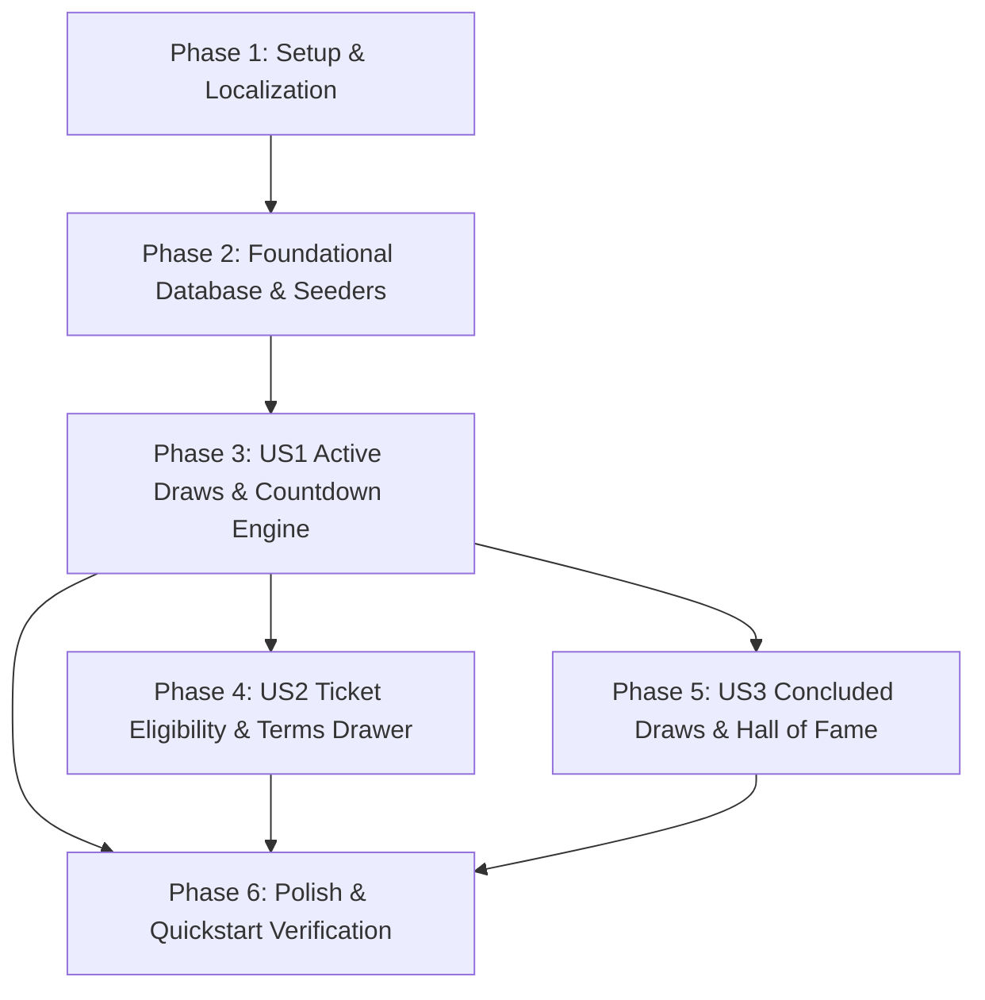

# Tasks: Arena of Draws & Promotional Countdowns

**Branch**: `003-draws-arena-countdown` | **Date**: 2026-09-29 | **Spec**: [spec.md](file:///d:/Work%20Projects/Knzin%20Project/specs/003-draws-arena-countdown/spec.md) | **Plan**: [plan.md](file:///d:/Work%20Projects/Knzin%20Project/specs/003-draws-arena-countdown/plan.md)

---

## CRITICAL INVARIANTS & AGENT GUARDRAILS

> [!IMPORTANT]
> **Strict Rules for Implementation Agents**:
> 1. **SCOPE LOCK (NO PHASE-3 CODE)**: Do NOT write code for payment gateway webhooks (ZainCash/Qi Card), live ticket serial minting from checkout orders, or cryptographic RNG commit-reveal algorithms. Feature 003 is strictly the front-of-house marketing showcase, countdown engine, and social proof archive.
> 2. **EXACT MIGRATION SEQUENCE**: Previous migrations in `backend/database/migrations/` end at `2026_09_29_000006_create_lesson_progress_table.php`. New migrations MUST strictly use:
>    - `2026_09_29_000007_create_draws_table.php`
>    - `2026_09_29_000008_create_prizes_table.php`
>    - `2026_09_29_000009_create_draw_winners_table.php`
> 3. **DUAL-SURFACE MOUNTING**:
>    - The comprehensive 3-tier arena, terms accordion, and Hall of Fame mount on `/raffle` (`frontend/src/app/[locale]/raffle/page.tsx`).
>    - The high-converting Grand Prize marquee banner mounts on the Homepage (`frontend/src/components/catalog/CatalogClientView.tsx`) pulling from the same cached `useDraws()` hook.
> 4. **DECOUPLED EXECUTION TYPES**:
>    - `automated_electronic` (Hourly $100 / Daily): Transitions at `00:00:00` to a pulsating electronic audit spinner with certified ticket serial output. No live video.
>    - `live_broadcast` (Monthly Grand Draw / $500k): Transitions at `00:00:00` to the official YouTube Live streaming action button.
> 5. **ZERO-CLS TABULAR NUMERALS**: `CountdownClock.tsx` MUST use CSS `font-variant-numeric: tabular-nums` inside `<bdi dir="ltr">` with fixed slot widths (`min-w-[2.2rem]`) to guarantee zero layout shift.
> 6. **FINTECH INTEGRITY & MINOR UNITS**: All monetary values stored in `BIGINT UNSIGNED` USD cents (`valuation_usd_cents`). Secondary Iraqi Dinar labels (`display_iqd_label`) are strictly marketing display strings.
> 7. **DYNAMIC LOCK GATE & ROLLING QUERY**: `DrawController` retrieves draws with `starts_at <= now() AND ends_at > now() - 15m`. If `ends_at <= now()`, status is dynamically computed as `'locked'` without waiting for cron jobs.

---

## Phase 1: Setup & Localization

**Purpose**: Establishing shared TypeScript contracts, mock fallback fixtures, and bilingual translation dictionaries for the promotional draws domain.

- [ ] T001 Establish TypeScript interfaces for DrawItem, PrizeItem, ActiveDrawsResponse, and ConcludedDrawsResponse in frontend/src/types/draws.ts
- [ ] T002 [P] Create mock draw fixtures and offline fallback data in frontend/src/data/mock-draws.ts
- [ ] T003 [P] Add draws translation dictionary namespace for Arabic locale in frontend/messages/ar.json
- [ ] T004 [P] Add draws translation dictionary namespace for English locale in frontend/messages/en.json

---

## Phase 2: Foundational (Database Schema, Models & Seeders)

**Purpose**: Database migrations, Eloquent relationships, and realistic Iraqi promotional draw seed data.

**⚠️ CRITICAL**: Must be completed and verified before ANY user story implementation begins.

- [ ] T005 Create draws table migration with UUID PK, tier enum, execution_type enum, status enum, timestamps, and composite index in backend/database/migrations/2026_09_29_000007_create_draws_table.php
- [ ] T006 [P] Create prizes table migration with UUID PK, draw_id FK (cascade), valuation_usd_cents BIGINT, and display_iqd_label in backend/database/migrations/2026_09_29_000008_create_prizes_table.php
- [ ] T007 [P] Create draw_winners table migration with UUID PK, draw_id FK (restrict), masked winner fields, and winning ticket serial in backend/database/migrations/2026_09_29_000009_create_draw_winners_table.php
- [ ] T008 Create Eloquent models Draw, Prize, and DrawWinner with HasUuids trait, relationships, and scopes (active, locked, concluded) in backend/app/Models/
- [ ] T009 Create PromotionalDrawSeeder populating an authentic rolling schedule (4 hourly draws, 1 daily draw, 1 monthly grand draw, 3 past winners) in backend/database/seeders/PromotionalDrawSeeder.php

**Checkpoint**: Database migrated, models linked, and seed data populated. User story implementation can now begin.

---

## Phase 3: User Story 1 - Active Draws & Real-Time Countdown Experience (Priority: P1) 🎯 MVP Core

**Goal**: Visitors browse active promotional draws with live synchronizing countdown clocks, see trust assurance badges, and experience the pulsating lock transition when time reaches 00:00:00.

**Independent Test**: Visit `/ar` to verify the Grand Prize countdown hero, and `/ar/raffle` to verify the 3-tier arena cards. Confirm that countdown clocks decrement smoothly every second with zero layout shift, and transition to the pulsating lock state at `00:00:00`.

### Tests for User Story 1

- [ ] T010 [P] [US1] Create backend feature test for active draws endpoint asserting JSend envelope, server UTC timestamp, and computed lock state in backend/tests/Feature/DrawApiTest.php

### Implementation for User Story 1

- [ ] T011 [US1] Implement DrawResource formatting active draw payloads, computing dynamic locked status (ends_at <= now), and emitting trust badge labels in backend/app/Http/Resources/DrawResource.php
- [ ] T012 [US1] Implement DrawController with active method filtering draws with 15-minute grace window in backend/app/Http/Controllers/DrawController.php
- [ ] T013 [US1] Register GET /api/v1/draws/active route in backend/routes/api.php
- [ ] T014 [P] [US1] Implement useCountdown hook with client-to-server offset drift math and visibilitychange mobile wake listener in frontend/src/hooks/useCountdown.ts
- [ ] T015 [P] [US1] Implement useDraws hook with TanStack React Query caching (30s staleTime) and offline fallback in frontend/src/hooks/useDraws.ts
- [ ] T016 [P] [US1] Implement CountdownClock component rendering monospace tabular digit slots (tabular-nums) wrapped in bdi dir="ltr" in frontend/src/components/draws/CountdownClock.tsx
- [ ] T017 [P] [US1] Implement PulsatingLockBadge component branching between automated electronic audit spinner and YouTube Live stream trigger in frontend/src/components/draws/PulsatingLockBadge.tsx
- [ ] T018 [US1] Implement DrawCard component rendering prize imagery, tier badges, countdown clock, trust badge, and course CTA in frontend/src/components/draws/DrawCard.tsx
- [ ] T019 [US1] Implement HeroGrandPrizeCountdown marquee banner for the Monthly Grand Draw in frontend/src/components/draws/HeroGrandPrizeCountdown.tsx
- [ ] T020 [US1] Embed HeroGrandPrizeCountdown above the course catalog in frontend/src/components/catalog/CatalogClientView.tsx
- [ ] T021 [US1] Implement DrawsArena container component with active draws grid in frontend/src/components/draws/DrawsArena.tsx
- [ ] T022 [US1] Mount DrawsArena on the dedicated raffle page anchored above the legal shield in frontend/src/app/[locale]/raffle/page.tsx

**Checkpoint**: User Story 1 is fully functional and independently testable end-to-end. Visitors can explore synchronized active draws across Homepage and Raffle surfaces.

---

## Phase 4: User Story 2 - Transparent Ticket Eligibility & Expiry Rules (Priority: P2)

**Goal**: Learners inspect tier-specific ticket rules (Hourly/Daily tickets expire immediately upon draw conclusion; Monthly Grand Draw tickets persist across all active periods in that month).

**Independent Test**: Expand the "شروط وأهلية السحب" drawer on any draw card and verify that tier-specific expiry conditions, educational bundle incentives, and legal disclaimers render accurately in both Arabic and English.

### Implementation for User Story 2

- [ ] T023 [P] [US2] Implement DrawTermsAccordion collapsible drawer explaining tier-specific ticket lifecycle and educational promotional rules in frontend/src/components/draws/DrawTermsAccordion.tsx
- [ ] T024 [US2] Integrate DrawTermsAccordion into DrawCard component in frontend/src/components/draws/DrawCard.tsx

**Checkpoint**: User Stories 1 AND 2 are functional. Complete transparency and ticket lifecycle terms are verifiable on every draw card.

---

## Phase 5: User Story 3 - Concluded Draws & Official Live Stream Integration (Priority: P3)

**Goal**: Visitors and past participants can view recently concluded draws, inspect verified winning ticket numbers and winner governorates, and access recorded or live YouTube draw broadcasts.

**Independent Test**: Navigate to `/ar/raffle`, switch to the "السحوبات المكتملة" (Concluded Draws) tab, verify that historical winner cards render with masked names and ticket numbers (e.g. `#KNZ-H12-8821`), and confirm external link redirection to YouTube Live.

### Implementation for User Story 3

- [ ] T025 [P] [US3] Implement DrawWinnerResource serializing privacy-masked winners, ticket serials, and broadcast replay URLs in backend/app/Http/Resources/DrawWinnerResource.php
- [ ] T026 [US3] Implement concluded method in DrawController and register GET /api/v1/draws/concluded route in backend/routes/api.php
- [ ] T027 [P] [US3] Implement ConcludedDrawsList component rendering Hall of Fame cards with ticket serials, winner governorates, and YouTube replay actions in frontend/src/components/draws/ConcludedDrawsList.tsx
- [ ] T028 [US3] Integrate active vs. concluded tab switching in DrawsArena component in frontend/src/components/draws/DrawsArena.tsx

**Checkpoint**: All 3 user stories are complete and fully operational. The complete active-to-concluded promotional lifecycle is functional.

---

## Phase 6: Polish, Verification & Quality Gate Sign-Off

**Purpose**: Automated test execution, quickstart validation, and cross-cutting responsive layout certification.

- [ ] T029 Execute automated backend feature tests verifying status transitions, lock windows, and privacy masking in backend/tests/Feature/DrawApiTest.php
- [ ] T030 [P] Audit bidirectional RTL/LTR layout mirroring and typography across mobile (375px) to desktop (1920px) viewports in frontend/src/app/[locale]/raffle/page.tsx
- [ ] T031 Execute and document all 5 verification scenarios from quickstart.md in specs/003-draws-arena-countdown/quickstart.md

---

## Dependencies & Execution Order

### Phase Dependencies

- **Setup (Phase 1)**: No dependencies — can start immediately.
- **Foundational (Phase 2)**: Depends on Phase 1 — **BLOCKS all user stories**.
- **User Story 1 (Phase 3 - P1 MVP)**: Depends on Phase 2. Can be implemented and tested independently.
- **User Story 2 (Phase 4 - P2)**: Depends on Phase 2 and US1 DrawCard component.
- **User Story 3 (Phase 5 - P3)**: Depends on Phase 2 and US1 DrawsArena container.
- **Polish (Phase 6)**: Depends on completion of all user stories.

### User Story Dependencies

---

## Parallel Execution Opportunities

- **Setup Phase (Phase 1)**: `T002`, `T003`, and `T004` can run in parallel with `T001`.
- **Foundational Phase (Phase 2)**: Migrations `T006` and `T007` can be created in parallel with `T005`.
- **User Story 1 (Phase 3)**:
  - Backend test `T010` and resources `T011`/`T012` can be implemented in parallel with frontend hooks `T014` and `T015`.
  - Frontend UI components `T016` (`CountdownClock`) and `T017` (`PulsatingLockBadge`) can be built in parallel.
  - `HeroGrandPrizeCountdown` (`T019`) and `DrawCard` (`T018`) can be developed concurrently.
- **User Story 2 & 3**:
  - `T023` (`DrawTermsAccordion`) and `T025` (`DrawWinnerResource`) can run in parallel across frontend and backend.

---

## Implementation Strategy: MVP First

1. **Step 1**: Execute Phase 1 (Setup) and Phase 2 (Foundational) to establish database tables, Eloquent models, and seed schedule.
2. **Step 2**: Execute Phase 3 (User Story 1 - Active Draws & Countdown). **STOP and VALIDATE**: At this checkpoint, visitors can view real-time synchronized countdowns for the Grand Prize on the Homepage and explore the 3-tier arena on `/raffle`. This is the working MVP.
3. **Step 3**: Execute Phase 4 (User Story 2) to attach transparency and ticket lifecycle terms to each draw card.
4. **Step 4**: Execute Phase 5 (User Story 3) to enable the Concluded Hall of Fame tab and YouTube Live stream integration.
5. **Step 5**: Execute Phase 6 (Polish & Verification) to run all 5 `quickstart.md` scenarios and certify Constitution compliance.
