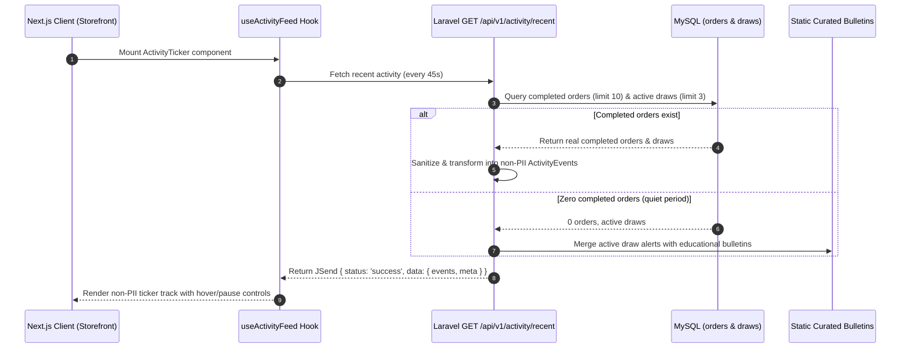

# Implementation Plan: Feature 004 — Front-of-House Trust, Engagement & Social Proof Suite

**Branch**: `004-front-of-house-trust-engagement` | **Date**: 2026-09-30 | **Spec**: [spec.md](./spec.md)  
**Input**: Finalized feature specification from `specs/004-front-of-house-trust-engagement/spec.md`  

---

## Summary

Feature 004 delivers the public storefront's **Trust, Engagement & Social Proof Suite (منظومة الثقة والتفاعل والإثبات الاجتماعي)**. It converts first-time visitors and skeptical learners into enrolled participants through 6 core capabilities:
1. **The Hook / Vision Narrative** (`TheHookSection.tsx`): Canonical Arabic founder quote on homepage combining vocational skill training with startup funding.
2. **"How It Works" 3-Step Interactive Onboarding** (`HowItWorksModal.tsx`): 1-to-2 click accessible dialog modal from Header HUD explaining the non-gambling educational gift model with focus trap and Escape dismissal.
3. **Live Social Proof & Urgency Ticker** (`ActivityTicker.tsx`): Streaming non-PII recent course enrollments, promotional ticket issuances, upcoming draw alarms, and educational bulletins, backed by a lightweight, read-only public endpoint (`GET /api/v1/activity/recent`).
4. **Persistent Floating WhatsApp Customer Support** (`FloatingWhatsAppButton.tsx`): Accessible support button positioned via logical CSS (`bottom-6 end-6`), equipped with an in-app fallback dialog pointing to `#faq` when unconfigured.
5. **Public FAQ & Objection Handling Accordion** (`FaqAccordion.tsx`): 5-category accordion resolving core questions (Platform model, Course downloads, Draw audits, 40% referral co-prize, Winner KYC) with WAI-ARIA keyboard navigation.
6. **Winner KYC Compliance Transparency Card** (`WinnerKycCard.tsx`): Official National ID (بطاقة وطنية) claim requirement card rendered on `/raffle` and within the FAQ.

---

## Technical Context

**Language/Version**:
- Frontend: TypeScript 5+, React 19.2.8, Next.js 16.3.6 (App Router)
- Backend: PHP 8.2+, Laravel 11.x

**Primary Dependencies**:
- Frontend: `@radix-ui/react-dialog` (v1.1.23), `@radix-ui/react-accordion` (v1.2.20), `next-intl` (v4.14.7), `lucide-react` (v1.48.0), `tailwindcss` (v4), `@tanstack/react-query` (v5.104.0)
- Backend: Laravel Framework 11.x, Laravel Sanctum, MySQL PDO

**Storage**:
- Persistence: MySQL 8+ / MariaDB (`utf8mb4_unicode_ci`, InnoDB)
- Existing Tables Queried: `orders` (completed status), `order_items`, `courses`, `course_parts`, `draws` (scheduled status), `prizes`
- Database Migrations: Zero new migrations required for Feature 004

**Testing**:
- Frontend: Node.js native test runner (`node --import tsx --test src/tests/*.test.ts`)
- Backend: PHPUnit / Pest via `php artisan test`

**Target Platform**:
- Responsive Web: Desktop (&ge;1024px), Tablet (768px–1023px), Mobile (375px–767px)
- Locales: Arabic (`ar`, `dir="rtl"`, primary) & English (`en`, `dir="ltr"`, secondary)

**Project Type**: Full-stack web application (Next.js client + Laravel REST API)

**Performance Goals**:
- Activity Ticker Cumulative Layout Shift: `CLS = 0.00`
- Ticker pause latency on hover/focus: `< 50ms`
- FAQ Accordion expand/collapse CSS transition: `< 250ms`
- Onboarding modal activation: `< 100ms`
- Target hash navigation clearance: `&ge; 80px` below sticky Header HUD

**Constraints**:
- Strict Non-PII serialization: No customer names, emails, phone numbers, governorates, or database UUIDs in public activity feed.
- Truthful social proof: Zero fabricated customer names or simulated transactions; quiet periods fall back to static educational bulletins and draw countdown alerts.
- No invented support contacts: Zero fabricated support emails or phone numbers.
- Strict scope isolation: No student library, no ticket serial minting table, no 40% affiliate engine code, no payment gateway webhooks, no KYC upload forms.

---

## Constitution Check

| Principle | Status | Evaluation & Architectural Guarantee |
| :--- | :--- | :--- |
| **I. Evidence-First & Brownfield** | **PASS** | Builds directly on verified existing tables (`orders`, `draws`, `courses`) from Features 001–003. Fabricated customer identities are strictly banned. |
| **II. Full-Stack Ownership** | **PASS** | Plans both the Laravel backend endpoint (`GET /api/v1/activity/recent`) with `ActivityEventResource` and the Next.js frontend UI components. |
| **III. Context Reconciliation** | **PASS** | Reconciles the Master Brief's live hooks with the Constitution's strict truthfulness mandate via non-PII enrollments and educational bulletins. |
| **IV. Owner Interaction Policy** | **PASS** | All product ambiguities resolved via the adversarial clarification pass; zero open architectural questions remain. |
| **V. Arabic-First RTL/LTR & a11y** | **PASS** | Tajawal font, logical CSS (`bottom-6 end-6`), `<bdi>` bidirectional text isolation, WAI-ARIA dialog/accordion, touch targets &ge;44x44px. |
| **VI. Strict Legal Decoupling** | **PASS** | "How It Works" and FAQ re-enforce the 100% vocational educational purchase model with complimentary promotional draw entries. |
| **VII. Financial & Data Integrity** | **PASS** | Client never computes or alters balances; Activity API is strictly read-only and server-sanitized. |
| **VIII. Payment & DB Integrity** | **PASS** | Queries completed orders from the database; zero database migrations required. |
| **IX. Fair Draws & Transparency** | **PASS** | Urgency alerts pull directly from scheduled draws; Winner KYC compliance card enforces official identity verification rules. |
| **X. Server-Enforced Auth & KYC** | **PASS** | Winner KYC disclaimer published publicly; post-draw file upload workflows remain isolated in Feature 008. |
| **XI. SDD Lifecycle Gates** | **PASS** | Spec clarified & checklist validated (16/16); `plan.md` created before tasks or implementation. |

---

## Project Structure

### Documentation (this feature)

```text
specs/004-front-of-house-trust-engagement/
├── spec.md              # Finalized requirements specification
├── checklists/
│   └── requirements.md  # 16/16 validated specification checklist
├── plan.md              # Technical implementation plan (this document)
├── research.md          # Technical research & decision log
├── data-model.md        # Entities, DTOs, and domain contracts
├── quickstart.md        # Validation guide and verification scenarios
├── contracts/
│   ├── activity-recent.v1.json  # OpenAPI 3.1 specification for activity endpoint
│   └── ui-contracts.md          # Frontend component props & accessibility contracts
└── tasks.md             # Implementation tasks (created in next phase: /speckit-tasks)
```

### Source Code (repository root)

```text
backend/
├── app/
│   ├── Http/
│   │   ├── Controllers/
│   │   │   └── ActivityController.php        # GET /api/v1/activity/recent implementation
│   │   └── Resources/
│   │       └── ActivityEventResource.php     # Non-PII sanitization & bilingual DTO
│   └── Models/
│       ├── Order.php                         # Existing Feature 002 model
│       └── Draw.php                          # Existing Feature 003 model
├── routes/
│   └── api.php                               # Registers Route::get('/activity/recent', ...)
└── tests/
    └── Feature/
        └── ActivityApiTest.php               # PHPUnit test suite for activity feed & privacy

frontend/
├── messages/
│   ├── ar.json                               # Arabic translations for trust & engagement suite
│   └── en.json                               # English translations for trust & engagement suite
└── src/
    ├── app/
    │   └── [locale]/
    │       ├── layout.tsx                    # Mounts ActivityTicker & FloatingWhatsAppButton
    │       ├── page.tsx                      # Homepage server entry
    │       └── raffle/
    │           └── page.tsx                  # Mounts WinnerKycCard in raffle transparency
    ├── components/
    │   ├── catalog/
    │   │   └── CatalogClientView.tsx         # Mounts TheHookSection & FaqAccordion
    │   ├── compliance/
    │   │   └── WinnerKycCard.tsx             # Public KYC compliance card
    │   ├── faq/
    │   │   └── FaqAccordion.tsx              # 5-category accessible FAQ accordion
    │   ├── home/
    │   │   └── TheHookSection.tsx            # Founder philosophy vision narrative
    │   └── layout/
    │       ├── ActivityTicker.tsx            # Real-time social proof & countdown ticker
    │       ├── FloatingWhatsAppButton.tsx    # Persistent floating WhatsApp support
    │       ├── HeaderHUD.tsx                 # Integrates "How It Works" triggers (desktop & mobile)
    │       ├── HowItWorksModal.tsx           # 3-step accessible onboarding dialog
    │       ├── MobileNavSheet.tsx            # Adds "How It Works" drawer navigation item
    │       └── WhatsAppFallbackDialog.tsx    # Unconfigured fallback dialog pointing to #faq
    ├── hooks/
    │   └── useActivityFeed.ts                # React Query polling hook (30-60s interval)
    └── tests/
        └── TrustAndEngagementInvariants.test.ts # Node.js test suite for frontend invariants
```

---

## Architectural Breakdown

### 1. The Hook / Vision Narrative (`TheHookSection.tsx`)
- **Placement**: Homepage between `HeroGrandPrizeCountdown` (and `ResumeHeroCard`) and the Course Grid (`CatalogClientView.tsx`).
- **Anchor & Clearance**: `<section id="vision" className="scroll-mt-20 sm:scroll-mt-24">`.
- **Text Fidelity**: Verbatim Arabic founder mission from Master Brief line 46:  
  *«نحن نؤمن بأن الشباب يحتاجون إلى المهارة ورأس المال معاً. لذلك، نحن نعلمك مهارات العمل الحر، ونمنحك فرصة لربح تمويل مشروعك في نفس الوقت.»*
- **Typography & Responsive Styling**: Glassmorphic dark card, emerald/gold gradient border accents, responsive font sizing (`text-lg sm:text-2xl`), balanced typography in both Arabic (`dir="rtl"`) and English (`dir="ltr"`).

---

### 2. "How It Works" 3-Step Interactive Onboarding (`HowItWorksModal.tsx`)
- **Header HUD Integration**:
  - **Desktop (&ge;1024px)**: Prominent button in navbar with `HelpCircle` icon: `«كيف تعمل كَنزين؟»` / `«How It Works»` (1 click).
  - **Mobile Header HUD (<1024px)**: Compact question-mark button in the sticky top HUD (1 click).
  - **Mobile Drawer (`MobileNavSheet.tsx`)**: Dedicated navigation item with badge (2 clicks).
- **Dialog Architecture**:
  - Reuses `@/components/ui/dialog` (Radix UI).
  - Automatically handles focus trapping, Escape key dismiss, and focus restoration to trigger.
  - Step 1: **اختر الكورس والمهارة** ($2 part / $10 bundle).
  - Step 2: **استلم تذكرتك المجانية** (1 ticket / 15 tickets free promotional grant).
  - Step 3: **تابع السحب المباشر** (YouTube Live public broadcast).
  - Directional alignment: Steps flow right-to-left in Arabic and left-to-right in English.

---

### 3. Public Activity API (`GET /api/v1/activity/recent`)
- **Server Implementation**:
  - Controller: `backend/app/Http/Controllers/ActivityController.php`.
  - Resource: `backend/app/Http/Resources/ActivityEventResource.php`.
  - Queries `Order::where('status', 'completed')->with(['items.course', 'items.part'])->latest()->take(10)->get()`.
  - Queries `Draw::where('status', 'scheduled')->where('scheduled_at', '>', now())->orderBy('scheduled_at')->take(3)->with('prize')->get()`.
- **Data Sanitization & Privacy Invariant**:
  - **Database Order &rarr; Server-Side Sanitizer &rarr; Public Event DTO &rarr; JSON Response**.
  - `id`: Masked hex string (`evt_ord_[hash]`, `evt_drw_[hash]`, `evt_blt_[hash]`).
  - Personal customer names, emails, phone numbers, governorates, and database UUIDs are strictly stripped.
  - Formatted text: `«انضمام متعلم جديد إلى كورس {course} — تم منح {tickets} تذكرة مجانية!»`.
- **Quiet Period & Zero-Order Fallback**:
  - If completed orders count is zero, the response automatically pads with active draw countdown urgency alerts and curated platform educational bulletins without fabricating customer activity.

---

### 4. Activity Ticker UI (`ActivityTicker.tsx`)
- **Mount Point**: In `layout.tsx` directly beneath `<HeaderHUD />`.
- **Presentation**: Continuous CSS marquee track (`h-10`, 40px fixed height) with `CLS = 0.00`.
- **Data Hook**: `useActivityFeed.ts` using `@tanstack/react-query` with a 45-second polling interval and local memory cache.
- **Accessibility & Motion**:
  - Hover/Focus pause: Instantly pauses marquee scrolling on mouse enter or keyboard focus (`:hover`, `:focus-within`).
  - Reduced motion: When `prefers-reduced-motion: reduce` is active, marquee scrolling is disabled; events render in a static or discretely scrollable strip.
  - Bidirectional text safety: Mixed Arabic/English/numerical strings wrapped in `<bdi>`.

---

### 5. Persistent Floating WhatsApp Support (`FloatingWhatsAppButton.tsx`)
- **Positioning**: Fixed logical CSS `bottom-6 end-6 z-40`.
  - Bottom-left in Arabic (`dir="rtl"`).
  - Bottom-right in English (`dir="ltr"`).
  - Touch target: `56x56px` (`w-14 h-14`).
- **Configuration & Action**:
  - Destination read from `NEXT_PUBLIC_WHATSAPP_SUPPORT_URL`.
  - Opens in new tab with pre-filled greeting: `مرحباً، لدي استفسار حول منصة كَنزين`.
- **Fallback Dialog (`WhatsAppFallbackDialog.tsx`)**:
  - If environment variable is missing, empty, or unparseable:
  - Clicking button triggers an accessible dialog explaining live WhatsApp chat is currently offline and guiding visitor to `#faq`.
  - **Zero invented email addresses or phone numbers.**
- **Collision Avoidance**: Uses `z-40`, naturally covered by `CheckoutBottomSheet`'s `z-50` modal backdrop.

---

### 6. Public FAQ & Objection Handling Accordion (`FaqAccordion.tsx`)
- **Mount Point**: In `CatalogClientView.tsx` beneath the Course Grid.
- **Anchor**: `<section id="faq" className="scroll-mt-20 sm:scroll-mt-24 space-y-6">`.
- **Component**: Built on `@/components/ui/accordion` (Radix UI).
- **5 Structured Categories**:
  1. Platform Model & Promotional Tickets (`model`)
  2. Course Downloads & Educational Access (`downloads`)
  3. Draw Transparency & YouTube Live (`draws`)
  4. Referral System & The 40% Co-Prize (`referral`) — *Informational only; zero affiliate tracking code in Feature 004*
  5. Winner Identification & KYC Claims (`kyc`)
- **Default State**: First question in each category expanded by default (`type="multiple"` with `defaultValue`).
- **Keyboard Navigation**: Standard WAI-ARIA keys (`Tab`, `Enter`, `Space`, `ArrowUp`, `ArrowDown`).

---

### 7. Winner KYC Compliance Transparency Card (`WinnerKycCard.tsx`)
- **Mount Points**:
  1. Embedded compliance notice inside `FaqAccordion.tsx` under category `kyc`.
  2. Standalone card on `/raffle` page in the legal transparency section.
- **Verbatim Requirement**:
  *«شرط تسليم الجوائز: يُلزم الفائز بتقديم إثبات هوية رسمي يطابق البيانات الأساسية (مثل البريد الإلكتروني) التي تم الشراء بها، وللإدارة الحق في حجب الجائزة في حال ثبوت تلاعب أو استخدام بطاقات دفع مسروقة.»*
- **Strict Scope Boundary**: Read-only informational card. Zero file inputs, document upload forms, or verification APIs.

---

### 8. Navigation & Sticky Header Clearance Architecture
- **Same-Page Anchors (`/#vision`, `/#faq`)**:
  - HTML anchor navigation with native browser scrolling.
  - Progress bar exclusion: `progress-utils.ts` already rejects same-page hash changes, ensuring zero artificial loading bar flicker.
- **Cross-Route Anchors (e.g. `/raffle` &rarr; `/#faq`)**:
  - Router navigates to `/`, renders page, and settles focus on `#faq`.
- **Sticky Header Clearance**:
  - Every target container declares `scroll-mt-20 sm:scroll-mt-24` (80px–96px top scroll margin).
  - Eliminates JavaScript race conditions and guarantees full visibility below the 64px Header HUD.

---

## Data Flow Architecture



---

## Testing & Verification Strategy

### 1. Deterministic Backend Tests (`backend/tests/Feature/ActivityApiTest.php`)
- `test_activity_recent_returns_200_jsend_structure()`: Verifies HTTP 200, JSend `status: success`, and array of events.
- `test_activity_recent_sanitizes_pii_strictly()`: Verifies response contains zero `email`, `user_id`, `terms_agreed_ip`, or order UUIDs.
- `test_activity_recent_formats_non_pii_enrollment_events()`: Verifies Arabic/English text matches canonical non-PII patterns.
- `test_activity_recent_falls_back_to_bulletins_when_orders_are_empty()`: Seeds 0 orders and asserts response includes active draws and educational bulletins with `has_live_orders: false`.
- `test_activity_recent_handles_active_draw_countdown_alerts()`: Seeds active draw and asserts `countdown_alert` event.

### 2. Deterministic Frontend Tests (`frontend/src/tests/TrustAndEngagementInvariants.test.ts`)
- `test_bilingual_dictionary_parity()`: Asserts 100% key parity between `messages/ar.json` and `messages/en.json` across `theHook`, `howItWorks`, `ticker`, `faq`, `whatsapp`, and `kyc`.
- `test_the_hook_verbatim_quote()`: Asserts exact canonical founder philosophy text.
- `test_how_it_works_canonical_3_steps()`: Asserts sequence, icons, and pricing rules ($2 part / $10 bundle).
- `test_whatsapp_fallback_dialog_triggers()`: Asserts fallback behavior when URL is unconfigured, ensuring zero fabricated emails/phones.
- `test_winner_kyc_verbatim_disclaimer()`: Asserts exact matching of National ID requirement.

### 3. Browser & Viewport Verification
- Verify "How It Works" modal focus trapping and Escape key restoration on desktop and mobile viewports.
- Verify Activity Ticker pauses on hover and keyboard focus.
- Verify Floating WhatsApp button logical positioning (`bottom-6 end-6`) in Arabic (bottom-left) and English (bottom-right).
- Verify section anchors (`/#vision`, `/#faq`) clear the sticky Header HUD by &ge;80px.

---

## Traceability Matrix

| Requirement / Criterion | Implementation Component | Technical Decision | Verification Method |
| :--- | :--- | :--- | :--- |
| **FR-001, FR-002, SC-002** (The Hook) | `TheHookSection.tsx` | Glassmorphic card between Hero & Catalog with verbatim quote | Unit test + browser visual check |
| **FR-003, FR-004, FR-005, FR-025, SC-001** (How It Works) | `HowItWorksModal.tsx`, `HeaderHUD.tsx`, `MobileNavSheet.tsx` | Radix Dialog with dual-surface desktop/mobile triggers | Unit test + modal focus trap test |
| **FR-006, FR-007, FR-011, SC-003** (Activity Ticker) | `ActivityController.php`, `ActivityTicker.tsx`, `useActivityFeed.ts` | Server non-PII transformation, zero-order fallback, CSS marquee pause | `ActivityApiTest` + ticker pause test |
| **FR-008, FR-009, FR-010** (Ticker UX & A11y) | `ActivityTicker.tsx` | `<bdi>` tags, hover/focus pause, `prefers-reduced-motion` | Node invariant test + CSS inspection |
| **FR-012, FR-013, FR-014, FR-015, SC-004** (WhatsApp Support) | `FloatingWhatsAppButton.tsx`, `WhatsAppFallbackDialog.tsx` | Logical `bottom-6 end-6`, in-app offline dialog without fake emails | Node invariant test + fallback modal test |
| **FR-016, FR-017, FR-018, SC-005** (FAQ Accordion) | `FaqAccordion.tsx` | Radix Accordion with first item expanded, WAI-ARIA keys | Node invariant test + keyboard navigation |
| **FR-019, SC-006** (Section Clearance) | `TheHookSection.tsx`, `FaqAccordion.tsx` | CSS `scroll-mt-20 sm:scroll-mt-24` (&ge;80px margin) | Hash navigation clearance test |
| **FR-020, FR-021, SC-007** (Winner KYC Card) | `WinnerKycCard.tsx` | Read-only compliance card on `/raffle` and FAQ | Node invariant test + verbatim matching |
| **FR-022, FR-023, FR-024** (Responsive & A11y) | All components | Touch targets &ge;44x44px, Tajawal font, RTL/LTR mirroring | Viewport audit + CSS validation |

---

## Complexity Tracking

*No constitutional violations exist. Zero new database migrations, zero heavy animation libraries, and zero foreign abstractions introduced.*

| Area | Decision | Why Chosen | Simpler Alternative Rejected |
| :--- | :--- | :--- | :--- |
| **Activity Feed** | Laravel endpoint + React Query | Server-authoritative sanitization guaranteeing zero PII leakage | Client-side fake order generator (rejected: violates truthfulness) |
| **Modal UI** | Radix UI Dialog primitive | Native WAI-ARIA compliance, focus trap, and Escape dismissal | Hand-rolled modal (rejected: prone to focus leaks and a11y bugs) |
| **Section Clearance** | CSS `scroll-margin-top` | Hardware-accelerated, responsive, zero JS race conditions | JavaScript `window.scrollTo` offsets (rejected: brittle and laggy) |
