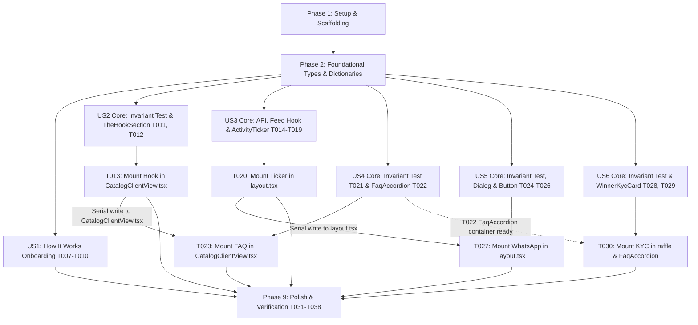

# Tasks: Feature 004 — Front-of-House Trust, Engagement & Social Proof Suite

**Feature Branch**: `004-front-of-house-trust-engagement`  
**Specification**: [spec.md](./spec.md)  
**Implementation Plan**: [plan.md](./plan.md)  
**Design Artifacts**: [research.md](./research.md) | [data-model.md](./data-model.md) | [contracts/activity-recent.v1.json](./contracts/activity-recent.v1.json) | [contracts/ui-contracts.md](./contracts/ui-contracts.md) | [quickstart.md](./quickstart.md)  

---

## Overview & Execution Strategy

This task list decomposes the implementation of **Feature 004: Front-of-House Trust, Engagement & Social Proof Suite (منظومة الثقة والتفاعل والإثبات الاجتماعي)** into 38 dependency-ordered, testable tasks across 9 phases.

- **MVP Scope**: User Story 1 ("How It Works" 3-Step Interactive Onboarding) provides immediate customer clarity.
- **Strict Data Privacy**: Activity events strictly mask internal IDs (`^evt_(ord|drw|blt)_[a-f0-9]{12}$`) with zero PII serialization.
- **Strict Truthfulness**: Prohibits simulated customer identities; quiet periods automatically fall back to static educational bulletins and draw countdown alerts.
- **Zero Database Migrations**: Queries existing `orders` and `draws` tables from Features 001–003.
- **Strict Scope Guard**: Strictly excludes Features 005–009 (no ticket serial minting table, no student library, no payment gateway webhooks, no affiliate tracking engine, no KYC upload forms).

---

## Phase 1: Setup & Project Scaffolding

**Purpose**: Initialize directory layout and verify environment runtime readiness.

- [X] T001 Create component directories for home, faq, and compliance in `frontend/src/components/home`, `frontend/src/components/faq`, and `frontend/src/components/compliance`
- [X] T002 Verify local runtime services (MySQL on port 3306, Laravel API on 8000, Next.js dev server on 3000) and ensure `NEXT_PUBLIC_WHATSAPP_SUPPORT_URL` is defined in `frontend/.env.local`

---

## Phase 2: Foundational Work (Prerequisites for All Stories)

**Purpose**: Core TypeScript interfaces and shared bilingual localization dictionaries that block user story implementation.

- [X] T003 [P] Create TypeScript interfaces for Activity Ticker events and JSend response envelope in `frontend/src/types/activity.ts` per `data-model.md` (`ActivityEvent`, `ActivityFeedResponse`, `ActivityFeedMeta`)
- [X] T004 [P] Create TypeScript interfaces for FAQ and Onboarding in `frontend/src/types/faq.ts` per `data-model.md` (`FaqItem`, `FaqCategory`, `HowItWorksStep`, `WinnerKycDisclaimer`)
- [X] T005 [P] Scaffold Arabic localization dictionary in `frontend/messages/ar.json` adding complete translation keys across namespaces `theHook`, `howItWorks`, `ticker`, `faq`, `whatsapp`, and `kyc`
- [X] T006 [P] Scaffold English localization dictionary in `frontend/messages/en.json` adding matching translation keys across all 6 namespaces with 100% key parity

**Checkpoint**: Foundational types and bilingual dictionaries ready — user story implementation can begin.

---

## Phase 3: User Story 1 — Header "How It Works" 3-Step Interactive Onboarding (Priority: P1) 🎯 MVP

**Goal**: Deliver a 1-to-2 click accessible onboarding dialog modal explaining the 3-step vocational educational purchase model ($2 part / $10 bundle) with complimentary promotional tickets and YouTube Live draw transparency.

**Independent Test**: Click "كيف تعمل كَنزين؟" in desktop Header HUD, mobile shortcut icon (`?`), or mobile drawer item; verify modal opens, focus is trapped, 3 sequential steps render cleanly with icons, and `Escape` key dismisses modal restoring focus to trigger.

### Tests for User Story 1

- [X] T007 [P] [US1] Create unit tests in `frontend/src/tests/HowItWorksInvariants.test.ts` asserting "How It Works" 3-step sequence, icons (`BookOpen`, `Ticket`, `Trophy`), pricing invariants ($2 / $10), and bilingual dictionary synchronization

### Implementation for User Story 1

- [X] T008 [US1] Implement `frontend/src/components/layout/HowItWorksModal.tsx` reusing `@/components/ui/dialog` with WAI-ARIA focus trap, `Escape` key dismissal, focus restoration, and responsive RTL/LTR step flow
- [X] T009 [US1] Integrate desktop 1-click trigger button (`«كيف تعمل كَنزين؟»` / `«How It Works»`) and mobile 1-click shortcut icon (`HelpCircle`) into `frontend/src/components/layout/HeaderHUD.tsx`
- [X] T010 [US1] Integrate mobile 2-click drawer navigation item into `frontend/src/components/layout/MobileNavSheet.tsx` with descriptive subtitle and step badge

**Checkpoint**: User Story 1 functional and independently testable on desktop and mobile viewports.

---

## Phase 4: User Story 2 — The Hook / Vision Narrative Experience (Priority: P1)

**Goal**: Present the authoritative founder philosophy and vocational empowerment vision on the homepage between the Hero Countdown and Course Catalog, establishing brand legitimacy and non-gambling educational purpose.

**Independent Test**: Navigate to `/ar` and `/en`, verify `TheHookSection` renders below `HeroGrandPrizeCountdown` with verbatim founder text, responsive typography, and smooth scrolling to `/#vision` clearing the sticky header by ≥80px.

### Tests for User Story 2

- [X] T011 [P] [US2] Create unit test in `frontend/src/tests/TheHookInvariants.test.ts` asserting verbatim match of canonical founder quote: `«نحن نؤمن بأن الشباب يحتاجون إلى المهارة ورأس المال معاً. لذلك، نحن نعلمك مهارات العمل الحر، ونمنحك فرصة لربح تمويل مشروعك في نفس الوقت.»`

### Implementation for User Story 2

- [X] T012 [US2] Implement `frontend/src/components/home/TheHookSection.tsx` with verbatim Arabic/English founder text, glassmorphic styling, responsive typography, and `<section id="vision" className="scroll-mt-20 sm:scroll-mt-24">`
- [X] T013 [US2] Mount `TheHookSection.tsx` in `frontend/src/components/catalog/CatalogClientView.tsx` directly between `HeroGrandPrizeCountdown` (and `ResumeHeroCard`) and the Course Grid

**Checkpoint**: User Stories 1 and 2 functional and independently verifiable on homepage.

---

## Phase 5: User Story 3 — Real-Time Social Proof & Activity Ticker (Priority: P2)

**Goal**: Stream verified non-PII course purchases, promotional ticket awards, upcoming draw countdown alarms, and educational bulletins via a purpose-built public read-only API and smooth marquee ticker that pauses on hover/focus.

**Independent Test**: Verify `GET /api/v1/activity/recent` returns HTTP 200 with non-PII events; verify frontend `ActivityTicker` scrolls continuously, pauses within 50ms of hover/focus, respects `prefers-reduced-motion`, and uses `<bdi>` for mixed text.

### Tests for User Story 3

- [X] T014 [P] [US3] Create backend feature test `backend/tests/Feature/ActivityApiTest.php` asserting JSend structure, non-PII sanitization (zero `email`, `user_id`, `terms_agreed_ip`, or order UUIDs), draw alarms, and quiet-period static bulletin fallback

### Implementation for User Story 3

- [X] T015 [US3] Implement `backend/app/Http/Resources/ActivityEventResource.php` transforming completed orders and scheduled draws into non-PII DTOs with masked ID format `^evt_(ord|drw|blt)_[a-f0-9]{12}$`
- [X] T016 [US3] Implement `backend/app/Http/Controllers/ActivityController.php` querying completed `orders` (limit 10) and scheduled `draws` (limit 3), falling back to curated educational bulletins when live completed orders are zero
- [X] T017 [US3] Register public unauthenticated route `Route::get('/activity/recent', [ActivityController::class, 'recent'])` in `backend/routes/api.php`
- [X] T018 [P] [US3] Implement client-side polling hook `frontend/src/hooks/useActivityFeed.ts` using `@tanstack/react-query` with 45s interval, memory caching, and offline fallback
- [X] T019 [US3] Implement `frontend/src/components/layout/ActivityTicker.tsx` with CSS marquee track (`h-10`, `CLS = 0.00`), hover/focus pause, `<bdi>` text wrapping, and static discrete display for `prefers-reduced-motion: reduce`
- [X] T020 [US3] Mount `ActivityTicker.tsx` directly beneath `<HeaderHUD />` in `frontend/src/app/[locale]/layout.tsx` across all public routes

**Checkpoint**: User Stories 1, 2, and 3 functional with live backend polling and zero PII exposure.

---

## Phase 6: User Story 4 — Public FAQ & Objection Handling Accordion (Priority: P2)

**Goal**: Provide an accessible 5-category FAQ accordion on the homepage answering core customer objections (Platform model, Course downloads, Draw audits, 40% referral co-prize, Winner KYC) with WAI-ARIA keyboard navigation and first question expanded.

**Independent Test**: Navigate to `/#faq` on homepage; verify section scrolls with ≥80px header clearance, first question in each category is expanded by default, and `Tab`/`Enter`/`Space`/arrow keys navigate and toggle accordion items.

### Tests for User Story 4

- [X] T021 [P] [US4] Create unit test in `frontend/src/tests/FaqAccordionInvariants.test.ts` asserting 5 categories (`model`, `downloads`, `draws`, `referral`, `kyc`) and verifying default expanded item keys

### Implementation for User Story 4

- [X] T022 [US4] Implement `frontend/src/components/faq/FaqAccordion.tsx` reusing `@/components/ui/accordion` with `type="multiple"`, `defaultValue` expanding first item of each category, WAI-ARIA keys, and `<section id="faq" className="scroll-mt-20 sm:scroll-mt-24">`
- [X] T023 [US4] Mount `FaqAccordion.tsx` in `frontend/src/components/catalog/CatalogClientView.tsx` beneath the Course Grid (integration depends on T013)

**Checkpoint**: User Stories 1 through 4 functional with accessible objection handling.

---

## Phase 7: User Story 5 — Persistent Floating WhatsApp Customer Support (Priority: P3)

**Goal**: Render a persistent floating WhatsApp customer care button anchored inline-end (`bottom-6 end-6`) on all public pages, opening a pre-filled chat or an in-app fallback dialog pointing to `#faq` when unconfigured.

**Independent Test**: Verify button floats at bottom-left in Arabic (`dir="rtl"`) and bottom-right in English (`dir="ltr"`); verify clicking with valid URL opens WhatsApp; verify clicking with unconfigured URL opens fallback dialog explaining chat is offline (strictly zero invented emails/phones).

### Tests for User Story 5

- [X] T024 [P] [US5] Create unit test in `frontend/src/tests/WhatsAppButtonInvariants.test.ts` asserting WhatsApp pre-filled greeting URL formatting and fallback offline dialog state logic

### Implementation for User Story 5

- [X] T025 [US5] Implement `frontend/src/components/layout/WhatsAppFallbackDialog.tsx` explaining WhatsApp chat is offline and providing button scrolling to `/#faq` with zero invented contacts
- [X] T026 [US5] Implement `frontend/src/components/layout/FloatingWhatsAppButton.tsx` with logical positioning `fixed bottom-6 end-6 z-40`, touch target `w-14 h-14` (56x56px), pre-filled greeting (`«مرحباً، لدي استفسار حول منصة كَنزين»`), and fallback dialog trigger
- [X] T027 [US5] Mount `FloatingWhatsAppButton.tsx` in `frontend/src/app/[locale]/layout.tsx` (integration depends on T020)

**Checkpoint**: User Stories 1 through 5 functional across all public storefront routes.

---

## Phase 8: User Story 6 — Public Winner KYC Compliance & Legal Transparency (Priority: P3)

**Goal**: Display an official Winner KYC National ID claim transparency card on `/raffle` and within the FAQ, ensuring participants understand identification requirements without prematurely introducing upload forms or verification APIs.

**Independent Test**: Navigate to `/ar/raffle` and `/en/raffle`; verify Winner KYC transparency card renders verbatim National ID requirement and consumer protection law citation; verify zero document upload inputs or file upload forms appear.

### Tests for User Story 6

- [X] T028 [P] [US6] Create unit test in `frontend/src/tests/WinnerKycInvariants.test.ts` asserting verbatim match of National ID legal clause: `«شرط تسليم الجوائز: يُلزم الفائز بتقديم إثبات هوية رسمي يطابق البيانات الأساسية (مثل البريد الإلكتروني) التي تم الشراء بها، وللإدارة الحق في حجب الجائزة في حال ثبوت تلاعب أو استخدام بطاقات دفع مسروقة.»`

### Implementation for User Story 6

- [X] T029 [US6] Implement `frontend/src/components/compliance/WinnerKycCard.tsx` rendering verbatim Arabic/English legal claim clause, Consumer Protection Law No. 1 (2010) citation, and strictly read-only badge layout (zero file inputs)
- [X] T030 [US6] Mount `WinnerKycCard.tsx` as standalone card in `frontend/src/app/[locale]/raffle/page.tsx` within Raffle Transparency section AND embed as compliance highlight in `frontend/src/components/faq/FaqAccordion.tsx` under category `kyc` (integration into FaqAccordion depends on T022)

**Checkpoint**: All 6 user stories implemented and integrated across the storefront.

---

## Phase 9: Polish, Cross-Cutting & End-to-End Verification

**Purpose**: Full regression testing, quickstart scenario execution, and multi-viewport accessibility verification.

- [X] T031 [P] Execute backend test suite via `cd backend && php artisan test` and verify 100% pass across all tests including `ActivityApiTest`
- [X] T032 [P] Execute frontend test suite via `cd frontend && npm test` and verify 100% pass across all tests including `HowItWorksInvariants`, `TheHookInvariants`, `FaqAccordionInvariants`, `WhatsAppButtonInvariants`, and `WinnerKycInvariants`
- [X] T033 Execute Quickstart Scenario 1 in `quickstart.md`: Onboarding "How It Works" 1-to-2 click verification, focus trap, and `Escape` key restoration on desktop and mobile viewports
- [X] T034 Execute Quickstart Scenario 2 in `quickstart.md`: The Hook narrative visibility and ≥80px sticky header clearance on deep-link `/#vision`
- [X] T035 Execute Quickstart Scenario 3 in `quickstart.md`: Real-Time Activity Ticker continuous streaming, hover/focus pause, and `<bdi>` bidirectional text isolation
- [X] T036 Execute Quickstart Scenario 4 in `quickstart.md`: Floating WhatsApp button logical positioning (bottom-left RTL / bottom-right LTR) and unconfigured fallback offline dialog
- [X] T037 Execute Quickstart Scenario 5 in `quickstart.md`: Public FAQ accordion categories, default expansion of first item, WAI-ARIA keyboard navigation, and `/#faq` clearance
- [X] T038 Execute Quickstart Scenario 6 in `quickstart.md`: Winner KYC legal compliance notice on `/raffle` and within FAQ, confirming zero upload forms

---

## Dependencies & Execution Order

### Dependency Graph

### User Story Dependencies

#### Story-Level Independence (Post-Phase 2)
All six user stories can begin execution immediately following Phase 2 (`Foundational Work`):
- **User Story 1 (P1 - How It Works)**: Fully independent. Invariant test (`T007`), modal component (`T008`), and triggers (`T009`, `T010`) touch only dedicated onboarding and header/drawer files with zero cross-story overlap.
- **User Story 2 (P1 - The Hook)**: Independent core. Invariant test (`T011`) and section component (`T012`) proceed immediately after Phase 2 without waiting for any other story.
- **User Story 3 (P2 - Activity Ticker)**: Independent core. Feature test (`T014`), API resource/controller/routes (`T015–T017`), client hook (`T018`), and ticker component (`T019`) proceed immediately after Phase 2 without waiting for any other story.
- **User Story 4 (P2 - FAQ Accordion)**: Independent core. Invariant test (`T021`) and accordion component (`T022`) proceed immediately after Phase 2 without waiting for US2.
- **User Story 5 (P3 - Floating WhatsApp)**: Independent core. Invariant test (`T024`), fallback dialog (`T025`), and button component (`T026`) proceed immediately after Phase 2 without waiting for US3.
- **User Story 6 (P3 - Winner KYC Card)**: Independent core. Invariant test (`T028`) and KYC card component (`T029`) proceed immediately after Phase 2 without waiting for US4.

#### Exact Task-Level File Integration Dependencies
Serialization is strictly confined to the three integration tasks that write to shared files:
1. **`T013 → T023` (`CatalogClientView.tsx`)**:
   - `T013` [US2] mounts `TheHookSection.tsx` above the course grid.
   - `T023` [US4] mounts `FaqAccordion.tsx` below the course grid.
   - `T023` must execute after `T013` to prevent concurrent write contention on `CatalogClientView.tsx`.
   - *Independence Guard*: This does NOT block US4 core work (`T021`, `T022`), which executes in parallel with US2.
2. **`T020 → T027` (`layout.tsx`)**:
   - `T020` [US3] mounts `ActivityTicker.tsx` beneath `<HeaderHUD />`.
   - `T027` [US5] mounts `FloatingWhatsAppButton.tsx` at the layout root.
   - `T027` must execute after `T020` to prevent concurrent write contention on `layout.tsx`.
   - *Independence Guard*: This does NOT block US5 core work (`T024`, `T025`, `T026`), which executes in parallel with US3.
3. **`T022 → T030` (`FaqAccordion.tsx`)**:
   - `T022` [US4] creates and exports `FaqAccordion.tsx`.
   - `T030` [US6] mounts `WinnerKycCard.tsx` on `raffle/page.tsx` (independent) and embeds it inside `FaqAccordion.tsx` under category `kyc`.
   - Embedding into `FaqAccordion.tsx` requires the container component from `T022` to exist.
   - *Independence Guard*: This does NOT block US6 core work (`T028`, `T029`), which executes in parallel with US4.

---

## Parallel Execution Opportunities

### 1. Story-Level Independence (Concurrent Story Streams)
Once Phase 2 (`Foundational Work`) is complete, **all six user stories proceed independently in parallel**:
- Different implementation workers or agents can execute US1, US2, US3, US4, US5, and US6 concurrently.
- No user story is blocked from starting by another user story.
- Cross-story synchronization is strictly deferred to the three specific shared-file integration tasks (`T013 → T023`, `T020 → T027`, `T022 → T030`).

### 2. Task-Level Parallel Execution (Tasks Marked `[P]`)
Only tasks marked `[P]` may execute concurrently without blocking. Each has been verified to edit an isolated, dedicated file with no prerequisite within its phase:
- **Phase 2 Foundational Types & Dictionaries**:
  - `T003 [P]` (`frontend/src/types/activity.ts`)
  - `T004 [P]` (`frontend/src/types/faq.ts`)
  - `T005 [P]` (`frontend/messages/ar.json`)
  - `T006 [P]` (`frontend/messages/en.json`)
- **Story Invariant & Feature Test Suites**:
  - `T007 [P]` (`frontend/src/tests/HowItWorksInvariants.test.ts`)
  - `T011 [P]` (`frontend/src/tests/TheHookInvariants.test.ts`)
  - `T014 [P]` (`backend/tests/Feature/ActivityApiTest.php`)
  - `T021 [P]` (`frontend/src/tests/FaqAccordionInvariants.test.ts`)
  - `T024 [P]` (`frontend/src/tests/WhatsAppButtonInvariants.test.ts`)
  - `T028 [P]` (`frontend/src/tests/WinnerKycInvariants.test.ts`)
  *(All test suites write to dedicated, disjoint test files and execute concurrently with zero file contention).*
- **Independent Client Hook Authoring**:
  - `T018 [P]` (`frontend/src/hooks/useActivityFeed.ts` — authored against the API route contract independently of backend controller completion).
- **Phase 9 Polish & Regression Suites**:
  - `T031 [P]` (`cd backend && php artisan test`)
  - `T032 [P]` (`cd frontend && npm test`)

### 3. Internal Story Pipelines (Sequential Work within Stories)
Non-`[P]` tasks within each story follow internal sequential dependency pipelines:
- **US1 Pipeline**: `T007` [P] runs independently. `T008` (HowItWorksModal component) must complete before `T009` (HeaderHUD trigger) and `T010` (MobileNavSheet item) can import and mount it.
- **US2 Pipeline**: `T011` [P] runs independently. `T012` (TheHookSection component) must complete before `T013` (mount in `CatalogClientView.tsx`).
- **US3 Pipeline**: `T014` [P] and `T018` [P] start independently.
  - Backend chain: `T015` (Resource) → `T016` (Controller) → `T017` (Route in `api.php`).
  - Frontend chain: `T018` (Hook) → `T019` (ActivityTicker component) → `T020` (Mount in `layout.tsx`).
- **US4 Pipeline**: `T021` [P] runs independently. `T022` (FaqAccordion component) must complete before `T023` (mount in `CatalogClientView.tsx`).
- **US5 Pipeline**: `T024` [P] runs independently. `T025` (WhatsAppFallbackDialog) must complete before `T026` (FloatingWhatsAppButton), which must complete before `T027` (mount in `layout.tsx`).
- **US6 Pipeline**: `T028` [P] runs independently. `T029` (WinnerKycCard component) must complete before `T030` (mount on `raffle/page.tsx` and embed in `FaqAccordion.tsx`).

### 4. Strictly Serialized Shared Integration File Writes
To prevent concurrent write conflicts on shared application source files, workers synchronize only on the following three concrete integration tasks:
1. `frontend/src/components/catalog/CatalogClientView.tsx`: `T013` (US2) mounts first; `T023` (US4) mounts second. `T023` waits for `T013`.
2. `frontend/src/app/[locale]/layout.tsx`: `T020` (US3) mounts first; `T027` (US5) mounts second. `T027` waits for `T020`.
3. `frontend/src/components/faq/FaqAccordion.tsx`: `T022` (US4) scaffolds the accordion container first; `T030` (US6) embeds the KYC compliance highlight second. `T030` FAQ embedding waits for `T022`.

---

## Implementation Strategy & MVP Milestone

1. **Step 1: Setup & Foundational (Phases 1 & 2)**: Scaffold directories, TypeScript types, and bilingual dictionaries.
2. **Step 2: MVP Increment (Phase 3 - User Story 1)**: Build and test "How It Works" modal with Header HUD triggers. First-time visitors can now understand the platform model within 1 click. Zero shared file dependencies.
3. **Step 3: Concurrent Core Authoring (Phases 4, 5, 6, 7 & 8)**: Author tests, backend endpoints, and components across US2 through US6 in parallel.
4. **Step 4: Ordered Integration Mounting**: Complete initial mountings in `CatalogClientView.tsx` (`T013`) and `layout.tsx` (`T020`), followed by subsequent dependent mountings (`T023`, `T027`, and `T030`).
5. **Step 5: Full Verification (Phase 9)**: Execute backend and frontend test suites and complete all 6 Quickstart validation scenarios.
