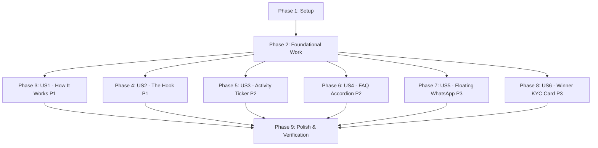

# Tasks: Feature 004 — Front-of-House Trust, Engagement & Social Proof Suite

**Feature Branch**: `004-front-of-house-trust-engagement`  
**Specification**: [spec.md](./spec.md)  
**Implementation Plan**: [plan.md](./plan.md)  
**Design Artifacts**: [research.md](./research.md) | [data-model.md](./data-model.md) | [contracts/activity-recent.v1.json](./contracts/activity-recent.v1.json) | [contracts/ui-contracts.md](./contracts/ui-contracts.md) | [quickstart.md](./quickstart.md)  

---

## Overview & Execution Strategy

This task list decomposes the implementation of **Feature 004: Front-of-House Trust, Engagement & Social Proof Suite (منظومة الثقة والتفاعل والإثبات الاجتماعي)** into 38 dependency-ordered, testable tasks across 9 phases.

- **MVP Scope**: User Story 1 ("How It Works" 3-Step Interactive Onboarding) provides immediate customer clarity.
- **Strict Data Privacy**: Activity events strictly mask internal IDs (`^evt_(ord|drw|blt)_[a-f0-9]{12}$`) with zero PII serialization.
- **Strict Truthfulness**: Prohibits simulated customer identities; quiet periods automatically fall back to static educational bulletins and draw countdown alerts.
- **Zero Database Migrations**: Queries existing `orders` and `draws` tables from Features 001–003.
- **Strict Scope Guard**: Strictly excludes Features 005–009 (no ticket serial minting table, no student library, no payment gateway webhooks, no affiliate tracking engine, no KYC upload forms).

---

## Phase 1: Setup & Project Scaffolding

**Purpose**: Initialize directory layout and verify environment runtime readiness.

- [ ] T001 Create component directories for home, faq, and compliance in `frontend/src/components/home`, `frontend/src/components/faq`, and `frontend/src/components/compliance`
- [ ] T002 Verify local runtime services (MySQL on port 3306, Laravel API on 8000, Next.js dev server on 3000) and ensure `NEXT_PUBLIC_WHATSAPP_SUPPORT_URL` is defined in `frontend/.env.local`

---

## Phase 2: Foundational Work (Prerequisites for All Stories)

**Purpose**: Core TypeScript interfaces and shared bilingual localization dictionaries that block user story implementation.

- [ ] T003 [P] Create TypeScript interfaces for Activity Ticker events and JSend response envelope in `frontend/src/types/activity.ts` per `data-model.md` (`ActivityEvent`, `ActivityFeedResponse`, `ActivityFeedMeta`)
- [ ] T004 [P] Create TypeScript interfaces for FAQ and Onboarding in `frontend/src/types/faq.ts` per `data-model.md` (`FaqItem`, `FaqCategory`, `HowItWorksStep`, `WinnerKycDisclaimer`)
- [ ] T005 [P] Scaffold Arabic localization dictionary in `frontend/messages/ar.json` adding complete translation keys across namespaces `theHook`, `howItWorks`, `ticker`, `faq`, `whatsapp`, and `kyc`
- [ ] T006 [P] Scaffold English localization dictionary in `frontend/messages/en.json` adding matching translation keys across all 6 namespaces with 100% key parity

**Checkpoint**: Foundational types and bilingual dictionaries ready — user story implementation can begin.

---

## Phase 3: User Story 1 — Header "How It Works" 3-Step Interactive Onboarding (Priority: P1) 🎯 MVP

**Goal**: Deliver a 1-to-2 click accessible onboarding dialog modal explaining the 3-step vocational educational purchase model ($2 part / $10 bundle) with complimentary promotional tickets and YouTube Live draw transparency.

**Independent Test**: Click "كيف تعمل كَنزين؟" in desktop Header HUD, mobile shortcut icon (`?`), or mobile drawer item; verify modal opens, focus is trapped, 3 sequential steps render cleanly with icons, and `Escape` key dismisses modal restoring focus to trigger.

### Tests for User Story 1

- [ ] T007 [P] [US1] Create unit tests in `frontend/src/tests/TrustAndEngagementInvariants.test.ts` asserting "How It Works" 3-step sequence, icons (`BookOpen`, `Ticket`, `Trophy`), pricing invariants ($2 / $10), and bilingual dictionary synchronization

### Implementation for User Story 1

- [ ] T008 [US1] Implement `frontend/src/components/layout/HowItWorksModal.tsx` reusing `@/components/ui/dialog` with WAI-ARIA focus trap, `Escape` key dismissal, focus restoration, and responsive RTL/LTR step flow
- [ ] T009 [US1] Integrate desktop 1-click trigger button (`«كيف تعمل كَنزين؟»` / `«How It Works»`) and mobile 1-click shortcut icon (`HelpCircle`) into `frontend/src/components/layout/HeaderHUD.tsx`
- [ ] T010 [US1] Integrate mobile 2-click drawer navigation item into `frontend/src/components/layout/MobileNavSheet.tsx` with descriptive subtitle and step badge

**Checkpoint**: User Story 1 functional and independently testable on desktop and mobile viewports.

---

## Phase 4: User Story 2 — The Hook / Vision Narrative Experience (Priority: P1)

**Goal**: Present the authoritative founder philosophy and vocational empowerment vision on the homepage between the Hero Countdown and Course Catalog, establishing brand legitimacy and non-gambling educational purpose.

**Independent Test**: Navigate to `/ar` and `/en`, verify `TheHookSection` renders below `HeroGrandPrizeCountdown` with verbatim founder text, responsive typography, and smooth scrolling to `/#vision` clearing the sticky header by ≥80px.

### Tests for User Story 2

- [ ] T011 [P] [US2] Create unit test in `frontend/src/tests/TrustAndEngagementInvariants.test.ts` asserting verbatim match of canonical founder quote: `«نحن نؤمن بأن الشباب يحتاجون إلى المهارة ورأس المال معاً. لذلك، نحن نعلمك مهارات العمل الحر، ونمنحك فرصة لربح تمويل مشروعك في نفس الوقت.»`

### Implementation for User Story 2

- [ ] T012 [US2] Implement `frontend/src/components/home/TheHookSection.tsx` with verbatim Arabic/English founder text, glassmorphic styling, responsive typography, and `<section id="vision" className="scroll-mt-20 sm:scroll-mt-24">`
- [ ] T013 [US2] Mount `TheHookSection.tsx` in `frontend/src/components/catalog/CatalogClientView.tsx` directly between `HeroGrandPrizeCountdown` (and `ResumeHeroCard`) and the Course Grid

**Checkpoint**: User Stories 1 and 2 functional and independently verifiable on homepage.

---

## Phase 5: User Story 3 — Real-Time Social Proof & Activity Ticker (Priority: P2)

**Goal**: Stream verified non-PII course purchases, promotional ticket awards, upcoming draw countdown alarms, and educational bulletins via a purpose-built public read-only API and smooth marquee ticker that pauses on hover/focus.

**Independent Test**: Verify `GET /api/v1/activity/recent` returns HTTP 200 with non-PII events; verify frontend `ActivityTicker` scrolls continuously, pauses within 50ms of hover/focus, respects `prefers-reduced-motion`, and uses `<bdi>` for mixed text.

### Tests for User Story 3

- [ ] T014 [P] [US3] Create backend feature test `backend/tests/Feature/ActivityApiTest.php` asserting JSend structure, non-PII sanitization (zero `email`, `user_id`, `terms_agreed_ip`, or order UUIDs), draw alarms, and quiet-period static bulletin fallback

### Implementation for User Story 3

- [ ] T015 [US3] Implement `backend/app/Http/Resources/ActivityEventResource.php` transforming completed orders and scheduled draws into non-PII DTOs with masked ID format `^evt_(ord|drw|blt)_[a-f0-9]{12}$`
- [ ] T016 [US3] Implement `backend/app/Http/Controllers/ActivityController.php` querying completed `orders` (limit 10) and scheduled `draws` (limit 3), falling back to curated educational bulletins when live completed orders are zero
- [ ] T017 [US3] Register public unauthenticated route `Route::get('/activity/recent', [ActivityController::class, 'recent'])` in `backend/routes/api.php`
- [ ] T018 [P] [US3] Implement client-side polling hook `frontend/src/hooks/useActivityFeed.ts` using `@tanstack/react-query` with 45s interval, memory caching, and offline fallback
- [ ] T019 [US3] Implement `frontend/src/components/layout/ActivityTicker.tsx` with CSS marquee track (`h-10`, `CLS = 0.00`), hover/focus pause, `<bdi>` text wrapping, and static discrete display for `prefers-reduced-motion: reduce`
- [ ] T020 [US3] Mount `ActivityTicker.tsx` directly beneath `<HeaderHUD />` in `frontend/src/app/[locale]/layout.tsx` across all public routes

**Checkpoint**: User Stories 1, 2, and 3 functional with live backend polling and zero PII exposure.

---

## Phase 6: User Story 4 — Public FAQ & Objection Handling Accordion (Priority: P2)

**Goal**: Provide an accessible 5-category FAQ accordion on the homepage answering core customer objections (Platform model, Course downloads, Draw audits, 40% referral co-prize, Winner KYC) with WAI-ARIA keyboard navigation and first question expanded.

**Independent Test**: Navigate to `/#faq` on homepage; verify section scrolls with ≥80px header clearance, first question in each category is expanded by default, and `Tab`/`Enter`/`Space`/arrow keys navigate and toggle accordion items.

### Tests for User Story 4

- [ ] T021 [P] [US4] Create unit test in `frontend/src/tests/TrustAndEngagementInvariants.test.ts` asserting 5 categories (`model`, `downloads`, `draws`, `referral`, `kyc`) and verifying default expanded item keys

### Implementation for User Story 4

- [ ] T022 [US4] Implement `frontend/src/components/faq/FaqAccordion.tsx` reusing `@/components/ui/accordion` with `type="multiple"`, `defaultValue` expanding first item of each category, WAI-ARIA keys, and `<section id="faq" className="scroll-mt-20 sm:scroll-mt-24">`
- [ ] T023 [US4] Mount `FaqAccordion.tsx` in `frontend/src/components/catalog/CatalogClientView.tsx` beneath the Course Grid

**Checkpoint**: User Stories 1 through 4 functional with accessible objection handling.

---

## Phase 7: User Story 5 — Persistent Floating WhatsApp Customer Support (Priority: P3)

**Goal**: Render a persistent floating WhatsApp customer care button anchored inline-end (`bottom-6 end-6`) on all public pages, opening a pre-filled chat or an in-app fallback dialog pointing to `#faq` when unconfigured.

**Independent Test**: Verify button floats at bottom-left in Arabic (`dir="rtl"`) and bottom-right in English (`dir="ltr"`); verify clicking with valid URL opens WhatsApp; verify clicking with unconfigured URL opens fallback dialog explaining chat is offline (strictly zero invented emails/phones).

### Tests for User Story 5

- [ ] T024 [P] [US5] Create unit test in `frontend/src/tests/TrustAndEngagementInvariants.test.ts` asserting WhatsApp pre-filled greeting URL formatting and fallback offline dialog state logic

### Implementation for User Story 5

- [ ] T025 [US5] Implement `frontend/src/components/layout/WhatsAppFallbackDialog.tsx` explaining WhatsApp chat is offline and providing button scrolling to `/#faq` with zero invented contacts
- [ ] T026 [US5] Implement `frontend/src/components/layout/FloatingWhatsAppButton.tsx` with logical positioning `fixed bottom-6 end-6 z-40`, touch target `w-14 h-14` (56x56px), pre-filled greeting (`«مرحباً، لدي استفسار حول منصة كَنزين»`), and fallback dialog trigger
- [ ] T027 [US5] Mount `FloatingWhatsAppButton.tsx` in `frontend/src/app/[locale]/layout.tsx`

**Checkpoint**: User Stories 1 through 5 functional across all public storefront routes.

---

## Phase 8: User Story 6 — Public Winner KYC Compliance & Legal Transparency (Priority: P3)

**Goal**: Display an official Winner KYC National ID claim transparency card on `/raffle` and within the FAQ, ensuring participants understand identification requirements without prematurely introducing upload forms or verification APIs.

**Independent Test**: Navigate to `/ar/raffle` and `/en/raffle`; verify Winner KYC transparency card renders verbatim National ID requirement and consumer protection law citation; verify zero document upload inputs or file upload forms appear.

### Tests for User Story 6

- [ ] T028 [P] [US6] Create unit test in `frontend/src/tests/TrustAndEngagementInvariants.test.ts` asserting verbatim match of National ID legal clause: `«شرط تسليم الجوائز: يُلزم الفائز بتقديم إثبات هوية رسمي يطابق البيانات الأساسية (مثل البريد الإلكتروني) التي تم الشراء بها، وللإدارة الحق في حجب الجائزة في حال ثبوت تلاعب أو استخدام بطاقات دفع مسروقة.»`

### Implementation for User Story 6

- [ ] T029 [US6] Implement `frontend/src/components/compliance/WinnerKycCard.tsx` rendering verbatim Arabic/English legal claim clause, Consumer Protection Law No. 1 (2010) citation, and strictly read-only badge layout (zero file inputs)
- [ ] T030 [US6] Mount `WinnerKycCard.tsx` as standalone card in `frontend/src/app/[locale]/raffle/page.tsx` within Raffle Transparency section AND embed as compliance highlight in `frontend/src/components/faq/FaqAccordion.tsx` under category `kyc`

**Checkpoint**: All 6 user stories implemented and integrated across the storefront.

---

## Phase 9: Polish, Cross-Cutting & End-to-End Verification

**Purpose**: Full regression testing, quickstart scenario execution, and multi-viewport accessibility verification.

- [ ] T031 [P] Execute backend test suite via `cd backend && php artisan test` and verify 100% pass across all tests including `ActivityApiTest`
- [ ] T032 [P] Execute frontend test suite via `cd frontend && npm test` and verify 100% pass across all 32+ tests including `TrustAndEngagementInvariants.test.ts`
- [ ] T033 Execute Quickstart Scenario 1 in `quickstart.md`: Onboarding "How It Works" 1-to-2 click verification, focus trap, and `Escape` key restoration on desktop and mobile viewports
- [ ] T034 Execute Quickstart Scenario 2 in `quickstart.md`: The Hook narrative visibility and ≥80px sticky header clearance on deep-link `/#vision`
- [ ] T035 Execute Quickstart Scenario 3 in `quickstart.md`: Real-Time Activity Ticker continuous streaming, hover/focus pause, and `<bdi>` bidirectional text isolation
- [ ] T036 Execute Quickstart Scenario 4 in `quickstart.md`: Floating WhatsApp button logical positioning (bottom-left RTL / bottom-right LTR) and unconfigured fallback offline dialog
- [ ] T037 Execute Quickstart Scenario 5 in `quickstart.md`: Public FAQ accordion categories, default expansion of first item, WAI-ARIA keyboard navigation, and `/#faq` clearance
- [ ] T038 Execute Quickstart Scenario 6 in `quickstart.md`: Winner KYC legal compliance notice on `/raffle` and within FAQ, confirming zero upload forms

---

## Dependencies & Execution Order

### Phase Dependencies

### User Story Dependencies

- **User Story 1 (P1 - How It Works)**: Can proceed immediately after Phase 2. Zero dependencies on other stories.
- **User Story 2 (P1 - The Hook)**: Can proceed immediately after Phase 2. Mounts in `CatalogClientView.tsx`.
- **User Story 3 (P2 - Activity Ticker)**: Can proceed immediately after Phase 2. Implements backend API + frontend ticker.
- **User Story 4 (P2 - FAQ Accordion)**: Can proceed immediately after Phase 2. Mounts in `CatalogClientView.tsx`.
- **User Story 5 (P3 - Floating WhatsApp)**: Can proceed immediately after Phase 2. Mounts in `layout.tsx`.
- **User Story 6 (P3 - Winner KYC Card)**: Can proceed immediately after Phase 2. Mounts in `raffle/page.tsx` and embeds in US4 FAQ.

---

## Parallel Execution Opportunities

- **Phase 2 Foundational**:
  - `T003` (`activity.ts`) and `T004` (`faq.ts`) can run in parallel.
  - `T005` (`ar.json`) and `T006` (`en.json`) can run in parallel.
- **Across User Stories**:
  - Once Phase 2 is complete, US1 (`T007–T010`), US2 (`T011–T013`), US3 (`T014–T020`), US4 (`T021–T023`), and US5 (`T024–T027`) can proceed in parallel.
- **Within User Story 3**:
  - Backend test `T014` and frontend hook `T018` can be written in parallel.
- **Phase 9 Polish**:
  - `T031` (`php artisan test`) and `T032` (`npm test`) can run in parallel.

---

## Implementation Strategy & MVP Milestone

1. **Step 1: Setup & Foundational (Phases 1 & 2)**: Scaffold directories, TypeScript types, and bilingual dictionaries.
2. **Step 2: MVP Increment (Phase 3 - User Story 1)**: Build and test "How It Works" modal with Header HUD triggers. First-time visitors can now understand the platform model within 1 click.
3. **Step 3: Vision & Engagement (Phases 4 & 5 - User Stories 2 & 3)**: Deploy The Hook section on homepage and launch the live Activity Ticker with backend `GET /api/v1/activity/recent`.
4. **Step 4: Trust & Compliance (Phases 6, 7 & 8 - User Stories 4, 5 & 6)**: Deploy FAQ accordion, floating WhatsApp button with offline fallback, and Winner KYC disclaimer card.
5. **Step 5: Full Verification (Phase 9)**: Execute backend and frontend test suites and complete all 6 Quickstart validation scenarios.
