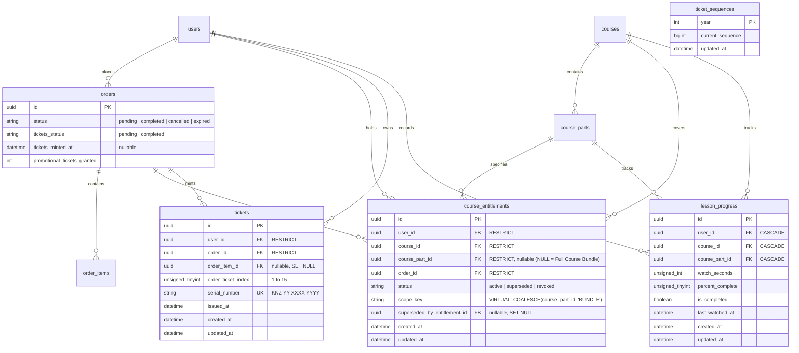

# Data Model & Schema Specification: Feature 005 — Learner Hub & Ticket Ledger

**Branch**: `005-learner-hub`  
**Date**: 2026-10-01  
**Status**: Complete (Audited for Durable Sequences, Idempotency Index, and Media Protection)  

---

## 1. Entity-Relationship Overview



---

## 2. Table Specifications

### 2.1 Table: `course_entitlements`

Represents an authoritative learner authorization to access a modular course part or the complete course bundle.

```sql
CREATE TABLE `course_entitlements` (
    `id` CHAR(36) NOT NULL,
    `user_id` CHAR(36) NOT NULL,
    `course_id` CHAR(36) NOT NULL,
    `course_part_id` CHAR(36) NULL,
    `order_id` CHAR(36) NOT NULL,
    `status` VARCHAR(20) NOT NULL DEFAULT 'active',
    `scope_key` VARCHAR(36) GENERATED ALWAYS AS (COALESCE(`course_part_id`, 'BUNDLE')) VIRTUAL,
    `superseded_by_entitlement_id` CHAR(36) NULL,
    `created_at` TIMESTAMP NULL DEFAULT CURRENT_TIMESTAMP,
    `updated_at` TIMESTAMP NULL DEFAULT CURRENT_TIMESTAMP ON UPDATE CURRENT_TIMESTAMP,
    
    PRIMARY KEY (`id`),
    -- Foreign keys use RESTRICT to prevent accidental deletion of financial/audit records
    CONSTRAINT `fk_entitlements_user` FOREIGN KEY (`user_id`) REFERENCES `users` (`id`) ON DELETE RESTRICT,
    CONSTRAINT `fk_entitlements_course` FOREIGN KEY (`course_id`) REFERENCES `courses` (`id`) ON DELETE RESTRICT,
    CONSTRAINT `fk_entitlements_part` FOREIGN KEY (`course_part_id`) REFERENCES `course_parts` (`id`) ON DELETE RESTRICT,
    CONSTRAINT `fk_entitlements_order` FOREIGN KEY (`order_id`) REFERENCES `orders` (`id`) ON DELETE RESTRICT,
    CONSTRAINT `fk_entitlements_superseded_by` FOREIGN KEY (`superseded_by_entitlement_id`) REFERENCES `course_entitlements` (`id`) ON DELETE SET NULL,
    
    -- Invariants: At most one active entitlement per user per course per scope (bundle or specific part)
    UNIQUE KEY `uq_user_course_scope_status` (`user_id`, `course_id`, `scope_key`, `status`),
    INDEX `idx_entitlements_user_lookup` (`user_id`, `course_id`, `status`),
    INDEX `idx_entitlements_order` (`order_id`)
) ENGINE=InnoDB DEFAULT CHARSET=utf8mb4 COLLATE=utf8mb4_unicode_ci;
```

#### Fields & Purpose
- `id`: UUID primary key.
- `user_id`: Reference to `users.id`. Protected by `ON DELETE RESTRICT`.
- `course_id`: Reference to `courses.id`. Protected by `ON DELETE RESTRICT`.
- `course_part_id`: Nullable reference to `course_parts.id`. When `NULL`, represents a **Full Course Bundle** granting access to all active published parts of that course. When non-null, grants access to that specific modular part.
- `order_id`: Traceability link to the originating completed `orders` row. Protected by `ON DELETE RESTRICT`.
- `status`: Lifecycle state:
  - `'active'`: Currently valid and grants access.
  - `'superseded'`: Used only during account merge reconciliation when two merged accounts possessed identical entitlements.
  - `'revoked'`: Inactive due to order cancellation, chargeback, or administrative refund.
- `scope_key`: Virtual generated column (`COALESCE(course_part_id, 'BUNDLE')`). Enables MariaDB to enforce uniqueness across bundle and individual part records without `NULL` collision traps.
- `superseded_by_entitlement_id`: Audit pointer for merged rows.

#### Bundle Upgrade & Coexistence Guarantee
Because `scope_key` is `'BUNDLE'` for a full course purchase and `part_id` for a single part purchase:
- An active Part 2 entitlement and an active Bundle entitlement can **safely coexist** as `status = 'active'` without violating `uq_user_course_scope_status`.
- While the bundle is active, the authorization query returns `true` for all course parts.
- If the bundle purchase is later refunded or revoked (`bundle.status = 'revoked'`), the learner's independent Part 2 entitlement remains `status = 'active'`. Querying Part 2 returns `true`; querying Part 3 returns `false`. The learner NEVER loses their legitimately purchased Part 2 access.

---

### 2.2 Table: `tickets`

Represents an individual verifiable promotional giveaway entry awarded with educational purchases.

```sql
CREATE TABLE `tickets` (
    `id` CHAR(36) NOT NULL,
    `user_id` CHAR(36) NOT NULL,
    `order_id` CHAR(36) NOT NULL,
    `order_item_id` CHAR(36) NULL,
    `order_ticket_index` TINYINT UNSIGNED NOT NULL,
    `serial_number` VARCHAR(24) NOT NULL,
    `issued_at` TIMESTAMP NOT NULL DEFAULT CURRENT_TIMESTAMP,
    `created_at` TIMESTAMP NULL DEFAULT CURRENT_TIMESTAMP,
    `updated_at` TIMESTAMP NULL DEFAULT CURRENT_TIMESTAMP ON UPDATE CURRENT_TIMESTAMP,
    
    PRIMARY KEY (`id`),
    -- Financial/audit retention invariant: tickets cannot be deleted by cascading parent deletes
    CONSTRAINT `fk_tickets_user` FOREIGN KEY (`user_id`) REFERENCES `users` (`id`) ON DELETE RESTRICT,
    CONSTRAINT `fk_tickets_order` FOREIGN KEY (`order_id`) REFERENCES `orders` (`id`) ON DELETE RESTRICT,
    CONSTRAINT `fk_tickets_order_item` FOREIGN KEY (`order_item_id`) REFERENCES `order_items` (`id`) ON DELETE SET NULL,
    
    -- Invariants:
    -- 1. Canonical serial uniqueness
    UNIQUE KEY `uq_tickets_serial_number` (`serial_number`),
    -- 2. Database-level idempotency protection: Exactly one row per index (1 to N) per order
    UNIQUE KEY `uq_order_ticket_index` (`order_id`, `order_ticket_index`),
    INDEX `idx_tickets_user_issued` (`user_id`, `issued_at` DESC),
    INDEX `idx_tickets_order` (`order_id`)
) ENGINE=InnoDB DEFAULT CHARSET=utf8mb4 COLLATE=utf8mb4_unicode_ci;
```

#### Fields & Invariants
- `id`: UUID primary key.
- `user_id`: Reference to `users.id`. Protected by `ON DELETE RESTRICT`. Re-attributed upon Google OAuth merge.
- `order_id`: Originating fulfilled `orders` row. Protected by `ON DELETE RESTRICT`.
- `order_ticket_index`: 1-based index of the ticket within the originating order grant ($1$ for single part; $1, \dots, 15$ for bundle). Together with `order_id`, enforces that concurrent worker races or retries cannot insert duplicate tickets beyond the exact entitled count.
- `serial_number`: Canonical Crockford Base32 formatted serial `^KNZ-[0-9]{2}-[0-9A-HJKMNP-Z]{4}-[0-9A-HJKMNP-Z]{4}$`. Globally unique, immutable, never reused.
- `issued_at`: Exact UTC timestamp when the promotional entitlement was awarded. Used for window-based draw eligibility evaluation.
- **Architectural Boundary**: Zero `draw_id` foreign keys. Permanent ledger entries outlive individual draw conclusions.

---

### 2.3 Table: `ticket_sequences` (Authoritative Durable Sequence Store)

Enforces the constitutional requirement of atomic sequence allocation per year, preventing deadlocks under high-volume draw countdowns.

```sql
CREATE TABLE `ticket_sequences` (
    `year` INT NOT NULL,
    `current_sequence` BIGINT UNSIGNED NOT NULL DEFAULT 0,
    `updated_at` TIMESTAMP NULL DEFAULT CURRENT_TIMESTAMP ON UPDATE CURRENT_TIMESTAMP,
    
    PRIMARY KEY (`year`)
) ENGINE=InnoDB DEFAULT CHARSET=utf8mb4 COLLATE=utf8mb4_unicode_ci;
```

#### Atomic Block Allocation Mechanics
- MariaDB serves as the **sole authoritative durable sequence allocator**.
- Allocation executes atomically inside an isolated transaction with pessimistic row-locking on the year counter:
  ```sql
  START TRANSACTION;
  -- 1. Ensure year counter row exists
  INSERT IGNORE INTO ticket_sequences (`year`, `current_sequence`) VALUES (:year, 0);
  
  -- 2. Lock the row and read current sequence
  SELECT `current_sequence` 
  FROM ticket_sequences 
  WHERE `year` = :year 
  FOR UPDATE;
  
  -- 3. Application derives: $start = $current_sequence + 1, $end = $current_sequence + :count
  -- 4. Guard against 40-bit domain overflow
  -- IF $end >= 1099511627776 THEN ROLLBACK AND THROW SequenceExhaustedException
  
  -- 5. Advance counter and release lock
  UPDATE ticket_sequences 
  SET `current_sequence` = :end 
  WHERE `year` = :year;
  
  COMMIT;
  ```
- **Durability & Recovery**: Guaranteed by MariaDB InnoDB write-ahead redo log (WAL). Survives worker crashes, Redis node restarts, and host reboots.
- **Concurrency & Elimination of Lock Contention**: The row lock on `year` is held only for the duration of the short allocation transaction. Workers are pre-assigned mutually disjoint, non-overlapping sequence blocks $[S_{\text{start}}, S_{\text{end}}]$, eliminating row-lock contention on the `tickets` table during insertion.
- **Unused Numbers on Worker Failure**: If a worker crashes after allocating $[S_{\text{start}}, S_{\text{end}}]$ but before committing tickets, those allocated numbers remain unused (creating a gap in sequence values). Gaps are mathematically harmless; they can NEVER produce duplicate serials because the sequence allocator never goes backward.

---

### 2.4 Table: `orders` (Schema Extension: Fulfillment & Ticket State)

```sql
-- Migration adds ticket reconciliation tracking to orders table
ALTER TABLE `orders`
    ADD COLUMN `tickets_status` ENUM('pending', 'completed') NOT NULL DEFAULT 'pending' AFTER `status`,
    ADD COLUMN `tickets_minted_at` TIMESTAMP NULL AFTER `tickets_status`;
```

#### Purpose
- Decouples transaction commit from queue dispatch success.
- If Redis dispatch fails after database commit, `tickets_status` remains `'pending'`.
- A background reconciliation command (`knzin:reconcile-ticket-generation`) polls for completed orders with `tickets_status = 'pending'` and re-dispatches ticket generation, guaranteeing zero lost grants.

---

### 2.5 Table: `users` (Schema Extension: `learner_code`)

```sql
-- Migration adds learner_code to users table
ALTER TABLE `users`
    ADD COLUMN `learner_code` VARCHAR(16) NOT NULL AFTER `email`,
    ADD UNIQUE KEY `uq_users_learner_code` (`learner_code`);
```

#### Fields & Purpose
- `learner_code`: Persistent opaque learner identifier uniquely assigned to the learner (e.g. `LRN-7K2M9W`).
- Persisted in MariaDB with a `UNIQUE` index, enforcing uniqueness at the database layer.
- Generated on registration via CSPRNG selecting 6 Crockford Base32 characters (keyspace $32^6 = 1,073,741,824$). Handled via application collision-check loop (up to 3 retries) with database unique constraint violation handling on concurrent races.
- Rendered on the dynamic anti-piracy Canvas watermark for forensic attribution without exposing database UUIDs, emails, or personal identifiers.

---

### 2.6 Table: `lesson_progress` (Schema Hardening)

Tracks learner watch depth, percentage, and completion status.

```sql
-- Existing table structure in migration 2026_09_29_000006_create_lesson_progress_table.php
-- Invariants enforced via service logic:
-- watch_seconds = MIN(part_duration_seconds, MAX(existing.watch_seconds, input.watch_seconds))
-- percent_complete = MIN(100, MAX(existing.percent_complete, input.percent_complete))
-- is_completed = existing.is_completed || input.percent_complete >= 95
```

---

## 3. Database Invariants & Verification Matrix

| Invariant | Database Mechanism | Service Mechanism |
| :--- | :--- | :--- |
| **No Duplicate Active Bundle Entitlement** | `UNIQUE KEY (user_id, course_id, scope_key, status)` where `scope_key = 'BUNDLE'` and `status = 'active'` | `EntitlementService::grantBundleEntitlement` with `DB::transaction()` and pessimistic locking |
| **No Duplicate Active Part Entitlement** | `UNIQUE KEY (user_id, course_id, scope_key, status)` where `scope_key = part_id` and `status = 'active'` | `EntitlementService::grantPartEntitlement` checking existing active access |
| **Bundle Upgrade Safety** | Part 2 and Bundle have different `scope_key` values; both remain `active` | Effective query evaluates `course_part_id IS NULL OR course_part_id = :partId`; bundle revocation preserves part |
| **Financial / Audit Retention** | `ON DELETE RESTRICT` on `orders` and `users` foreign keys in `course_entitlements` and `tickets` | Orders and tickets are never deleted; users deactivated rather than purged |
| **Durable Sequence Allocation** | MariaDB `ticket_sequences` table with transactional `SELECT ... FOR UPDATE` and `UPDATE` | Single authoritative ACID source of truth; survives Redis loss; race-safe range derivation |
| **Idempotent Ticket Delta Guarantee** | `UNIQUE KEY (order_id, order_ticket_index)` | Worker assigns exact index $1 \dots N$; duplicate inserts rejected at database layer |
| **Dispatch Failure Recovery** | `orders.tickets_status` (`pending` / `completed`) | Scheduled reconciliation command catches un-enqueued jobs |
| **Learner Code Uniqueness** | `UNIQUE KEY uq_users_learner_code (learner_code)` on `users` | Server generates unique `LRN-XXXXXX` on registration with collision-retry loop; DB constraint guarantees uniqueness |
| **Monotonic Progress & Sticky 95%** | `uq_progress_user_part (user_id, course_part_id)` | `ProgressController` computes `MAX()` on watch depth and percent complete |
| **Draw Window Independence** | Zero `draw_id` foreign keys on `tickets` | Dynamic evaluation against active draw timestamps (`starts_at <= issued_at < ends_at`) |
