# Feature 005 — Tasks: Learner Hub, Course Library & Ticket Ledger

**Branch**: `005-learner-hub`  
**Input Specs**: `specs/005-learner-hub/spec.md`, `plan.md`, `data-model.md`, `contracts/*.contract.md`, `research.md`, `quickstart.md`  
**Status**: Ready for Implementation  

---

## Phase 1 — Database Foundations

**Purpose**: Establish schema migrations, constraints, virtual generated columns, and foreign key integrity before application logic implementation.

- [X] T001 Create migration `2026_10_01_000001_create_course_entitlements_table.php` in `backend/database/migrations/` defining `id` (char 36 PK), `user_id` (char 36 FK RESTRICT), `course_id` (char 36 FK RESTRICT), `course_part_id` (char 36 nullable FK RESTRICT), `order_id` (char 36 FK RESTRICT), `status` (varchar 20 default 'active'), virtual column `scope_key` (`COALESCE(course_part_id, 'BUNDLE')`), `superseded_by_entitlement_id` (char 36 nullable FK SET NULL), timestamps, index `idx_entitlements_user_lookup (user_id, course_id, status)`, and `UNIQUE KEY uq_user_course_scope_status (user_id, course_id, scope_key, status)`. [FR-001]
- [X] T002 [P] Create migration `2026_10_01_000002_create_tickets_table.php` in `backend/database/migrations/` defining `id` (char 36 PK), `user_id` (char 36 FK RESTRICT), `order_id` (char 36 FK RESTRICT), `order_item_id` (char 36 nullable FK SET NULL), `order_ticket_index` (tinyint unsigned not null), `serial_number` (varchar 24 not null), `issued_at` (timestamp not null default current_timestamp), timestamps, index `idx_tickets_user_issued (user_id, issued_at DESC)`, `UNIQUE KEY uq_tickets_serial_number (serial_number)`, and `UNIQUE KEY uq_order_ticket_index (order_id, order_ticket_index)`. [FR-007, FR-008, FR-014]
- [X] T003 [P] Create migration `2026_10_01_000003_create_ticket_sequences_table.php` in `backend/database/migrations/` defining `year` (int PK), `current_sequence` (bigint unsigned not null default 0), and `updated_at` (timestamp null on update current_timestamp). [FR-007, FR-008]
- [X] T004 [P] Create migration `2026_10_01_000004_add_learner_code_to_users_table.php` in `backend/database/migrations/` adding nullable `learner_code` (varchar 16 after email), backfilling existing users in chunks with unique `LRN-XXXXXX` Crockford Base32 values, and applying `NOT NULL` constraint and `UNIQUE KEY uq_users_learner_code (learner_code)`. [FR-005]
- [X] T005 [P] Create migration `2026_10_01_000005_add_tickets_status_to_orders_table.php` in `backend/database/migrations/` adding `tickets_status` (`ENUM('pending', 'completed') NOT NULL DEFAULT 'pending'` after status) and `tickets_minted_at` (timestamp null after tickets_status). [FR-007, FR-014]
- [X] T006 Run migrations via `php artisan migrate` in `backend/` and verify schema structure and index constraints in MariaDB. [FR-001, FR-007, FR-014]

---

## Phase 2 — Backend Domain & Core Services

**Purpose**: Eloquent models, relationships, casting, and foundational service abstractions.

- [X] T007 [P] Create `CourseEntitlement` Eloquent model in `backend/app/Models/CourseEntitlement.php` with UUID trait, guarded attributes, relationship methods (`user`, `course`, `coursePart`, `order`), and query scope `scopeEffective($query, $userId, $courseId, $partId = null)` implementing pure boolean access check: `where('user_id', $userId)->where('course_id', $courseId)->where('status', 'active')->where(fn($q) => $q->whereNull('course_part_id')->when($partId, fn($sq) => $sq->orWhere('course_part_id', $partId)))`. [FR-001, FR-003]
- [X] T008 [P] Create `Ticket` Eloquent model in `backend/app/Models/Ticket.php` with UUID trait, guarded attributes, relationship methods (`user`, `order`, `orderItem`), and cast for `issued_at` to immutable UTC datetime. [FR-007, FR-008, FR-009]
- [X] T009 [P] Create `TicketSequence` Eloquent model in `backend/app/Models/TicketSequence.php` with integer primary key `year`, timestamps disabled except `updated_at`, and cast for `current_sequence` to integer. [FR-007, FR-008]
- [X] T010 Update `User` model in `backend/app/Models/User.php` adding `learner_code` to fillable attributes, defining relationships (`courseEntitlements`, `tickets`), and adding boot hook to automatically generate unique `learner_code` (`LRN-` + 6 uppercase Crockford characters) with a 3-attempt collision retry loop. [FR-005]
- [X] T011 Update `Order` model in `backend/app/Models/Order.php` adding `tickets_status` and `tickets_minted_at` to fillable/casts, and defining relationships (`courseEntitlements`, `tickets`). [FR-001, FR-007, FR-014]
- [X] T012 Implement `EntitlementService` in `backend/app/Services/EntitlementService.php` with methods:
  - `grantAfterFulfillment(Order $order): void` (idempotent creation of bundle entitlement if `item_type === 'bundle'` or modular part entitlement if `item_type === 'part'`)
  - `hasAccess(User $user, Course $course, CoursePart $part): bool` (Part 1 returns true immediately; parts > 1 evaluate `CourseEntitlement::scopeEffective`)
  - `revokeEntitlements(Order $order): void` (transitions associated order entitlements to `status = 'revoked'`). [FR-001, FR-002, FR-003]
- [X] T013 Implement `TicketMintingService` in `backend/app/Services/TicketMintingService.php` with methods:
  - `allocateSequenceBlock(int $year, int $count): array` (executes isolated MariaDB transaction: `INSERT IGNORE`, `SELECT current_sequence FOR UPDATE`, 40-bit boundary guard checking `$end < 1099511627776`, `UPDATE ticket_sequences SET current_sequence = :end`, returns `[$start, $end]`)
  - `permuteSequence(int $sequence): int` (computes 40-bit affine bijection: `($sequence * config('knzin.ticket_multiplier') + config('knzin.ticket_adder')) % 1099511627776 ^ config('knzin.ticket_xor_mask')` where multiplier is odd coprime)
  - `formatSerial(int $year, int $permuted): string` (formats string conforming to `^KNZ-[0-9]{2}-[0-9A-HJKMNP-Z]{4}-[0-9A-HJKMNP-Z]{4}$` using Crockford Base32 alphabet `0123456789ABCDEFGHJKMNPQRSTVWXYZ`)
  - `mintForOrder(Order $order): int` (pessimistic lock `lockForUpdate()`, reads existing ticket count, derives missing delta from entitled ratio [1 or 15], allocates sequence block, inserts tickets with sequential `order_ticket_index` $1 \dots N$, and marks `tickets_status = 'completed'`). [FR-007, FR-008, FR-014]
- [X] T014 Configure ticket obfuscation constants in `backend/config/knzin.php` (`ticket_multiplier` as odd 40-bit coprime integer, `ticket_adder` as integer constant, `ticket_xor_mask` as 40-bit mask). [FR-008]

---

## Phase 3 — Fulfillment & Ticket Ledger Subsystem

**Purpose**: Asynchronous ticket generation, queue failure resilience, reconciliation daemon, and development simulator.

- [X] T015 [US3] Create `GenerateTicketsJob` in `backend/app/Jobs/GenerateTicketsJob.php` implementing `ShouldQueue` with Redis connection, retry backoff (3 attempts), calling `TicketMintingService::mintForOrder($order)` inside `DB::transaction`, and logging completion or failure. [FR-007, FR-014]
- [X] T016 Hook `GenerateTicketsJob` dispatching in `backend/app/Services/OrderService.php` (or fulfillment handler) immediately after order transitions to `completed`, dispatching `GenerateTicketsJob::dispatch($order->id)->afterCommit()`. [FR-007, FR-014]
- [X] T017 [US3] Create `ReconcileTicketGenerationCommand` in `backend/app/Console/Commands/ReconcileTicketGenerationCommand.php` (`signature = 'knzin:reconcile-ticket-generation'`) querying orders with `status = 'completed' AND tickets_status = 'pending' AND created_at <= NOW() - INTERVAL 2 MINUTE`, re-dispatching `GenerateTicketsJob` for each stale order, and reporting recovered count. [FR-007, FR-014]
- [X] T018 Register `knzin:reconcile-ticket-generation` in `backend/routes/console.php` (or `app/Console/Kernel.php`) to run every 5 minutes (`everyFiveMinutes()`). [FR-007, FR-014]
- [X] T019 Create `SimulateFulfillmentCommand` in `backend/app/Console/Commands/SimulateFulfillmentCommand.php` (`signature = 'knzin:simulate-fulfillment {--email=} {--course=} {--type=bundle} {--part=}'`) restricted to non-production environments (`app()->environment('production')` guard aborts), creating completed test order, activating course entitlements, and queueing `GenerateTicketsJob`. [FR-013]

---

## Phase 4 — Media Security & Playback Authorization Subsystem

**Purpose**: Private storage configuration, signed streaming tokens, expiring downloads, and anti-piracy Canvas watermark payload.

- [X] T020 [US2] Configure protected media disk abstraction in `backend/config/filesystems.php` (`protected-media` pointing to local private storage `storage/app/protected-media` in dev and S3-compatible private bucket in production). [FR-004]
- [X] T021 [US2] Implement `MediaProtectionService` in `backend/app/Services/MediaProtectionService.php` with methods:
  - `generatePlaybackToken(User $user, Course $course, CoursePart $part): array` (validates access via `EntitlementService`, generates signed URL with max 15-minute [900s] expiration, and builds authoritative watermark payload: `{account_email, learner_code, rendered_at}`)
  - `generateDownloadToken(User $user, Course $course, CoursePart $part, string $resourceId): array` (validates access, validates resource whitelist regex `^[a-zA-Z0-9_-]+$`, generates signed download URL with max 15-minute expiration). [FR-003, FR-004, FR-005, FR-006]
- [X] T022 [US2] Create local signed media stream route in `backend/routes/api.php` (`GET /api/v1/media/stream/{courseSlug}/{partNumber}`) with URL signature validation middleware (`signed`), streaming video binary chunks from `protected-media` disk for local development and integration tests. [FR-004]

---

## Phase 5 — Progress Persistence & Account Continuity Subsystem

**Purpose**: Monotonic progress updates, sticky 95% completion, and deterministic guest-to-Google account merge.

- [x] T023 [US5] Harden `recordProgress` in `backend/app/Http/Controllers/ProgressController.php`:
  - Validate `percent_complete` strictly `integer|min:0|max:100` and `watch_seconds` strictly `integer|min:0`
  - Cap `watch_seconds` at `part->duration_seconds` when duration is known
  - Verify entitlement for parts > 1 via `EntitlementService::hasAccess` (replaces direct `Order` query, eliminating `DEF-05A` and `DEF-05D`)
  - Enforce server-side monotonicity: `watch_seconds = max(existing, input)`, `percent_complete = max(existing, input)`
  - Enforce sticky completion: `is_completed = existing.is_completed || input.percent_complete >= 95`. [FR-015, FR-016, FR-017]
- [x] T024 [US5] Update `getActiveLearning` in `backend/app/Http/Controllers/ProgressController.php` to query authoritative server progress, returning null when no progress exists, eliminating mock/demo fallback. [FR-016]
- [x] T025 Extend `AccountMergeService` in `backend/app/Services/AccountMergeService.php`:
  - Acquire pessimistic locks in deterministic order: `User::whereIn('id', [$guestId, $googleId])->orderBy('id')->lockForUpdate()` then `Order::where('user_id', $guestId)->orderBy('id')->lockForUpdate()`
  - Reconcile `course_entitlements`: update `user_id` to Google user; for identical `(course_id, scope_key)` collisions, mark guest row `status = 'superseded'`, `superseded_by_entitlement_id = $googleEntitlement->id`
  - Re-attribute `tickets`: `Ticket::where('user_id', $guestUser->id)->update(['user_id' => $googleUser->id])`
  - Re-attribute `orders`: `Order::where('user_id', $guestUser->id)->update(['user_id' => $googleUser->id])`
  - Merge `lesson_progress`: retain `MAX(watch_seconds)`, `MAX(percent_complete)`, `is_completed = target || guest`, and delete guest duplicate records
  - Revoke guest tokens and deactivate guest user with audit pointer. [FR-012]

---

## Phase 6 — API Controller Layer & Contract Conformance

**Purpose**: Implement JSend-compliant endpoints according to API contracts.

- [x] T026 [P] [US1] Create `DashboardController` in `backend/app/Http/Controllers/DashboardController.php` implementing `GET /api/v1/user/dashboard` returning `summary` metrics, `active_learning` continuation item, and `enrolled_courses` array with `entitlement_type`, `owned_parts_count`, `total_active_parts`, `completed_parts_count`, `owned_scope_progress_percentage`, `overall_progress_percentage`, and bilingual course metadata per `dashboard.contract.md`. [FR-011]
- [x] T027 [P] [US2] Create `LessonPlaybackController` in `backend/app/Http/Controllers/LessonPlaybackController.php` implementing:
  - `POST /api/v1/lessons/{courseSlug}/parts/{partNumber}/playback-auth`: Part 1 returns public stream URL with null watermark; Part 2+ checks Sanctum auth and active entitlement via `MediaProtectionService`, returning signed 15-minute stream URL and watermark payload per `playback-auth.contract.md`
  - `POST /api/v1/lessons/{courseSlug}/parts/{partNumber}/downloads/{resourceId}`: Checks Sanctum auth and entitlement, returning signed 15-minute download URL per `downloads.contract.md`. [FR-002, FR-003, FR-004, FR-005, FR-006]
- [x] T028 [P] [US3] Create `TicketController` in `backend/app/Http/Controllers/TicketController.php` implementing `GET /api/v1/user/tickets`:
  - Check for any pending ticket orders for the user and trigger immediate queue re-dispatch
  - Fetch user's tickets ordered by `issued_at DESC` with canonical serials
  - Fetch active promotional draws (Hourly, Daily, Monthly) and evaluate dynamic eligibility using half-open interval `starts_at <= issued_at < ends_at` in UTC (draw `status === 'locked'` marks accumulation as closed; Monthly evaluates designated calendar month)
  - Return JSend payload with `total_tickets`, `server_time_utc`, `active_draws`, and `tickets[]` per `tickets.contract.md`. [FR-007, FR-008, FR-009, FR-010]
- [x] T029 Register all new routes in `backend/routes/api.php` under `Route::prefix('v1')`:
  - `GET /user/dashboard` with `auth:sanctum`
  - `POST /lessons/{courseSlug}/parts/{partNumber}/playback-auth` (optional Sanctum on Part 1, required for parts > 1)
  - `POST /lessons/{courseSlug}/parts/{partNumber}/downloads/{resourceId}` with `auth:sanctum`
  - `GET /user/tickets` with `auth:sanctum`. [FR-002, FR-003, FR-006, FR-010, FR-011]

---

## Phase 7 — Frontend Learner Hub & UI Hardening

**Purpose**: Next.js App Router views, components, data hooks, and stripping client-side fake ownership/mocks.

- [x] T030 [P] [US1] Create `useLearnerDashboard` data hook in `frontend/src/hooks/useLearnerDashboard.ts` fetching `GET /api/v1/user/dashboard` with error states, empty state handling, and locale awareness. [FR-011]
- [x] T031 [P] [US3] Create `useLearnerTickets` data hook in `frontend/src/hooks/useLearnerTickets.ts` fetching `GET /api/v1/user/tickets`, computing client-to-server clock skew from `server_time_utc`, managing synchronized countdown tick intervals, and discarding stale out-of-order responses. [FR-009, FR-010]
- [x] T032 [P] [US2] Create `useLessonPlayback` hook in `frontend/src/hooks/useLessonPlayback.ts` calling `POST /playback-auth`, handling `ERR_PART_LOCKED` paywall trigger, scheduling token refresh at 14 minutes, and managing watermark state. [FR-003, FR-004, FR-005]
- [x] T033 [P] [US1] Create `EnrolledCourseCard` component in `frontend/src/components/dashboard/EnrolledCourseCard.tsx` with progress meter, completed parts badge, continue learning button, and locked module upgrade CTA with bilingual RTL/LTR logical CSS. [FR-011, SC-005]
- [x] T034 [P] [US1] Create `JumpBackInHero` component in `frontend/src/components/dashboard/JumpBackInHero.tsx` rendering last watched vocational module with resume playback button. [FR-011, SC-006]
- [x] T035 [US1] Create `LearnerDashboardView` component in `frontend/src/components/dashboard/LearnerDashboardView.tsx` assembling metrics summary, JumpBackIn hero, enrolled course grid, and empty state with catalog CTA. [FR-011]
- [x] T036 [US1] Create dedicated dashboard page route in `frontend/src/app/[locale]/dashboard/page.tsx` mounting `LearnerDashboardView` with SSR/CSR auth boundary. [FR-011]
- [x] T037 [US3] Create `TicketLedgerDrawer` component in `frontend/src/components/layout/TicketLedgerDrawer.tsx` utilizing Radix UI Dialog primitive, sliding from layout inline-end (`dir="rtl"` right / `dir="ltr"` left), displaying ticket count badge, ticket cards with canonical Crockford serials (`KNZ-YY-XXXX-YYYY`), dynamic tier eligibility badges, and live countdown timers. [FR-008, FR-010, SC-004]
- [x] T038 [US3] Integrate `TicketLedgerDrawer` trigger into `frontend/src/components/layout/HeaderHUD.tsx` wiring ticket counter badge to open drawer without page navigation. [FR-010, SC-004]
- [x] T039 [US2] Create `LessonWatermarkOverlay` component in `frontend/src/components/lesson/LessonWatermarkOverlay.tsx` rendering an HTML5 Canvas layer floating over the video player with non-blocking click-through (`pointer-events-none`), dynamically drifting the purchaser's full email, `learner_code` (e.g. `LRN-7K2M9W`), and playback timestamp. [FR-005]
- [x] T040 [US2] Create `LessonVideoPlayer` component in `frontend/src/components/lesson/LessonVideoPlayer.tsx` consuming signed streaming URLs, mounting `LessonWatermarkOverlay`, and emitting video playback progress events. [FR-004, FR-005]
- [x] T041 [US2] Harden `LessonPlayerClientView` in `frontend/src/components/lesson/LessonPlayerClientView.tsx`:
  - Completely strip `localStorage` fake purchase reads (`knzin_purchased_parts_*`, eliminating `DEF-05B`)
  - Delegate authorization to `useLessonPlayback` hook
  - Mount locked paywall state with purchase triggers when `ERR_PART_LOCKED` is returned. [FR-003, FR-004]
- [x] T042 [US4] Update `LessonTabs` in `frontend/src/components/lesson/LessonTabs.tsx` to fetch expiring signed download URLs via `POST /downloads/...` instead of static URLs, and render locked triggers on unpurchased parts. [FR-006]
- [x] T043 Clean `frontend/src/lib/course-content.ts` removing all direct paid YouTube video URLs and static resource links for Part 2 and beyond (`DEF-05C`). Part 1 preview link remains public. [FR-003, FR-004]
- [x] T044 Clean `frontend/src/lib/progress.ts` completely removing `DEMO_ACTIVE_LEARNING` and hardcoded progress mock fallbacks (`DEF-05D`). [FR-016]

---

## Phase 8 — Automated Test Suite & Verification

**Purpose**: Backend PHPUnit feature tests, database transaction invariant tests, and frontend integration tests covering all failure modes.

- [x] T045 [P] Create `CourseEntitlementTest` in `backend/tests/Feature/CourseEntitlementTest.php`:
  - Test order completion creates active entitlement [FR-001]
  - Test bundle purchase grants access to all active published parts [FR-001]
  - Test single part purchase grants access only to purchased part [FR-001]
  - Test bundle and part entitlements safely coexist as active [FR-001]
  - Test bundle revocation preserves independent modular part access [FR-001]
  - Test duplicate effective entitlement creation is prevented at database layer. [FR-001, SC-007]
- [x] T046 [P] Create `PlaybackAuthorizationTest` in `backend/tests/Feature/PlaybackAuthorizationTest.php`:
  - Test Part 1 returns public stream URL with zero authentication [FR-002]
  - Test Part 2+ without authentication returns HTTP 401 [FR-003]
  - Test Part 2+ with unentitled user returns HTTP 403 `ERR_PART_LOCKED` [FR-003, SC-001]
  - Test Part 2+ with entitled user returns signed stream URL with 15-minute expiration and watermark payload [FR-004, FR-005]
  - Test URL signature tampering or expired timestamp is rejected at media origin [FR-004]
  - Test cross-user playback authorization attempt is denied [FR-003]
  - Test parameter tampering (mismatched course slug / part number) is rejected. [FR-003]
- [x] T047 [P] Create `TicketMintingIdempotencyTest` in `backend/tests/Feature/TicketMintingIdempotencyTest.php`:
  - Test $2 single part order mints exactly 1 ticket [FR-007, SC-002]
  - Test $10 complete bundle order mints exactly 15 tickets [FR-007, SC-002]
  - Test all serials conform to regex `^KNZ-[0-9]{2}-[0-9A-HJKMNP-Z]{4}-[0-9A-HJKMNP-Z]{4}$` [FR-008, SC-003]
  - Test `uq_order_ticket_index` uniqueness rejects duplicate insert attempts [FR-014]
  - Test simulated worker crash after partial insert (5 of 15) resumes and mints exactly remaining 10 delta [FR-014, SC-007]
  - Test concurrent worker execution with order lock produces exactly 15 tickets total. [FR-014, SC-002]
- [x] T048 [P] Create `TicketDispatchFailureRecoveryTest` in `backend/tests/Feature/TicketDispatchFailureRecoveryTest.php`:
  - Test order committed with `tickets_status = 'pending'` when queue dispatch fails [FR-007]
  - Test `knzin:reconcile-ticket-generation` detects stale pending orders and successfully mints tickets [FR-007, FR-014]
  - Test opening ticket drawer triggers on-demand re-dispatch for pending orders. [FR-007, FR-010]
- [x] T049 [P] Create `TicketEligibilityTest` in `backend/tests/Feature/TicketEligibilityTest.php`:
  - Test half-open interval `starts_at <= issued_at < ends_at` in UTC [FR-009]
  - Test ticket issued at exact `ends_at` qualifies for next draw window [FR-009]
  - Test draw with `status = 'locked'` closes ticket accumulation [FR-009]
  - Test monthly grand draw evaluates designated calendar month, not hardcoded 30 days [FR-009]
  - Test tickets remain queryable in ledger after draw conclusion. [FR-009]
- [x] T050 [P] Create `LessonProgressMonotonicityTest` in `backend/tests/Feature/LessonProgressMonotonicityTest.php`:
  - Test unauthenticated progress write returns HTTP 401 [FR-015, SC-008]
  - Test unentitled progress write on paid part returns HTTP 403 [FR-015, SC-008]
  - Test lower watch depth or percentage report cannot regress higher recorded values [FR-017]
  - Test reaching 95% sets `is_completed = true` permanently [FR-017]
  - Test subsequent lower watch report does not reset `is_completed` flag [FR-017]
  - Test `percent_complete` rejected if < 0 or > 100. [FR-015, FR-017]
- [x] T051 [P] Create `AccountMergeEntitlementsTest` in `backend/tests/Feature/AccountMergeEntitlementsTest.php`:
  - Test guest order, progress, entitlements, and tickets are transferred to Google user ID [FR-012]
  - Test guest and Google user with identical entitlement scope marks guest record `superseded` [FR-012]
  - Test guest and Google user with part + bundle coexistence preserves both records [FR-012]
  - Test merge executing during active ticket generation serializes safely without lost tickets. [FR-012, FR-014]
- [x] T052 [P] Create `LearnerDashboardTest` in `backend/tests/Feature/LearnerDashboardTest.php`:
  - Test `GET /api/v1/user/dashboard` returns enrolled courses, progress meters, and continuation hero [FR-011]
  - Test single part owner displays `owned_scope_progress_percentage` and `overall_progress_percentage` accurately [FR-011]
  - Test empty state returns empty enrolled list with zero mock data. [FR-011, FR-016]
- [x] T053 [P] Create `TicketPermutationTest` in `backend/tests/Unit/TicketPermutationTest.php`:
  - Test affine permutation bijection is strictly 1-to-1 across sample sequences [FR-008]
  - Test sequence allocation overflow guard throws `SequenceExhaustedException` at $2^{40}$ [FR-007, FR-008]
  - Test yearly rollover resets sequence cleanly for new year. [FR-007, FR-008]
- [x] T054 [P] Create `ClientUntrustInvariants.test.ts` in `frontend/src/tests/`:
  - Test modifying browser `localStorage` does NOT unlock paid video playback in player view [FR-003, SC-001]
  - Test player requests server authorization token via `/playback-auth` before playback. [FR-003, FR-004]
- [x] T055 [P] Create `LessonWatermarkOverlay.test.ts` in `frontend/src/tests/`:
  - Test Canvas renders learner email, `learner_code`, and formatted timestamp [FR-005]
  - Test Canvas element has `pointer-events: none` allowing video interaction pass-through. [FR-005]
- [x] T056 [P] Create `TicketLedgerDrawer.test.ts` in `frontend/src/tests/`:
  - Test ticket counter badge click opens sliding drawer without page navigation [FR-010, SC-004]
  - Test tickets display formatted Crockford serials and live draw countdown timers [FR-008, FR-010, SC-003]
  - Test drawer layout adheres to Arabic RTL and English LTR alignment. [SC-005]
- [x] T057 Execute full automated test suite (`php artisan test` in backend and `npm test` in frontend) and confirm 100% pass rate. [SC-001 to SC-008]

---

## Phase 9 — Deployment & Operational Rollout Gates

**Purpose**: Multi-stage production cutover ensuring zero insecure transition periods where paid content is exposed.

- [ ] T058 (Deployment Prerequisite) Provision private video asset packages for paid parts (Part 2+) on private storage bucket (`protected-media` disk on AWS S3/Cloudflare R2/Bunny Storage). [FR-004]
- [ ] T059 (Deployment Prerequisite) Verify private storage origin denies public anonymous HTTP access (confirming HTTP 403 without HMAC signature). [FR-004]
- [ ] T060 (Operational Gate) Deactivate/delete or set to private all public YouTube videos corresponding to paid parts (Part 2 and beyond) in the YouTube channel studio, eliminating direct public streaming paths (unlisted visibility is strictly prohibited as possession of an unlisted URL bypasses authorization). [FR-004]
- [ ] T061 (Deployment Gate) Run backend database migrations `2026_10_01_000001` through `2026_10_01_000005` in production environment. [FR-001, FR-007]
- [ ] T062 (Deployment Gate) Deploy frontend production build and execute edge CDN cache purge (Cloudflare/Vercel) to immediately invalidate cached bundles containing old `localStorage` logic. [FR-003, FR-016]
- [x] T063 Run `quickstart.md` end-to-end validation scenarios in staging/production (verified locally in dev environment) verifying completed order fulfillment, gated playback authorization, watermark overlay, ticket drawer, and progress persistence. [FR-001 to FR-017, SC-001 to SC-008]

---

## Dependency Graph

```mermaid
graph TD
    classDef db fill:#e1f5fe,stroke:#0288d1,stroke-width:2px;
    classDef backend fill:#e8f5e9,stroke:#388e3c,stroke-width:2px;
    classDef frontend fill:#fff3e0,stroke:#f57c00,stroke-width:2px;
    classDef test fill:#f3e5f5,stroke:#7b1fa2,stroke-width:2px;
    classDef ops fill:#ffebee,stroke:#d32f2f,stroke-width:2px;

    T001[T001: course_entitlements migration]:::db --> T006[T006: Run migrations]:::db
    T002[T002: tickets migration]:::db --> T006
    T003[T003: ticket_sequences migration]:::db --> T006
    T004[T004: learner_code migration]:::db --> T006
    T005[T005: orders tickets_status migration]:::db --> T006

    T006 --> T007[T007: CourseEntitlement model]:::backend
    T006 --> T008[T008: Ticket model]:::backend
    T006 --> T009[T009: TicketSequence model]:::backend
    T006 --> T010[T010: User learner_code]:::backend
    T006 --> T011[T011: Order tickets_status]:::backend

    T007 --> T012[T012: EntitlementService]:::backend
    T008 --> T013[T013: TicketMintingService]:::backend
    T009 --> T013
    T010 --> T013
    T014[T014: config knzin.php]:::backend --> T013

    T013 --> T015[T015: GenerateTicketsJob]:::backend
    T015 --> T016[T016: OrderService fulfillment hook]:::backend
    T015 --> T017[T017: ReconcileTicketGenerationCommand]:::backend
    T017 --> T018[T018: Schedule reconciliation]:::backend
    T016 --> T019[T019: SimulateFulfillmentCommand]:::backend

    T012 --> T020[T020: Protected media disk config]:::backend
    T020 --> T021[T021: MediaProtectionService]:::backend
    T021 --> T022[T022: Local media stream route]:::backend

    T012 --> T023[T023: ProgressController recordProgress]:::backend
    T023 --> T024[T024: ProgressController getActiveLearning]:::backend
    T012 --> T025[T025: AccountMergeService extension]:::backend
    T013 --> T025

    T012 --> T026[T026: DashboardController]:::backend
    T021 --> T027[T027: LessonPlaybackController]:::backend
    T013 --> T028[T028: TicketController]:::backend
    T026 --> T029[T029: Register API routes]:::backend
    T027 --> T029
    T028 --> T029

    T029 --> T030[T030: useLearnerDashboard hook]:::frontend
    T029 --> T031[T031: useLearnerTickets hook]:::frontend
    T029 --> T032[T032: useLessonPlayback hook]:::frontend

    T030 --> T033[T033: EnrolledCourseCard]:::frontend
    T030 --> T034[T034: JumpBackInHero]:::frontend
    T033 --> T035[T035: LearnerDashboardView]:::frontend
    T034 --> T035
    T035 --> T036[T036: /dashboard route page]:::frontend

    T031 --> T037[T037: TicketLedgerDrawer]:::frontend
    T037 --> T038[T038: HeaderHUD drawer trigger]:::frontend

    T032 --> T039[T039: LessonWatermarkOverlay]:::frontend
    T039 --> T040[T040: LessonVideoPlayer]:::frontend
    T040 --> T041[T041: Harden LessonPlayerClientView]:::frontend
    T029 --> T042[T042: LessonTabs expiring downloads]:::frontend
    T041 --> T043[T043: Clean course-content.ts URLs]:::frontend
    T024 --> T044[T044: Clean progress.ts mocks]:::frontend

    T029 --> T045[T045: CourseEntitlementTest]:::test
    T029 --> T046[T046: PlaybackAuthorizationTest]:::test
    T015 --> T047[T047: TicketMintingIdempotencyTest]:::test
    T017 --> T048[T048: TicketDispatchFailureRecoveryTest]:::test
    T028 --> T049[T049: TicketEligibilityTest]:::test
    T023 --> T050[T050: LessonProgressMonotonicityTest]:::test
    T025 --> T051[T051: AccountMergeEntitlementsTest]:::test
    T026 --> T052[T052: LearnerDashboardTest]:::test
    T013 --> T053[T053: TicketPermutationTest]:::test
    T041 --> T054[T054: ClientUntrustInvariants test]:::test
    T039 --> T055[T055: LessonWatermarkOverlay test]:::test
    T037 --> T056[T056: TicketLedgerDrawer test]:::test
    T045 & T046 & T047 & T048 & T049 & T050 & T051 & T052 & T053 & T054 & T055 & T056 --> T057[T057: Full Automated Test Suite Run]:::test

    T020 --> T058[T058: Provision private video assets]:::ops
    T058 --> T059[T059: Verify private origin ACL]:::ops
    T059 --> T060[T060: Deactivate public YouTube paid videos]:::ops
    T060 --> T061[T061: Run prod DB migrations]:::ops
    T043 & T044 & T061 --> T062[T062: Deploy frontend & purge CDN]:::ops
    T057 & T062 --> T063[T063: Quickstart verification run]:::ops
```

---

## Requirement Traceability

| Requirement / Success Criterion | Covered By Task IDs | Verification Target |
| :--- | :--- | :--- |
| **FR-001** (Entitlement Creation & Upgrade Safety) | T001, T006, T007, T012, T045, T063 | Database migration, `EntitlementService`, `CourseEntitlementTest` |
| **FR-002** (Part 1 Public Preview) | T012, T027, T029, T046 | `LessonPlaybackController`, `PlaybackAuthorizationTest` |
| **FR-003** (Gated Playback on Paid Parts) | T007, T012, T021, T027, T041, T046, T054 | `EntitlementService`, `LessonPlayerClientView`, `PlaybackAuthorizationTest` |
| **FR-004** (Signed Stream URLs $\le 15$ min) | T020, T021, T022, T027, T040, T046, T058, T059, T060 | `MediaProtectionService`, private storage disk, `PlaybackAuthorizationTest` |
| **FR-005** (Anti-Piracy Canvas Watermark) | T004, T010, T021, T027, T039, T040, T046, T055 | `users.learner_code`, `LessonWatermarkOverlay.tsx`, `PlaybackAuthorizationTest` |
| **FR-006** (15-Min Expiring Downloads) | T021, T027, T042, T046 | `MediaProtectionService`, `LessonTabs.tsx`, `PlaybackAuthorizationTest` |
| **FR-007** (Ticket Ratio & Async Minting) | T002, T003, T005, T008, T009, T011, T013, T015, T016, T017, T018, T047, T048 | `TicketMintingService`, `GenerateTicketsJob`, `ReconcileTicketGenerationCommand` |
| **FR-008** (Canonical Crockford Base32 Serials) | T002, T008, T013, T014, T037, T047, T053, T056 | 40-bit permutation, `TicketMintingService`, `TicketPermutationTest` |
| **FR-009** (Multi-Tier Dynamic Draw Eligibility) | T008, T028, T031, T049 | Half-open UTC interval, `TicketController`, `TicketEligibilityTest` |
| **FR-010** (Header HUD Ticket Drawer) | T028, T031, T037, T038, T056 | `TicketLedgerDrawer.tsx`, `HeaderHUD.tsx`, `TicketLedgerDrawer.test.tsx` |
| **FR-011** (Dedicated Learner Dashboard) | T026, T030, T033, T034, T035, T036, T052 | `DashboardController`, `LearnerDashboardView.tsx`, `LearnerDashboardTest` |
| **FR-012** (Extended Account Merge) | T025, T051 | `AccountMergeService`, `AccountMergeEntitlementsTest` |
| **FR-013** (Non-Prod Fulfillment Simulator) | T019, T063 | `SimulateFulfillmentCommand.php`, `quickstart.md` |
| **FR-014** (Strict Fulfillment Idempotency) | T002, T005, T011, T013, T015, T017, T047, T048 | `uq_order_ticket_index`, order row locking, `TicketMintingIdempotencyTest` |
| **FR-015** (Authenticated Paid Progress Writes) | T023, T050 | `ProgressController::recordProgress`, `LessonProgressMonotonicityTest` |
| **FR-016** (Authoritative Server Progress State) | T023, T024, T041, T044, T052 | Removal of `DEMO_ACTIVE_LEARNING` from `progress.ts`, `LearnerDashboardTest` |
| **FR-017** (Monotonic Progress & Sticky 95%) | T023, T050 | `MAX()` on watch depth/percentage, sticky completion in `ProgressController` |
| **SC-001** (100% Unentitled Access Denied) | T046, T054 | `PlaybackAuthorizationTest::test_unentitled_paid_part_denied` |
| **SC-002** (Exact Ticket Grant Ratios) | T047 | `TicketMintingIdempotencyTest::test_ticket_ratios` |
| **SC-003** (100% Valid Crockford Serials) | T047, T053, T056 | `TicketMintingTest::test_serial_regex` |
| **SC-004** (Drawer Reliable Viewport Operation) | T037, T038, T056 | `TicketLedgerDrawer.test.tsx` |
| **SC-005** (Bilingual Arabic/English Parity) | T033, T035, T037, T056 | CSS logical properties, `dir="rtl"` / `dir="ltr"` verification |
| **SC-006** (< 2 Clicks Continuation Resume) | T034, T036 | `JumpBackInHero.tsx` |
| **SC-007** (Zero Duplicate Grants on Retry) | T045, T047, T048 | `TicketMintingIdempotencyTest::test_duplicate_webhooks` |
| **SC-008** (100% Unentitled Writes Denied) | T050 | `LessonProgressMonotonicityTest::test_unentitled_write_denied` |

---

## Implementation Notes & Guardrails

1. **No Application Source Changes Until Tasks Approved**:
   Code edits begin only in the implementation phase (`/speckit-implement`).
2. **Brownfield Stack Lock**:
   - Backend: Laravel 11, MariaDB 10.11+ (InnoDB `utf8mb4_unicode_ci`), Redis 7+ queue.
   - Frontend: Next.js 16 App Router, TypeScript 5+, TailwindCSS v4, Radix UI Primitives, Lucide React.
3. **Financial & Data Retention Guardrails**:
   All foreign keys on financial/audit paths (`users`, `orders`, `courses`, `course_parts`) MUST use `ON DELETE RESTRICT`. Tickets and entitlements must never be deleted by cascade.
4. **Authoritative Sequence Allocation**:
   MariaDB `ticket_sequences` is the sole authoritative durable sequence allocator. Redis is strictly the queue transport. Range allocation and derivation execute inside a single isolated transaction with `SELECT ... FOR UPDATE`.
5. **Security Rollout Hard Gate**:
   Phase 9 deployment tasks enforce that existing public YouTube videos for paid parts are set to private/deleted BEFORE the new frontend is cut over, guaranteeing that old clients or cached bundles cannot bypass access restrictions.
