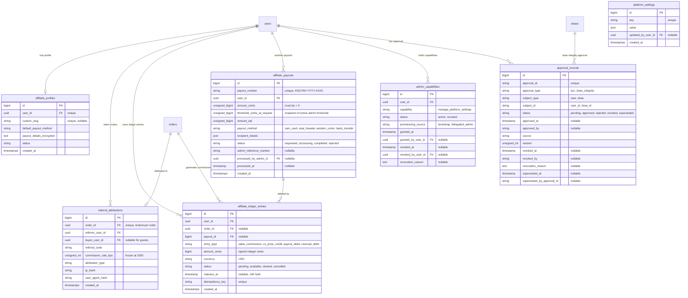
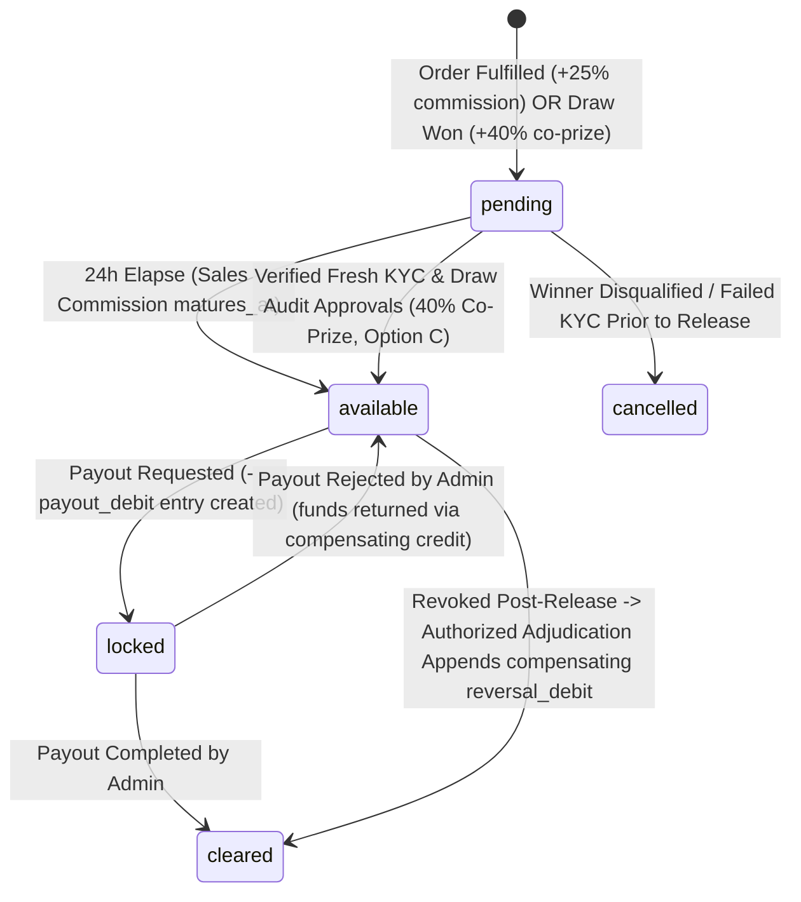

# Data Model Specification: Feature 006 — Affiliate & Referral Engine

**Domain**: Feature 006 — Affiliate & Referral Engine  
**Subledger**: Append-Only Affiliate Financial Subledger  
**Branch**: `006-affiliate-engine`  
**Date**: 2026-10-02  
**Database**: MySQL 8.0+ / MariaDB 10.4+ (InnoDB Engine)  

---

## 1. Relational Entity Overview

---

## 2. Table Schemas & Relational Invariants

### 2.1 Table: `affiliate_profiles`
Stores extended creator/influencer configuration without duplicating the core `users` identity.

| Column | Type | Nullable | Default | Description & Invariants |
| :--- | :--- | :--- | :--- | :--- |
| `id` | `BIGINT UNSIGNED` | No | Auto Inc | Primary key |
| `user_id` | `CHAR(36)` (UUID) | No | None | Foreign key referencing `users(id)` with `RESTRICT` on delete |
| `custom_slug` | `VARCHAR(64)` | Yes | `NULL` | Optional unique vanity slug (e.g. `alifaraj` for `knzin.com/alifaraj`) |
| `default_payout_method` | `VARCHAR(32)` | Yes | `NULL` | Preferred withdrawal method (`zain_cash`, `asia_hawala`, `western_union`, `bank_transfer`) |
| `payout_details` | `TEXT` | Yes | `NULL` | Encrypted JSON containing recipient phone number, IBAN, or full legal name |
| `status` | `VARCHAR(24)` | No | `'active'` | Profile lifecycle: `active`, `suspended`, `pending_verification` |
| `created_at` | `TIMESTAMP` | Yes | `NULL` | Creation timestamp |
| `updated_at` | `TIMESTAMP` | Yes | `NULL` | Last update timestamp |

**Indexes & Constraints**:
* `PRIMARY KEY (id)`
* `UNIQUE KEY uq_affiliate_profiles_user_id (user_id)`
* `UNIQUE KEY uq_affiliate_profiles_custom_slug (custom_slug)`
* `CONSTRAINT fk_affiliate_profiles_user FOREIGN KEY (user_id) REFERENCES users(id) ON DELETE RESTRICT`

---

### 2.2 Table: `referral_attributions`
Authoritative per-order referral binding. In accordance with the locked product decision, **attribution is locked per order**; it does NOT create automatic lifetime customer ownership.

| Column | Type | Nullable | Default | Description & Invariants |
| :--- | :--- | :--- | :--- | :--- |
| `id` | `BIGINT UNSIGNED` | No | Auto Inc | Primary key |
| `order_id` | `CHAR(36)` (UUID) | No | None | Foreign key referencing `orders(id)`. **Strictly unique** (1 order = max 1 attribution) |
| `referrer_user_id` | `CHAR(36)` (UUID) | No | None | Foreign key referencing `users(id)` who earned the attribution |
| `buyer_user_id` | `CHAR(36)` (UUID) | Yes | `NULL` | Foreign key referencing `users(id)` who made the purchase (nullable for guest checkout) |
| `referral_code` | `VARCHAR(32)` | No | None | Exact referral code used (`learner_code` or custom slug) |
| `commission_rate_bps` | `INT UNSIGNED` | No | `2500` | Frozen commission rate in basis points at fulfillment time (25.00%) |
| `attribution_type` | `VARCHAR(32)` | No | `'cookie'` | Source channel: `cookie_last_click`, `direct_link`, `vanity_slug` |
| `ip_hash` | `CHAR(64)` | Yes | `NULL` | Salted SHA-256 hash of client IP for anti-fraud rate limiting without PII exposure |
| `user_agent_hash` | `CHAR(64)` | Yes | `NULL` | SHA-256 hash of client User-Agent |
| `created_at` | `TIMESTAMP` | Yes | `NULL` | Timestamp when order attribution was locked |

**Indexes & Constraints**:
* `PRIMARY KEY (id)`
* `UNIQUE KEY uq_referral_attributions_order_id (order_id)` — Guarantees an order can never be attributed twice
* `KEY idx_referral_attributions_referrer (referrer_user_id, created_at)`
* `KEY idx_referral_attributions_buyer (buyer_user_id)`
* `CONSTRAINT fk_ref_attr_order FOREIGN KEY (order_id) REFERENCES orders(id) ON DELETE RESTRICT`
* `CONSTRAINT fk_ref_attr_referrer FOREIGN KEY (referrer_user_id) REFERENCES users(id) ON DELETE RESTRICT`
* `CONSTRAINT chk_ref_attr_anti_self_referral CHECK (referrer_user_id != buyer_user_id)` — Database-level self-referral guard

---

### 2.3 Table: `affiliate_ledger_entries` (Append-Only Affiliate Financial Subledger)
The legal, immutable financial source of truth for all affiliate earnings, hold states, and payout debits. Under the **Append-Only Affiliate Financial Subledger**, historical rows are permanent; rows are never deleted, and `amount_cents` is never rewritten in place.

| Column | Type | Nullable | Default | Description & Invariants |
| :--- | :--- | :--- | :--- | :--- |
| `id` | `BIGINT UNSIGNED` | No | Auto Inc | Primary key |
| `user_id` | `CHAR(36)` (UUID) | No | None | Foreign key referencing `users(id)` who owns this financial entry |
| `order_id` | `CHAR(36)` (UUID) | Yes | `NULL` | Foreign key referencing `orders(id)` (populated for sales commissions & reversals) |
| `payout_id` | `BIGINT UNSIGNED` | Yes | `NULL` | Foreign key referencing `affiliate_payouts(id)` (populated for payout debits) |
| `entry_type` | `VARCHAR(32)` | No | None | Transaction type: `sales_commission`, `co_prize_credit`, `payout_debit`, `reversal_debit` |
| `amount_cents` | `BIGINT` | No | None | Signed integer amount in USD cents (+50 for $2 part, +250 for $10 bundle, -5000 for payout) |
| `currency` | `CHAR(3)` | No | `'USD'` | Canonical platform accounting currency |
| `status` | `VARCHAR(24)` | No | `'pending'` | Lifecycle state: `pending`, `available`, `cleared`, `cancelled` |
| `funding_source` | `VARCHAR(32)` | No | `'commercial_operations'` | Source of funds: `commercial_operations`, `marketing_pool` |
| `metadata` | `JSON` | Yes | `NULL` | Structured audit metadata (e.g. winner prize, 0 deduction, reversal reason) |
| `matures_at` | `TIMESTAMP` | Yes | `NULL` | Timestamp when pending funds transition to available (24h hold for sales; null for Option C co-prizes) |
| `idempotency_key` | `VARCHAR(128)` | No | None | Unique string preventing duplicate credit/debit insertion |
| `created_at` | `TIMESTAMP` | Yes | `NULL` | Creation timestamp |
| `updated_at` | `TIMESTAMP` | Yes | `NULL` | Status transition timestamp |

**Indexes & Constraints**:
* `PRIMARY KEY (id)`
* `UNIQUE KEY uq_affiliate_ledger_idempotency (idempotency_key)` — Zero duplicate entries
* `UNIQUE KEY uq_affiliate_ledger_order_commission (order_id, entry_type)` — Guarantees exactly 1 commission per order
* `KEY idx_affiliate_ledger_user_status (user_id, status, matures_at)`
* `KEY idx_affiliate_ledger_payout (payout_id)`
* `CONSTRAINT fk_affiliate_ledger_user FOREIGN KEY (user_id) REFERENCES users(id) ON DELETE RESTRICT`
* `CONSTRAINT fk_affiliate_ledger_order FOREIGN KEY (order_id) REFERENCES orders(id) ON DELETE RESTRICT`

---

### 2.4 Table: `affiliate_payouts`
Auditable record of affiliate cash withdrawal requests, settlement states, and payment evidence.

| Column | Type | Nullable | Default | Description & Invariants |
| :--- | :--- | :--- | :--- | :--- |
| `id` | `BIGINT UNSIGNED` | No | Auto Inc | Primary key |
| `payout_number` | `VARCHAR(32)` | No | None | Human-readable unique serial (`KNZ-PAY-2026-XXXXXX`) |
| `user_id` | `CHAR(36)` (UUID) | No | None | Foreign key referencing requesting `users(id)` |
| `amount_cents` | `BIGINT UNSIGNED` | No | None | Requested amount in integer USD cents (must be > 0 and >= active threshold) |
| `threshold_cents_at_request` | `BIGINT UNSIGNED` | No | None | Immutable snapshot of active Admin minimum threshold in integer cents at request time |
| `amount_iqd` | `BIGINT UNSIGNED` | No | None | Converted gateway amount in Iraqi Dinar (calculated at fixed 1,310 rate) |
| `payout_method` | `VARCHAR(32)` | No | None | Selected transfer method (`zain_cash`, `asia_hawala`, `western_union`, `bank_transfer`) |
| `recipient_details` | `JSON` | No | None | Structured recipient metadata (phone number, account name, governorate) |
| `status` | `VARCHAR(24)` | No | `'requested'` | State machine: `requested` $\rightarrow$ `processing` $\rightarrow$ `completed` (or `rejected`) |
| `admin_reference_number`| `VARCHAR(128)` | Yes | `NULL` | External transaction tracking number provided by administrator (receipt proof) |
| `admin_notes` | `TEXT` | Yes | `NULL` | Administrative rejection reason or internal settlement notes |
| `processed_by_admin_id`| `CHAR(36)` (UUID) | Yes | `NULL` | Foreign key referencing administrative `users(id)` who executed payout |
| `processed_at` | `TIMESTAMP` | Yes | `NULL` | Timestamp of administrative settlement |
| `created_at` | `TIMESTAMP` | Yes | `NULL` | Request submission timestamp |
| `updated_at` | `TIMESTAMP` | Yes | `NULL` | State change timestamp |

**Indexes & Constraints**:
* `PRIMARY KEY (id)`
* `UNIQUE KEY uq_affiliate_payouts_number (payout_number)`
* `KEY idx_affiliate_payouts_user_status (user_id, status)`
* `CONSTRAINT fk_affiliate_payouts_user FOREIGN KEY (user_id) REFERENCES users(id) ON DELETE RESTRICT`
* `CONSTRAINT chk_affiliate_payouts_positive_amount CHECK (amount_cents > 0)`

---

### 2.5 Table: `admin_capabilities` (Initial Admin Provisioning & Authorization)
Stores multi-user administrative privileges with persistent provenance.

| Column | Type | Nullable | Default | Description & Invariants |
| :--- | :--- | :--- | :--- | :--- |
| `id` | `BIGINT UNSIGNED` | No | Auto Inc | Primary key |
| `user_id` | `CHAR(36)` (UUID) | No | None | Foreign key referencing `users(id)` |
| `capability` | `VARCHAR(64)` | No | None | Specific capability (e.g. `manage_platform_settings`) |
| `status` | `VARCHAR(24)` | No | `'active'` | Status: `active`, `revoked` |
| `provisioning_source` | `VARCHAR(32)` | No | None | Origin: `bootstrap`, `delegated_admin` |
| `granted_at` | `TIMESTAMP` | No | None | UTC timestamp when granted |
| `granted_by_user_id` | `CHAR(36)` (UUID) | Yes | `NULL` | Authorizing admin user ID (`null` for initial bootstrap) |
| `revoked_at` | `TIMESTAMP` | Yes | `NULL` | UTC timestamp if revoked |
| `revoked_by_user_id` | `CHAR(36)` (UUID) | Yes | `NULL` | Authorizing admin user ID who revoked |
| `revocation_reason` | `TEXT` | Yes | `NULL` | Auditable narrative reason for revocation |
| `created_at` | `TIMESTAMP` | Yes | `NULL` | Creation timestamp |
| `updated_at` | `TIMESTAMP` | Yes | `NULL` | Update timestamp |

**Indexes & Constraints**:
* `PRIMARY KEY (id)`
* `UNIQUE KEY uq_user_admin_capability (user_id, capability)` — Prevents duplicate capability assignment
* `KEY idx_admin_capabilities_lookup (user_id, capability, status)`
* `CONSTRAINT fk_admin_cap_user FOREIGN KEY (user_id) REFERENCES users(id) ON DELETE CASCADE`
* `CONSTRAINT fk_admin_cap_granted_by FOREIGN KEY (granted_by_user_id) REFERENCES users(id) ON DELETE SET NULL`
* `CONSTRAINT fk_admin_cap_revoked_by FOREIGN KEY (revoked_by_user_id) REFERENCES users(id) ON DELETE SET NULL`

---

### 2.6 Table: `approval_records` (Common Approval-Record Contract)
Stores universal approval evidence consumed for Option C Co-Prize releases and audits.

| Column | Type | Nullable | Default | Description & Invariants |
| :--- | :--- | :--- | :--- | :--- |
| `id` | `BIGINT UNSIGNED` | No | Auto Inc | Primary key |
| `approval_id` | `VARCHAR(64)` | No | None | Unique deterministic or external approval identifier |
| `approval_type` | `VARCHAR(32)` | No | None | Domain type: `kyc`, `draw_integrity` |
| `subject_type` | `VARCHAR(32)` | No | None | Target entity: `user`, `draw` |
| `subject_id` | `VARCHAR(64)` | No | None | Target identifier: `user_id` or `draw_id` |
| `status` | `VARCHAR(24)` | No | `'pending'` | Lifecycle: `pending`, `approved`, `rejected`, `revoked`, `superseded` |
| `approved_at` | `TIMESTAMP` | Yes | `NULL` | UTC timestamp of approval |
| `approved_by` | `VARCHAR(64)` | Yes | `NULL` | Identifier of authorizing officer/service principal |
| `source` | `VARCHAR(64)` | No | None | Origin subsystem: `compliance_kyc_subsystem`, `draw_audit_engine` |
| `version` | `INT UNSIGNED` | No | `1` | Monotonic schema/audit revision counter |
| `revoked_at` | `TIMESTAMP` | Yes | `NULL` | UTC timestamp if revoked |
| `revoked_by` | `VARCHAR(64)` | Yes | `NULL` | Revoking officer/admin |
| `revocation_reason` | `TEXT` | Yes | `NULL` | Auditable justification for revocation |
| `superseded_at` | `TIMESTAMP` | Yes | `NULL` | UTC timestamp if superseded |
| `superseded_by_approval_id` | `VARCHAR(64)` | Yes | `NULL` | Replacing approval ID |
| `created_at` | `TIMESTAMP` | Yes | `NULL` | Creation timestamp |
| `updated_at` | `TIMESTAMP` | Yes | `NULL` | Update timestamp |

**Indexes & Constraints**:
* `PRIMARY KEY (id)`
* `UNIQUE KEY uq_approval_records_approval_id (approval_id)`
* `UNIQUE KEY uq_approval_version (approval_type, subject_type, subject_id, version)` — Strict race safety on revision version
* `KEY idx_approval_records_lookup (approval_type, subject_id, version)`
* `KEY idx_approval_status (approval_type, status, revoked_at)`

---

### 2.7 Table: `platform_settings`
Dynamic platform configuration requiring authorized Admin mutation.

| Column | Type | Nullable | Default | Description & Invariants |
| :--- | :--- | :--- | :--- | :--- |
| `id` | `BIGINT UNSIGNED` | No | Auto Inc | Primary key |
| `key` | `VARCHAR(64)` | No | None | Unique setting key (e.g. `affiliate.payout_min_cents`) |
| `value` | `JSON` | No | None | JSON-encoded value (e.g. integer cents `5000`) |
| `updated_by_user_id` | `CHAR(36)` (UUID) | Yes | `NULL` | Foreign key referencing admin user who mutated setting |
| `created_at` | `TIMESTAMP` | Yes | `NULL` | Creation timestamp |
| `updated_at` | `TIMESTAMP` | Yes | `NULL` | Update timestamp |

**Indexes & Constraints**:
* `PRIMARY KEY (id)`
* `UNIQUE KEY uq_platform_settings_key (key)`
* `CONSTRAINT fk_platform_settings_updated_by FOREIGN KEY (updated_by_user_id) REFERENCES users(id) ON DELETE SET NULL`

---

## 3. Financial Invariants & Mathematical Formulations

### 3.1 25% Sales Commission Math
$$\text{commission\_cents} = \text{intdiv}(\text{order.total\_amount\_cents} \times 2500, 10000)$$
* **$2.00 Course Part**: $\text{intdiv}(200 \times 2500, 10000) = \mathbf{50\text{ cents}}$ ($0.50)
* **$10.00 Course Bundle**: $\text{intdiv}(1000 \times 2500, 10000) = \mathbf{250\text{ cents}}$ ($2.50)

### 3.2 40% Grand-Prize Co-Share Math
$$\text{co\_prize\_cents} = \text{intdiv}(\text{prize.valuation\_cents} \times 4000, 10000)$$
* **$10,000 Grand Prize**: $\text{intdiv}(1000000 \times 4000, 10000) = \mathbf{400,000\text{ cents}}$ ($4,000.00)
* **Funding Source**: Platform promotional marketing pool; winner retains 100% ($10,000).

### 3.3 Available Balance Derivation (Append-Only Subledger)
$$\text{AvailableBalance}(T) = \sum_{\substack{\text{status} = '\text{available}' \\ \text{matures\_at} \le T}} \text{amount\_cents} + \sum_{\text{entry\_type} = '\text{reversal\_debit}'} \text{amount\_cents} - \sum_{\text{entry\_type} = '\text{payout\_debit}'} |\text{amount\_cents}|$$
Where `reversal_debit` carries a negative `amount_cents` that compensates for revoked credits without mutating historical rows.

---

## 4. State Machines

### 4.1 Commission Ledger State Transition

