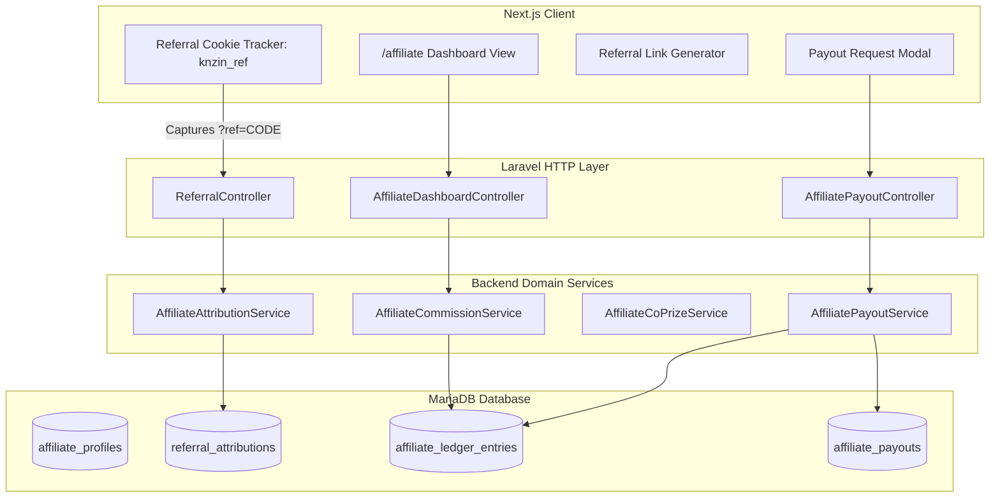

# Implementation Plan: Feature 006 — Multi-Tier Affiliate & Referral Engine

**Branch**: `006-affiliate-engine` | **Date**: 2026-10-02 | **Spec**: [specs/006-affiliate-engine/spec.md](spec.md)  
**Input**: Master Roadmap, Feature 006 Implementation Instruction, and locked product decisions (25% sales commission, 30-day last-click attribution, Admin-controlled minimum payout threshold, 24h maturation hold, 40% marketing pool grand-prize co-share).

---

## 1. Summary

Feature 006 introduces the dual-benefit viral affiliate engine into KNZiN:
1. **Buyer Protection**: Referred buyers receive their normal course access and full promotional tickets ($2 part = 1 ticket, $10 bundle = 15 tickets) with zero price surcharge and zero ticket loss.
2. **Referrer Sales Commission**: Referrers earn 25% on qualifying referred sales ($0.50 per $2 part, $2.50 per $10 bundle), credited to an append-only financial ledger with a 24-hour maturation hold.
3. **Grand-Prize 40% Co-Share**: Referrers receive an independent 40% prize valuation award funded by the KNZiN marketing pool when their referred customer wins an eligible draw (held in `pending` status until winner KYC and draw integrity audit are approved by Admin, per Option C).
4. **Self-Service Creator Portal**: Responsive `/affiliate` portal with real-time KPI cards, campaign link generator, transaction ledger, and local payout requests (ZainCash, AsiaHawala, Western Union) with an Admin-controlled minimum threshold.

---

## 2. Technical Context

* **Backend Stack**: Laravel 11.56.1, PHP 8.4.21, MariaDB 10.4.32 (InnoDB, row-level locks, transactions).
* **Frontend Stack**: Next.js 16.3.6 (App Router), React 19.2.8, Tailwind CSS v4, `next-intl` (Arabic RTL / English LTR), TanStack React Query ^5.104.
* **Storage & Currency**: All financial figures stored as integer USD cents (`BIGINT`); dual-currency gateway conversion at fixed 1,310 IQD rate (`intdiv($cents * 131, 10)`).
* **Testing Stack**: PHPUnit 10.5.65 (Backend unit & feature suites) + Native Node test runner with `tsx` (Frontend invariant tests).
* **Queue Driver**: `sync` for local development; Redis ready for production deployment.

---

## 3. Constitution Check & Invariant Verification

| Gate | Status | Evidence & Enforcement |
| :--- | :--- | :--- |
| **I. Authority Boundary** | **PASSED** | Preserves all 4 locked product owner decisions (25% commission rate, 30-day last-click, Admin-controlled minimum payout threshold with default $50, 24h maturation hold). |
| **II. Financial Integrity (DEC-002)** | **PASSED** | Uses append-only subledger (`affiliate_ledger_entries`), zero floating-point math, row-level pessimistic locking (`lockForUpdate()`), and aggregate balance derivation. |
| **III. Brownfield Reality** | **PASSED** | Reuses `User.learner_code`, `orders`, `CourseEntitlement`, and `Ticket` serials from Feature 005. Zero duplicate tables or rewrites. |
| **IV. Single User Identity** | **PASSED** | Single `users` table; `affiliate_profiles` extends users without separate login credentials. |
| **V. Anti-Pyramid Boundary** | **PASSED** | Single-tier referral only. Downline/multi-level commission networks are strictly excluded. |

---

## 4. Project Structure & Target File Inventory

```text
specs/006-affiliate-engine/
├── spec.md                                     # Formal specification
├── research.md                                 # Technical research & math formulations
├── data-model.md                               # Schema, indices, constraints, state machines
├── quickstart.md                               # Developer test scenarios 1–8
├── contracts/
│   ├── referrals.contract.md                   # Public referral resolution & order payload
│   ├── affiliate-dashboard.contract.md         # Affiliate KPI summary & ledger history
│   ├── payouts.contract.md                     # Withdrawal requests & settlement history
│   ├── co-prize.contract.md                    # Domain service contract for draw co-prize
│   ├── admin-provisioning.contract.md          # One-time bootstrap and delegated capability grants
│   └── approval-records.contract.md            # Universal approval record contract and freshness rules
└── plan.md                                     # This architecture & technical design file
```

---

## 5. Architectural Component Design



---

## 6. Implementation Phases & File Plan

### Phase 1: Database Foundations (Migrations & Constraints)
* `backend/database/migrations/2026_10_02_000001_create_affiliate_profiles_table.php`: Vanity slugs and payout settings.
* `backend/database/migrations/2026_10_02_000002_create_referral_attributions_table.php`: Per-order locked attribution with anti-self-referral check constraint.
* `backend/database/migrations/2026_10_02_000003_create_affiliate_ledger_entries_table.php`: Append-only ledger with unique idempotency keys.
* `backend/database/migrations/2026_10_02_000004_create_affiliate_payouts_table.php`: Payout requests with positive amount check constraint (`amount_cents > 0`) and snapshot audit column (`threshold_cents_at_request`).

### Phase 2: Eloquent Models & Domain Invariants
* `backend/app/Models/AffiliateProfile.php`: Relationship to `User`.
* `backend/app/Models/ReferralAttribution.php`: Relationship to `Order`, `referrer`, and `buyer`.
* `backend/app/Models/AffiliateLedgerEntry.php`: Status scopes (`matureAvailable`, `pendingHold`), signed amounts.
* `backend/app/Models/AffiliatePayout.php`: State transitions (`requested` $\rightarrow$ `completed`).
* Model enhancements:
  * `backend/app/Models/User.php`: Adds `hasOne(AffiliateProfile::class)` and `hasMany(AffiliateLedgerEntry::class)`.
  * `backend/app/Models/Order.php`: Adds `hasOne(ReferralAttribution::class)`.

### Phase 3: Core Domain Services & Configuration
* `backend/config/knzin.php`: Centralizes affiliate policy (`commission_rate_bps = 2500`, `payout_min_cents = 5000`, `maturation_hours = 24`, `cookie_duration_days = 30`, `co_prize_rate_bps = 4000`).
* `backend/app/Services/AffiliateAttributionService.php`: Validates incoming referral codes, enforces anti-self-referral rules, and locks attribution to `orders`.
* `backend/app/Services/AffiliateCommissionService.php`: Computes 25% commission upon order fulfillment, inserts idempotent ledger credit with 24h maturation hold.
* `backend/app/Services/AffiliateCoPrizeService.php`: Implements 40% grand-prize co-share allocation from platform marketing pool when a winning ticket is resolved (creates pending entry; releases to available status upon Admin KYC approval, per Option C).
* `backend/app/Services/AffiliatePayoutService.php`: Validates available balance, enforces active Admin minimum threshold dynamically at submission, snapshots threshold into `threshold_cents_at_request`, locks funds with `payout_debit` entry inside a database transaction, and guarantees pending payouts remain invariant under subsequent threshold changes.
* Hook into `backend/app/Services/OrderService.php`:
  * Attach attribution on order creation.
  * Trigger commission calculation in `fulfillOrder()` after transaction commit.

### Phase 4: API Controllers & Routes
* `backend/app/Http/Controllers/ReferralController.php`: Public `resolve` endpoint.
* `backend/app/Http/Controllers/AffiliateDashboardController.php`: Authenticated summary & paginated ledger.
* `backend/app/Http/Controllers/AffiliatePayoutController.php`: Payout request submission and history.
* `backend/routes/api.php`: Registers `/api/v1/referrals/...` and `/api/v1/affiliate/...` endpoints.

### Phase 5: Frontend Referral Capture & Affiliate Portal
* `frontend/src/middleware.ts` or client wrapper: Captures `?ref=CODE` query parameter and stores `knzin_ref` cookie for 30 days (`SameSite=Lax`).
* `frontend/src/app/[locale]/affiliate/page.tsx`: Dedicated Affiliate Dashboard route.
* `frontend/src/components/affiliate/AffiliateDashboardView.tsx`: Full bilingual dashboard container.
* `frontend/src/components/affiliate/AffiliateKpiCards.tsx`: Displays Unpaid Balance, Total Earned, Referred Orders, Co-Prize Entries.
* `frontend/src/components/affiliate/ReferralLinkCard.tsx`: One-click copy for referral link, QR code, and UTM campaign generator.
* `frontend/src/components/affiliate/AffiliateLedgerTable.tsx`: Paginated transaction history table.
* `frontend/src/components/affiliate/PayoutRequestModal.tsx`: Withdrawal request modal displaying current active threshold dynamically from API, validating input against minimum balance, with ZainCash/AsiaHawala/Western Union inputs.
* `frontend/src/hooks/useAffiliateDashboard.ts`: Data hook for dashboard KPIs.
* `frontend/src/hooks/useAffiliateLedger.ts`: Data hook for ledger pagination.
* `frontend/src/hooks/useAffiliatePayouts.ts`: Mutation hook for withdrawal requests.
* `frontend/messages/ar.json` & `en.json`: 100% dictionary key parity for `affiliate` namespace.

### Phase 6: Automated Testing & Invariant Verification
* Backend Unit Tests:
  * `backend/tests/Unit/AffiliateCommissionMathTest.php`: 25% integer math verification ($2 part $\rightarrow$ $0.50, $10 bundle $\rightarrow$ $2.50).
  * `backend/tests/Unit/AffiliateCoPrizeMathTest.php`: 40% grand-prize math verification.
* Backend Feature Tests:
  * `backend/tests/Feature/ReferralAttributionTest.php`: 30-day last-click binding, per-order isolation.
  * `backend/tests/Feature/AntiSelfReferralTest.php`: Rejection of identical user ID and normalized email.
  * `backend/tests/Feature/AffiliateCommissionFulfillmentTest.php`: Idempotent commission minting, duplicate webhook immunity.
  * `backend/tests/Feature/AffiliateCoPrizeResolutionTest.php`: Awarding 40% marketing pool prize upon draw win.
  * `backend/tests/Feature/AffiliatePayoutLifecycleTest.php`: Dynamic Admin threshold enforcement, snapshot audit verification (`threshold_cents_at_request`), pending payout invariance after threshold increase, zero auto-payout generation on threshold reduction, balance locking, and double-spend prevention.
* Frontend Invariant Tests:
  * `frontend/src/tests/BuyerBenefitPreservation.test.ts`: Asserts referred buyer receives 100% course entitlement and normal tickets with zero price surcharge.
  * `frontend/src/tests/AffiliatePortalInvariants.test.ts`: Asserts RTL/LTR dictionary synchronization, threshold validation, and referral link generation.

### Phase 7: Multi-User Security Architecture & Integration Contracts
* Migration `backend/database/migrations/2026_10_02_000006_create_admin_capabilities_table.php`:
  * Multi-user capability storage with `status`, `provisioning_source`, `granted_at`, `granted_by_user_id`, `revoked_at`, `revoked_by_user_id`, `revocation_reason`.
* Migration `backend/database/migrations/2026_10_02_000007_create_approval_records_table.php`:
  * Universal `approval_records` contract with provenance, state-based freshness, unique version constraint `uq_approval_version`, and trusted write boundary `ApprovalRegistryService`.
* Security & Administrative Console Commands:
  * `backend/app/Console/Commands/BootstrapAdminCommand.php`: One-time out-of-band bootstrap for first administrator guarded by deployment token secret (`ADMIN_BOOTSTRAP_TOKEN`), race-safe atomic singleton lock, and least-privilege root capability assignment.
  * `backend/app/Console/Commands/GrantAdminCapabilityCommand.php`: Delegated admin provisioning requiring active admin authorizer with `manage_admin_capabilities` and anti-self-grant protection.
  * `backend/app/Console/Commands/RevokeAdminCapabilityCommand.php`: Explicit revocation path with audit provenance requiring `manage_admin_capabilities`.
  * `backend/app/Console/Commands/SetPlatformSettingCommand.php`: Admin-authorized CLI setting mutation requiring `manage_platform_settings`.
* Integration Domain Providers & Services:
  * `backend/app/Services/ApprovalRegistryService.php`: Trusted write boundary for creating, revoking, and atomically superseding approval records.
  * `backend/app/Services/DatabaseCoPrizeApprovalProvider.php`: Queries authoritative `approval_records` for exact winner user ID and draw ID.
  * `backend/app/Services/ApprovalProvenance.php`: Encapsulates provenance and state-based freshness checks.
  * `backend/app/Services/AffiliateCoPrizeService.php`: Implements `adjudicateCoPrizeRevocation()` for authorized compensating reversal debits under the Append-Only Affiliate Financial Subledger requiring `adjudicate_affiliate_coprize`.
* Test Suites:
  * `backend/tests/Feature/AdminPlatformSettingsAuthorizationTest.php`: 17 comprehensive tests for bootstrap, tokens, delegated grants, revocation, capability segregation, self-grant prevention, and race conditions.
  * `backend/tests/Feature/AffiliateCoPrizeResolutionTest.php`: 19 comprehensive tests covering approval freshness, missing/revoked/superseded states, post-release revocation adjudication, and trusted approval write boundary.

---

## 7. Verification & Acceptance Gate Mapping

| Acceptance Scenario | Implementation Component | Verification Suite |
| :--- | :--- | :--- |
| **Scenario 1: Referred $2 Part Purchase** | `OrderService`, `AffiliateCommissionService` | `AffiliateCommissionFulfillmentTest` |
| **Scenario 2: Referred $10 Bundle Purchase** | `OrderService`, `AffiliateCommissionService` | `AffiliateCommissionFulfillmentTest` |
| **Scenario 3: Referred Winner 40% Co-Share** | `AffiliateCoPrizeService` | `AffiliateCoPrizeResolutionTest` |
| **Scenario 4: Coexistence of Purchase & Co-Prize** | `AffiliateCommissionService`, `AffiliateCoPrizeService` | `AffiliateCoPrizeResolutionTest` |
| **Scenario 5: Self-Referral Rejection** | `AffiliateAttributionService` | `AntiSelfReferralTest` |
| **Scenario 6: Duplicate Fulfillment Replay** | Database unique constraint, row lock | `AffiliateCommissionFulfillmentTest` |
| **Scenario 7: Duplicate Co-Prize Replay** | Database unique idempotency key | `AffiliateCoPrizeResolutionTest` |
| **Scenario 8: Payout Threshold, Snapshot & Balance Lock** | `AffiliatePayoutService`, ledger debit | `AffiliatePayoutLifecycleTest` |
| **Security Contract 1: Initial Admin Provisioning** | `BootstrapAdminCommand`, `AdminCapability` | `AdminPlatformSettingsAuthorizationTest` |
| **Security Contract 2: Approval Freshness & Revocation**| `DatabaseCoPrizeApprovalProvider`, `ApprovalRecord` | `AffiliateCoPrizeResolutionTest` |

