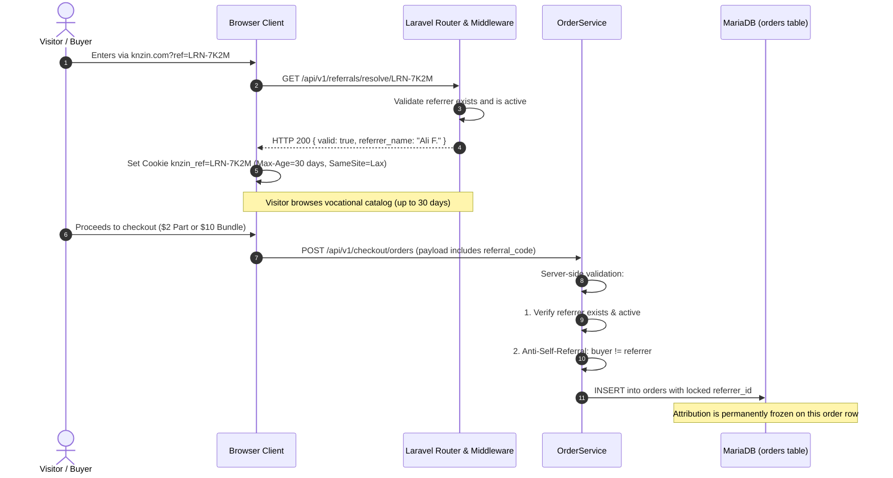

# Technical Research: Feature 006 — Multi-Tier Affiliate & Referral Engine

**Feature**: [specs/006-affiliate-engine/spec.md](spec.md)  
**Branch**: `006-affiliate-engine`  
**Date**: 2026-10-02  

---

## 1. Locked Commercial & Product Decisions

Following explicit product-owner ratification, the commercial rules for Feature 006 are locked as follows:

| Decision Area | Approved Policy | Architectural & Mathematical Rule |
| :--- | :--- | :--- |
| **Sales Commission Rate** | **25% of qualifying referred course purchases** | $2.00 part (200 cents) $\rightarrow$ **$0.50 commission (50 cents)**<br>$10.00 bundle (1,000 cents) $\rightarrow$ **$2.50 commission (250 cents)**.<br>All arithmetic executed via integer cents: `intdiv($totalAmountCents * 25, 100)`. |
| **Buyer Protection** | **100% Normal Benefits Preserved** | Buyer keeps 1 promotional ticket per $2 part, 15 tickets per $10 bundle. Zero ticket deduction, zero price surcharge. |
| **Minimum Payout Threshold** | **Admin-Controlled Dynamic Setting (Default: $50.00 USD / 5,000 cents)** | Dynamic business setting in integer minor units (`BIGINT` cents).<br>• **Active Threshold Rule**: Evaluated server-side at the exact moment of request submission against current active Admin setting.<br>• **Pending Invariance Rule**: Threshold changes never invalidate, cancel, or alter previously accepted pending payouts; lowering threshold never auto-generates payouts.<br>• **Audit Rule**: Every accepted payout persists `threshold_cents_at_request` for historical compliance. |
| **Sales Commission Maturation** | **24 Hours** | Centralized domain policy in `config/knzin.php` (`affiliate.maturation_hours = 24`); commissions enter `status = 'pending'` with `matures_at = now()->addHours(24)`. |
| **40% Grand-Prize Co-Share (Option C)** | **Confirmed Marketing Pool Reward (Held for KYC Audit)** | Independent event; 40% of grand prize valuation awarded to referrer when referred customer wins a draw; zero deduction from winner's prize.<br>**Option C Policy**: Initially credited in `status = 'pending'`; transitions to `available` strictly upon Admin approval of winner's KYC and draw integrity audit. |
| **Commission Structure** | **Single-Tier (No MLM)** | Single direct referrer only; multi-level downline commissions strictly excluded. |

---

## 2. Research Question 1: Financial Integrity & Append-Only Ledger Design

### Context & Constraints
* Constitution DEC-002 mandates that financial balances must never be a mutable integer column on `users` arbitrarily incremented (`user.commission_balance += amount`).
* The system must withstand duplicate webhooks, concurrent fulfillment calls, worker retries, and network race conditions.

### Architectural Solution
We implement an **Append-Only Affiliate Financial Subledger** (`affiliate_ledger_entries`), fully reconciled with Constitution `DEC-002`:
* Every financial transaction is represented as an immutable row with `entry_type`, `amount_cents`, `currency`, `status`, and `idempotency_key`.
* **Credit Entries**:
  * `sales_commission`: Created upon qualifying order fulfillment (`+50 cents` or `+250 cents`). Initial state: `pending`, matures in 24 hours to `available`.
  * `co_prize_credit`: Created when referred customer wins grand prize (`+40% of prize value`). Initial state: `pending`; transitions to `available` after winner KYC and draw audit are officially approved by Admin.
* **Debit Entries**:
  * `payout_debit`: Created when an affiliate requests a withdrawal (`-5000+ cents`), transitioning requested funds to locked state.
  * `reversal_debit`: Created upon order refund/chargeback to cancel unearned commission.
* **Balance Calculation (Server-Authoritative)**:
  $$\text{Available Balance} = \sum(\text{mature credit entries}) - \sum(\text{debit entries})$$
  $$\text{Pending Balance} = \sum(\text{immature credit entries in 24h hold})$$
* **Row-Level Locking**: When submitting a payout or processing fulfillment, the affiliate's ledger state is locked inside a MariaDB database transaction using `lockForUpdate()`.

---

## 3. Research Question 2: Attribution Lifecycle & 30-Day Last-Click Mechanics

### Context & Constraints
* How does the system capture referral intent, preserve it across browsing, and authoritatively bind it to the purchase without trusting the client?
* Per owner decision, attribution is **locked per order**; it must NOT create automatic lifetime customer ownership.

### Architectural Solution


* **Last-Click Rule**: If the visitor clicks a second referral link `?ref=LRN-OTHER` before purchase, the cookie is overwritten with the latest valid code.
* **Per-Order Independence**: When User B places Order #1, it is bound to User A. If User B returns 60 days later organically (no referral link) and buys Order #2, Order #2 has `referrer_id = null`. User A does not own User B for life.

---

## 4. Research Question 3: Anti-Self-Referral & Fraud Prevention

### Context & Constraints
* Fraudsters will attempt self-referral loops (buying courses with their own link to receive 25% discounts).
* The engine must detect hard violations deterministically without false-positive blacklisting of legitimate students on shared cellular networks.

### Defense Invariants (`DEF-06A`)
1. **Authenticated User Self-Referral Shield**:
   * If `auth:sanctum` user ID matches the referrer's user ID $\rightarrow$ `ERR_SELF_REFERRAL_FORBIDDEN`. Attribution dropped.
2. **Guest Normalized Email Shield**:
   * If buyer guest email (lowercased, trimmed) matches the referrer's account email $\rightarrow$ attribution dropped.
3. **Audit Trail Preservation**:
   * When an order is created, the system records `attribution_ip_hash` (`sha256(ip + app_key)`) and `user_agent_hash` for post-hoc fraud analysis without storing sensitive unhashed PII.
4. **Suspicious Self-Dealing Threshold**:
   * If 5+ orders occur from the identical IP within 1 hour with the same referral code, the commission is flagged for administrative review (`status = 'flagged'`) rather than automatic payout.

---

## 5. Research Question 4: Grand-Prize 40% Co-Share Domain Boundary

### Context & Constraints
* Feature 006 must not own or implement draw winner selection or electronic RNG (belongs to Feature 008).
* How does the system seamlessly award the 40% co-prize when a winning ticket serial is declared?

### Architectural Solution
* Feature 006 exposes a dedicated domain service: `App\Services\AffiliateCoPrizeService`.
* When Feature 008 declares winning ticket `#KNZ-26-XXXX-YYYY`:
  1. The draw runner invokes `AffiliateCoPrizeService::awardCoPrize(DrawWinner $winner)`.
  2. The service resolves the ticket $\rightarrow$ order $\rightarrow$ `referrer_id`.
  3. If an attributed referrer exists, it fetches the prize valuation (e.g. $10,000 car = 1,000,000 cents).
  4. It computes integer $40\% = \text{intdiv}(1000000 \times 40, 100) = 400,000\text{ cents}$ ($4,000).
  5. It inserts an idempotent row into `affiliate_ledger_entries`:
     * `entry_type = 'co_prize_credit'`
     * `source_type = 'draw_winner'`
     * `source_id = $winner->id`
     * `amount_cents = 400000`
     * `status = 'pending'` (held until winner KYC verification and draw audit are approved by Admin, per Option C)
     * `idempotency_key = "co_prize_winner_{$winner->id}"`
  6. If the ticket had no referrer, the service logs `NO_REFERRER_ATTRIBUTED` and completes cleanly.

---

## 6. Research Question 5: Payout Request Lifecycle, Threshold Invariance & Concurrency

### Context & Constraints
* An affiliate with $50.00 available balance could attempt to submit two concurrent withdrawal requests to drain $100.00.
* Payouts in Iraq are settled via manual mobile wallet transfers (ZainCash, AsiaHawala) or Western Union wire transfers by platform administrators.
* The minimum payout threshold is an **Admin-controlled business setting** (integer minor units), not a static database constant.

### Payout Threshold Rules & Architectural Solution
1. **Active Threshold Behavior**:
   * The Admin-controlled threshold is evaluated dynamically server-side at the **exact moment the request is submitted**.
   * The backend is authoritative; frontend display values only guide the user.
   * If `requestAmount < activeThresholdCents`, the server rejects the request (`HTTP 422 ERR_PAYOUT_THRESHOLD_UNMET`).
2. **Pending Payouts Invariance After Threshold Changes**:
   * Once a payout request is accepted and enters `status = 'requested'`, subsequent threshold changes (increases or decreases) **MUST NOT invalidate, cancel, or modify** that pending payout.
   * The accepted payout continues through administrative settlement under the threshold active when it was submitted.
   * Example: If threshold is $50 and an affiliate requests $60, it is accepted (`status = 'requested'`). If the Admin then raises the threshold to $100, the pending $60 payout remains valid and proceeds through settlement. Only new requests must meet $100.
   * Conversely, lowering the threshold (e.g. from $50 to $25) **never automatically generates payouts** for affiliates; affiliates must explicitly submit withdrawal requests.
3. **Audit Requirement (`threshold_cents_at_request`)**:
   * Every payout record captures the snapshot column `threshold_cents_at_request` at creation time.
   * This provides an immutable audit trail allowing administrators and auditors to verify:
     - What threshold was active at that moment?
     - What amount did the affiliate request?
     - Why was the request accepted?
4. **Pessimistic Concurrency Guard & Ledger Debit**:
   ```php
   DB::transaction(function () use ($affiliate, $requestAmount) {
       // 1. Lock affiliate profile row
       $profile = AffiliateProfile::where('user_id', $affiliate->id)->lockForUpdate()->firstOrFail();
       
       // 2. Compute mature available balance from ledger
       $availableCents = $this->calculateAvailableBalance($affiliate->id);
       
       // 3. Resolve currently active Admin threshold (runtime setting with config fallback)
       $activeMinThresholdCents = app(PlatformSettingsService::class)->get('affiliate.payout_min_cents', config('knzin.affiliate.payout_min_cents', 5000));
       
       if ($requestAmount > $availableCents || $requestAmount < $activeMinThresholdCents) {
           throw new PayoutThresholdException("Minimum payout is {$activeMinThresholdCents} cents");
       }
       
       // 4. Atomically create payout record with immutable snapshot of active threshold
       $payout = AffiliatePayout::create([
           'payout_number' => 'KNZ-PAY-' . date('Y') . '-' . strtoupper(Str::random(6)),
           'user_id' => $affiliate->id,
           'amount_cents' => $requestAmount,
           'threshold_cents_at_request' => $activeMinThresholdCents,
           'status' => 'requested',
       ]);
       
       // 5. Atomically insert debit ledger entry
       AffiliateLedgerEntry::create([
           'user_id' => $affiliate->id,
           'payout_id' => $payout->id,
           'entry_type' => 'payout_debit',
           'amount_cents' => -$requestAmount,
           'status' => 'cleared',
           'idempotency_key' => "payout_{$payout->id}",
       ]);
   });
   ```
* This ensures available balance decreases immediately upon request creation, rendering double-spend impossible.
* When the platform admin executes the transfer, they input the external transaction tracking number (`admin_reference_number`), marking the payout `completed`.

---

## 7. Configuration & Parameter Architecture

Baseline policies are defined in [`backend/config/knzin.php`](file:///d:/Work%20Projects/Knzin%20Project/backend/config/knzin.php) and dynamically overrideable via Admin settings storage:

```php
'affiliate' => [
    'commission_rate_bps' => 2500, // 25.00% (2500 basis points)
    'payout_min_cents' => 5000,    // Default baseline: $50.00 USD (5,000 cents)
    'maturation_hours' => 24,      // 24 hours holding period for sales commissions
    'cookie_duration_days' => 30,  // 30 days last-click window
    'co_prize_rate_bps' => 4000,   // 40.00% grand-prize co-share
],
```

* **Dynamic Threshold Override**: The Admin can update `affiliate.payout_min_cents` at runtime. The payout service queries this dynamic setting first, falling back to the configuration baseline.
* Zero hardcoded magic numbers in controllers, models, or database migrations.

---

## 8. Research Question 6: Initial Admin Provisioning & Multi-User RBAC Architecture

### Context & Constraints
* The repository currently has no RBAC or Admin UI.
* Single-owner, hardcoded email, or `--force` command assumptions are strictly rejected for production safety.
* How to establish the first trusted Administrator safely, securely, and auditably?

### Architectural Solution
1. **Four-Stage Authorization Model**:
   $$\text{User} \longrightarrow \text{Admin Capability} \longrightarrow \text{Persistent Authorization} \longrightarrow \text{Protected Mutation}$$
2. **One-Time Out-of-Band Bootstrap (`knzin:bootstrap-admin`)**:
   * Evaluates `AdminCapability::active()->where('capability', 'manage_platform_settings')->exists()`.
   * If any active administrator exists, the bootstrap path is **permanently blocked**.
   * Requires `--token` matching deployment secret `ADMIN_BOOTSTRAP_TOKEN` via `hash_equals`.
   * Rejects non-existent users; the target must be an existing legitimate `User`.
   * Excluded from all HTTP routes (returns 404).
3. **Subsequent Delegated Admin Grants (`knzin:grant-admin-capability`)**:
   * Requires an active administrator to authorize the grant (`--authorized-by`).
   * Provenance records `provisioning_source = 'delegated_admin'` and `granted_by_user_id`.
4. **Explicit Revocation (`knzin:revoke-admin-capability`)**:
   * Immediate capability deactivation (`status = 'revoked'`) with timestamp, revoker ID, and reason.

---

## 9. Research Question 7: Option C Approval Freshness & Revocation Handling

### Context & Constraints
* For Option C Co-Prize releases, should freshness be based on an arbitrary TTL or state/versioning?
* Arbitrary TTLs (e.g. 7 days or 30 days) are brittle and ungrounded in legal/product rules.
* How does the system handle revocation before release vs post-release?

### Architectural Solution
1. **State/Version-Based Freshness (Superior to Arbitrary TTL)**:
   * Approvals are fresh if and only if:
     1. Status is `approved` and timestamped.
     2. Exact subject match (`user_id` for KYC, `draw_id` for draw integrity).
     3. Not revoked (`revoked_at IS NULL`).
     4. Not superseded (`superseded_at IS NULL`).
   * Generic caller booleans (`kycApproved=true`) are rejected.
2. **Pre-Release Revocation**:
   * If either KYC or Draw Audit is revoked prior to release, co-prize remains held in `pending`.
3. **Post-Release Revocation & Append-Only Financial Subledger**:
   * Historical financial ledger rows are immutable; original `amount_cents` is never rewritten in place, and entries are never deleted.
   * If compliance revokes an approval post-release, authorized administrative adjudication (`adjudicateCoPrizeRevocation()`) appends a compensating `reversal_debit` entry (`amount_cents = -originalAmount`), bringing net subledger balance to 0 while preserving complete audit history.

