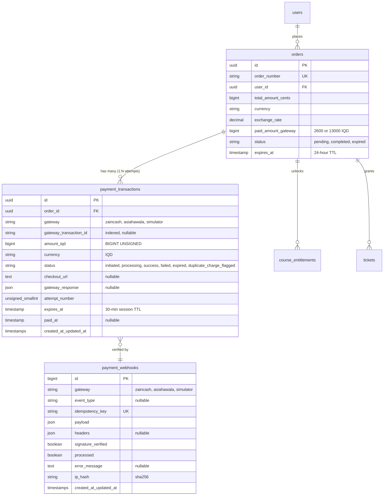
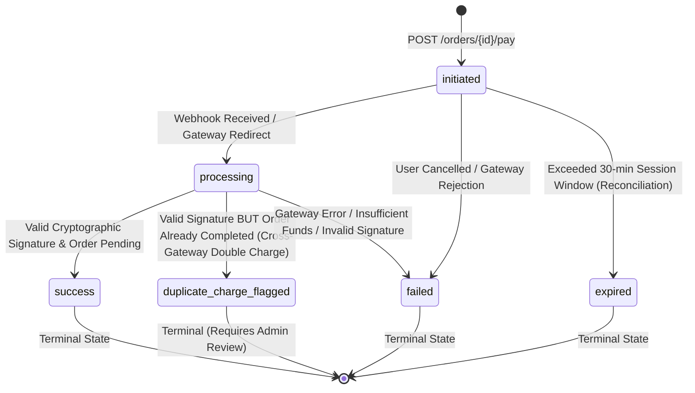

# Data Model Specification: Feature 007 — Dual-Gateway Direct Payment Integration & Server-to-Server Reconciliation

**Feature Branch**: `007-payments`  
**Date**: 2026-10-03 (Updated & Audited)  
**Status**: Completed & Audited (Phase 1)  
**Governing Documents**: `specs/007-payments/spec.md`, `.specify/memory/constitution.md` (v3.3.0), DEC-003

---

## 1. Overview & Architectural Boundaries

Feature 007 introduces two core database entities:
1. `payment_transactions`: Tracks individual payment attempts against an order. Supports the **1:N multi-attempt continuity pattern** (Decision D-4), allowing users to retry or switch between ZainCash and AsiaHawala on a pending order without losing their cart, quiz answers, or referral attribution. Includes forensic tracking for cross-gateway duplicate charge anomalies.
2. `payment_webhooks`: An append-only audit ledger recording every inbound webhook event, raw payload, cryptographic signature verification status, and processing outcome to guarantee complete idempotency, forensic auditability, and replay protection (Constitution Sections VII, VIII).

Existing entities (`orders`, `users`, `course_entitlements`, `tickets`) remain backwards-compatible and are integrated through surgical, non-breaking Eloquent relationships.

---

## 2. Entity Relationship Diagram (Mermaid)



---

## 3. Database Schema Definitions (DDL & Migrations)

### 3.1 `payment_transactions` Table
Stores each initiation attempt with its gateway metadata, amount in Iraqi Dinars, lifecycle state, and expiration window.

```php
Schema::create('payment_transactions', function (Blueprint $table) {
    $table->uuid('id')->primary();
    $table->foreignUuid('order_id')
        ->constrained('orders')
        ->onDelete('restrict')
        ->cascadeOnUpdate();
    
    $table->string('gateway', 32); // 'zaincash', 'asiahawala', 'simulator'
    $table->string('gateway_transaction_id', 128)->nullable();
    $table->unsignedBigInteger('amount_iqd');
    $table->string('currency', 3)->default('IQD');
    $table->string('status', 32)->default('initiated'); // 'initiated', 'processing', 'success', 'failed', 'expired', 'duplicate_charge_flagged'
    $table->text('checkout_url')->nullable();
    $table->json('gateway_response')->nullable();
    $table->unsignedSmallInteger('attempt_number')->default(1);
    $table->timestamp('expires_at');
    $table->timestamp('paid_at')->nullable();
    $table->timestamps();

    // Indexes
    $table->unique(['gateway', 'gateway_transaction_id'], 'uq_payment_txns_gateway_txn');
    $table->index(['order_id', 'status'], 'idx_payment_txns_order_status');
    $table->index(['status', 'created_at'], 'idx_payment_txns_status_created');
});

// Non-negative amount invariant
DB::statement('ALTER TABLE payment_transactions ADD CONSTRAINT chk_payment_txns_amount_positive CHECK (amount_iqd > 0)');
```

### 3.2 `payment_webhooks` Table
An append-only forensic and idempotency ledger recording every inbound webhook notification.

```php
Schema::create('payment_webhooks', function (Blueprint $table) {
    $table->id();
    $table->string('gateway', 32); // 'zaincash', 'asiahawala', 'simulator'
    $table->string('event_type', 64)->nullable();
    $table->string('idempotency_key', 128)->unique();
    $table->json('payload');
    $table->json('headers')->nullable();
    $table->boolean('signature_verified')->default(false);
    $table->boolean('processed')->default(false);
    $table->text('error_message')->nullable();
    $table->string('ip_hash', 64);
    $table->timestamps();

    // Indexes
    $table->index(['gateway', 'processed'], 'idx_payment_webhooks_gateway_processed');
    $table->index('created_at', 'idx_payment_webhooks_created_at');
});
```

---

## 4. Eloquent Models & Invariant Logic

### 4.1 `App\Models\PaymentTransaction`
```php
namespace App\Models;

use Illuminate\Database\Eloquent\Concerns\HasUuids;
use Illuminate\Database\Eloquent\Factories\HasFactory;
use Illuminate\Database\Eloquent\Model;
use Illuminate\Database\Eloquent\Relations\BelongsTo;

class PaymentTransaction extends Model
{
    use HasFactory, HasUuids;

    protected $fillable = [
        'order_id',
        'gateway',
        'gateway_transaction_id',
        'amount_iqd',
        'currency',
        'status',
        'checkout_url',
        'gateway_response',
        'attempt_number',
        'expires_at',
        'paid_at',
    ];

    protected function casts(): array
    {
        return [
            'amount_iqd' => 'integer',
            'attempt_number' => 'integer',
            'gateway_response' => 'array',
            'expires_at' => 'datetime',
            'paid_at' => 'datetime',
        ];
    }

    public function order(): BelongsTo
    {
        return $this->belongsTo(Order::class);
    }

    public function isExpired(): bool
    {
        return $this->expires_at->isPast();
    }

    public function isTerminal(): bool
    {
        return in_array($this->status, ['success', 'failed', 'expired', 'duplicate_charge_flagged'], true);
    }
}
```

### 4.2 `App\Models\PaymentWebhook`
```php
namespace App\Models;

use Illuminate\Database\Eloquent\Factories\HasFactory;
use Illuminate\Database\Eloquent\Model;

class PaymentWebhook extends Model
{
    use HasFactory;

    protected $fillable = [
        'gateway',
        'event_type',
        'idempotency_key',
        'payload',
        'headers',
        'signature_verified',
        'processed',
        'error_message',
        'ip_hash',
    ];

    protected function casts(): array
    {
        return [
            'payload' => 'array',
            'headers' => 'array',
            'signature_verified' => 'boolean',
            'processed' => 'boolean',
        ];
    }
}
```

### 4.3 Extensions to `App\Models\Order`
```php
// Added to backend/app/Models/Order.php:

public function paymentTransactions(): HasMany
{
    return $this->hasMany(PaymentTransaction::class);
}

public function latestPaymentTransaction(): HasOne
{
    return $this->hasOne(PaymentTransaction::class)->latestOfMany();
}
```

---

## 5. State Machine & Transition Rules

### 5.1 `PaymentTransaction` State Machine



### 5.2 Transition Validation Invariants
1. **Immutable Success**: A transaction in `success` state can **never** transition to `failed`, `expired`, or `initiated`.
2. **Replay Shield**: If a webhook arrives for an already `success` transaction, the webhook record is marked `processed = true`, and the response returns HTTP 200 without re-invoking `fulfillOrder()`.
3. **Cross-Gateway Double Charge Defense**: If a successful webhook arrives for Transaction B, but the order was already completed by Transaction A, Transaction B is assigned `duplicate_charge_flagged`, logged in `payment_webhooks`, and flagged for administrative audit to safeguard user funds.
4. **Cascading Order State**:
   - When a transaction transitions to `success`, `OrderService::fulfillOrder($order)` is executed within the same database transaction with `lockForUpdate()`.
   - The `orders.status` transitions from `pending` &rarr; `completed`.
   - `OrderService` synchronously invokes `EntitlementService` and `AffiliateCommissionService`, and dispatches `GenerateTicketsJob` after commit.
   - If a transaction transitions to `failed`, the order remains `pending` to allow retry or wallet switching (Decision D-4), unless the order's own 24-hour TTL (`orders.expires_at`) has elapsed.

---

## 6. Financial Integrity Invariants (Constitution Check)

1. **Zero Floats**: `amount_iqd` is stored as `unsignedBigInteger`. Any conversion from USD cents uses integer arithmetic or direct lookup:
   - Part ($2.00): `2600` IQD.
   - Bundle ($10.00): `13000` IQD.
2. **Amount Tamper Detection**: If a webhook reports a successful payment with `amount_iqd` less than `orders.paid_amount_gateway` (or the transaction's expected amount), the transaction is marked `failed` with error message `"AMOUNT_MISMATCH"`, logged to `payment_webhooks`, and fulfillment is aborted.
3. **Pessimistic Concurrency**: All status mutations are executed inside `DB::transaction()` with explicit `lockForUpdate()` queries on both `orders` and `payment_transactions`.
