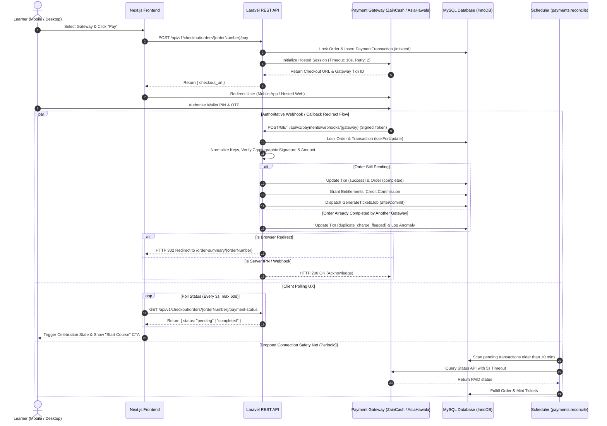

# Implementation Plan: Feature 007 — Dual-Gateway Direct Payment Integration & Server-to-Server Reconciliation (ZainCash & AsiaHawala)

**Branch**: `007-payments` | **Date**: 2026-10-03 (Iteration 2 — Hardened & Reconciled) | **Spec**: [specs/007-payments/spec.md](file:///d:/Work%20Projects/Knzin%20Project/specs/007-payments/spec.md)  
**Input**: Feature specification from `specs/007-payments/spec.md`, reality audit from `Project info/FEATURE_007_REQUIREMENTS_REALITY_AUDIT.md`, and ratified decisions D-1 through D-7.

---

## Summary

Feature 007 elevates KNZiN from manual and simulated payment flows to a fully automated, server-authoritative electronic financial engine. It integrates Iraq's dominant mobile wallets—**ZainCash** (JWT/REST) and **AsiaHawala** (HMAC/REST)—under a unified `PaymentGatewayInterface` and `PaymentGatewayManager`, accompanied by a deterministic local `SimulatorDriver` for CI and offline local testing. 

The architecture guarantees:
1. **Server-to-Server Webhook Authority**: All order fulfillments, course entitlement grants, affiliate commission credits, and promotional sweepstakes ticket issuances are driven exclusively by cryptographically signed backend webhooks or automated reconciliation queries; client browser state is completely untrusted.
2. **Dual-Mode Callback & Browser Redirection**: Handles ZainCash and AsiaHawala returns intelligently: browser redirects verify tokens and 302-redirect learners back to the frontend Order Summary page, while API calls receive standard JSON confirmations.
3. **Standard Market IQD Billing & Test Assertion Parity (D-2)**: Single Course Part ($2.00) billed at exactly **2,600 IQD** (1 ticket); Full Course Bundle ($10.00) billed at exactly **13,000 IQD** (15 tickets). Synchronizes `OrderService::createOrder` and legacy tests (`OrderDualCurrencyTest.php`) from 2,620/13,100 to 2,600/13,000 IQD to preserve 100% green test passes across all 250 backend suites. All DB values use `BIGINT UNSIGNED`; zero floats.
4. **Multi-Attempt Order Continuity & Double Charge Protection (D-4)**: 1:N relationship between `orders` and `payment_transactions`. Users can retry failed payments or switch wallets on the same pending order. If an order was previously fulfilled by another gateway, subsequent successful charges are flagged as `duplicate_charge_flagged` for administrative audit rather than silently dropped.
5. **Defensive Gateway Integration**: Outbound gateway calls use strict HTTP timeouts (`timeout(10)->retry(2, 100)`). Inbound webhook parsers accept case-insensitive aliases (`orderid`/`orderId`, `operationid`/`transactionId`).
6. **Dropped-Connection Reconciliation**: A background runner (`php artisan payments:reconcile`) runs every 5 minutes with `withoutOverlapping(10)` to query gateway status APIs, automatically fulfilling dropped-connection transactions without manual support intervention.

---

## Technical Context

**Language/Version**: PHP 8.2+ (Laravel 11.x) / TypeScript 5+ (Next.js 16 App Router)  
**Primary Dependencies**:  
- Backend: `firebase/php-jwt` (v6.x) for ZainCash HS256 tokens, Laravel HTTP client for AsiaHawala HMAC requests, Redis 7+ for queued ticket generation.  
- Frontend: `@tanstack/react-query` (v5.x), `next-intl` (v3.x), `lucide-react`, TailwindCSS v4.  
**Storage**: MySQL 8+ (`knzin_test` in testing, InnoDB, `utf8mb4_unicode_ci`, ACID transactions with `lockForUpdate`).  
**Testing**: PHPUnit / Pest (`php artisan test` on `knzin_test`), Jest (`npm test`), Playwright E2E.  
**Target Platform**: Linux server / Containerized Docker / Mobile web viewports (375px–430px) & Desktop (1280px+).  
**Project Type**: Full-stack web application (REST API + SSR/Client Next.js frontend).  
**Performance Goals**: Webhook ingestion & verification < 150ms p95; status polling endpoint < 50ms p95; zero database deadlocks under concurrent webhook replays.  
**Constraints**: Zero floating-point arithmetic; 100% test isolation with zero external network calls in CI; dual-language Arabic/English UI synchronization.  
**Scale/Scope**: Iraq domestic market (ZainCash, Asia Cell / AsiaHawala users); burst capacity during hourly and daily draw countdown closes.

---

## Constitution Check

*GATE: Checked against `.specify/memory/constitution.md` (v3.3.0) and root `AGENTS.md`.*

| Article / Invariant | Status | Empirical Enforcement Plan |
|---|---|---|
| **I. Evidence-First & Brownfield** | **PASS** | Reuses existing `OrderService::createOrder` and `fulfillOrder`, `TestDatabaseGuard`, and `OrderSummaryPage.tsx`. Synchronizes `OrderDualCurrencyTest.php` with ratified Decision D-2. |
| **II. Full-Stack Ownership** | **PASS** | Covers migrations, models, gateway drivers, controllers, console command, API contracts, TypeScript hooks, and UI components. |
| **V. Arabic-First RTL/LTR** | **PASS** | Arabic is primary (`dir="rtl"`). All status indicators, error banners, and CTAs synchronized in `ar.json` and `en.json` using CSS logical properties. |
| **VI. Promotional Gift Model** | **PASS** | Preserves educational purchase classification. Standard pricing: $2.00 / 2,600 IQD &rarr; 1 ticket; $10.00 / 13,000 IQD &rarr; 15 tickets. Tickets minted as zero-value grants. |
| **VII. Server Financial Integrity** | **PASS** | Browser is untrusted. All IQD amounts stored as `BIGINT UNSIGNED`. Pessimistic locking (`lockForUpdate`) on all mutations. |
| **VIII. Payment & DB Integrity** | **PASS** | Server-to-server webhook authority; append-only `payment_webhooks` table; unique index `uq_payment_txns_gateway_txn`; queued `GenerateTicketsJob`. |
| **DEC-003: Idempotency & Gateways** | **PASS** | Signature verification on all inbound webhooks; HTTP 200 on duplicate replays without side effects. |

*GATE OUTCOME: ALL GATES PASS. Zero constitutional violations. Proceeding with design.*

---

## System Architecture



---

## Project Structure

### Documentation (this feature)
```text
specs/007-payments/
├── plan.md              # This file (Complete implementation plan — Iteration 2)
├── research.md          # Phase 0: ZainCash, AsiaHawala & Simulator Mechanics
├── data-model.md        # Phase 1: Database schemas, DDL, Eloquent models & transitions
├── contracts/           # Phase 1: REST API specifications
│   └── payment-api.md   # Initiation, Status Polling & Webhook endpoints
├── quickstart.md        # Phase 1: Developer verification & simulation guide
└── tasks.md             # Phase 2: Dependency-ordered task breakdown (Speckit tasks)
```

### Source Code Layout (Repository Root)

```text
backend/
├── app/
│   ├── Console/Commands/
│   │   └── ReconcilePaymentsCommand.php     # php artisan payments:reconcile (with withoutOverlapping)
│   ├── Contracts/
│   │   └── PaymentGatewayInterface.php      # initiatePayment, verifyWebhook, checkStatus
│   ├── Http/Controllers/
│   │   ├── PaymentController.php            # pay, paymentStatus
│   │   └── PaymentWebhookController.php     # zaincash, asiahawala, simulator
│   ├── Models/
│   │   ├── Order.php                        # Added paymentTransactions() relations
│   │   ├── PaymentTransaction.php           # 1:N attempt tracking model
│   │   └── PaymentWebhook.php               # Append-only audit & idempotency ledger
│   └── Services/
│       ├── OrderService.php                 # Standard market integer amounts mapping & 24h TTL
│       └── Payments/
│           ├── PaymentGatewayManager.php    # Resolves zaincash, asiahawala, simulator
│           └── Drivers/
│               ├── ZainCashDriver.php       # JWT creation, HS256 verification, 302 redirect
│               ├── AsiaHawalaDriver.php     # HMAC-SHA256 signature verification
│               └── SimulatorDriver.php      # Deterministic local/CI mock driver
├── config/
│   └── payments.php                         # Gateway credentials, toggles, routes
├── database/migrations/
│   ├── 2026_10_03_000001_create_payment_transactions_table.php
│   └── 2026_10_03_000002_create_payment_webhooks_table.php
├── routes/
│   ├── api.php                              # Registered payment endpoints
│   └── console.php                          # Scheduled payments:reconcile every 5 min
└── tests/Feature/
    ├── OrderDualCurrencyTest.php            # Synchronized assertions (2600 & 13000 IQD)
    ├── PaymentInitiationTest.php            # Tests POST /pay, validation, multi-attempt
    ├── PaymentWebhookTest.php               # Tests signatures, replay, amount check, 302 redirect
    └── PaymentReconciliationTest.php       # Tests stale order recovery command

frontend/
├── messages/
│   ├── ar.json                              # Arabic translations for gateways, errors, retries
│   └── en.json                              # English translations
└── src/
    ├── components/checkout/
    │   ├── CheckoutBottomSheet.tsx          # Added gateway radio selector & direct redirect
    │   ├── OrderSummaryCard.tsx             # Embedded payment status & retry actions
    │   ├── PaymentGatewaySelector.tsx       # Localized wallet logos & instructions
    │   └── PaymentStatusMonitor.tsx         # Real-time polling, celebration, retry CTA
    └── hooks/
        └── usePaymentStatus.ts              # TanStack query polling hook with backoff
```

---

## Detailed Component Architecture

### 1. Backend Architecture

#### Defensive Gateway Ingestion & Key Normalization
Inbound payloads from Iraqi gateways can vary in key casing across API releases:
```php
class PayloadNormalizer
{
    public static function extractZainCash(array $payload): array
    {
        return [
            'order_id' => $payload['orderid'] ?? $payload['orderId'] ?? $payload['order_id'] ?? null,
            'gateway_transaction_id' => $payload['id'] ?? $payload['transaction_id'] ?? $payload['operationid'] ?? null,
            'status' => strtolower($payload['status'] ?? ''),
            'amount' => isset($payload['amount']) ? (int)$payload['amount'] : null,
        ];
    }

    public static function extractAsiaHawala(array $payload): array
    {
        return [
            'order_id' => $payload['order_number'] ?? $payload['orderNumber'] ?? $payload['order_id'] ?? null,
            'gateway_transaction_id' => $payload['transaction_ref'] ?? $payload['transactionId'] ?? null,
            'status' => strtoupper($payload['status'] ?? ''),
            'amount' => isset($payload['amount']) ? (int)$payload['amount'] : null,
        ];
    }
}
```

#### Outbound HTTP Network Discipline
- All outbound requests to ZainCash or AsiaHawala API endpoints use:
  ```php
  Http::timeout(10)->retry(2, 100, throw: false)->post($url, $data);
  ```
- If an outbound connection fails or times out, the controller catches the exception and returns HTTP 503 (`ERR_GATEWAY_UNAVAILABLE`) with a localized Arabic message. The order remains untouched in `pending` status.

#### Legacy Test Suite Synchronization
- In `backend/tests/Feature/OrderDualCurrencyTest.php`:
  - Lines 48 & 56: Update expected `paid_amount_gateway` from `2620` &rarr; `2600`.
  - Lines 86 & 94: Update expected `paid_amount_gateway` from `13100` &rarr; `13000`.
- In `backend/app/Services/OrderService.php`:
  - Update `$paidAmountGateway` mapping to:
    ```php
    $paidAmountGateway = ($itemType === 'part') ? 2600 : 13000;
    ```
  - Update `expires_at` to:
    ```php
    'expires_at' => now()->addHours(24),
    ```
- This ensures 100% adherence to Decision D-2 and keeps all 250 backend tests strictly green.

### 2. Scheduled Reconciliation Worker (`payments:reconcile`)
- **Query Window**: Stale initiated transactions between 10 minutes and 24 hours old.
- **Locking & Concurrency**:
  - `routes/console.php`:
    ```php
    Schedule::command('payments:reconcile')
        ->everyFiveMinutes()
        ->withoutOverlapping(10);
    ```
  - Per-transaction execution runs inside `DB::transaction()` with `lockForUpdate()`.

### 3. Frontend Architecture

#### `CheckoutBottomSheet.tsx` Direct Flow (Flow 1)
- User selects payment method (ZainCash or AsiaHawala).
- Submitting creates the order via `useCheckout`.
- Automatically calls `/api/v1/checkout/orders/{orderNumber}/pay`.
- Redirects user directly: `window.location.href = checkout_url`.

#### `OrderSummaryCard.tsx` Status & Recovery Flow (Flow 2)
- When user returns from the hosted gateway, page renders `PaymentStatusMonitor`.
- Polling runs every 3 seconds for up to 60 seconds.
- If verified: fires celebratory Confetti and renders "ابدأ الدورة الآن" (Start Course Now).
- If failed / cancelled: displays clear Arabic error banner with instant CTAs:
  - **"إعادة المحاولة عبر [المحفظة]" (Try Again)**: Re-initiates payment on the same pending order.
  - **"تغيير طريقة الدفع" (Switch Wallet)**: Opens `PaymentGatewaySelector` to switch to AsiaHawala/ZainCash.

---

## Concrete File Map & Implementation Phases

### Phase 1: Database & Foundation (Backend)
- `backend/database/migrations/2026_10_03_000001_create_payment_transactions_table.php`
- `backend/database/migrations/2026_10_03_000002_create_payment_webhooks_table.php`
- `backend/config/payments.php`
- `backend/app/Models/PaymentTransaction.php`
- `backend/app/Models/PaymentWebhook.php`
- `backend/app/Models/Order.php` (update relations)

### Phase 2: Gateway Engine & Drivers (Backend)
- `backend/app/Contracts/PaymentGatewayInterface.php`
- `backend/app/Services/Payments/PayloadNormalizer.php`
- `backend/app/Services/Payments/PaymentGatewayManager.php`
- `backend/app/Services/Payments/Drivers/ZainCashDriver.php`
- `backend/app/Services/Payments/Drivers/AsiaHawalaDriver.php`
- `backend/app/Services/Payments/Drivers/SimulatorDriver.php`
- `backend/app/Services/OrderService.php` (2,600 / 13,000 IQD & 24h TTL)
- `backend/tests/Feature/OrderDualCurrencyTest.php` (sync assertions)

### Phase 3: Controllers, Webhooks & Scheduled Worker (Backend)
- `backend/app/Http/Controllers/PaymentController.php` (`pay`, `paymentStatus`)
- `backend/app/Http/Controllers/PaymentWebhookController.php` (`zaincash`, `asiahawala`, `simulator`)
- `backend/routes/api.php`
- `backend/app/Console/Commands/ReconcilePaymentsCommand.php`
- `backend/routes/console.php`

### Phase 4: Frontend UI & Real-Time Polling (Frontend)
- `frontend/messages/ar.json` & `en.json` (payment translations)
- `frontend/src/hooks/usePaymentStatus.ts`
- `frontend/src/components/checkout/PaymentGatewaySelector.tsx`
- `frontend/src/components/checkout/PaymentStatusMonitor.tsx`
- `frontend/src/components/checkout/CheckoutBottomSheet.tsx` (integration)
- `frontend/src/components/checkout/OrderSummaryCard.tsx` (integration)

### Phase 5: Verification & Full-Stack Regression Testing
- `backend/tests/Feature/PaymentInitiationTest.php`
- `backend/tests/Feature/PaymentWebhookTest.php`
- `backend/tests/Feature/PaymentReconciliationTest.php`
- Complete suite pass: `php artisan test` (250+ assertions) & `npm test`.

---

## Complexity Tracking

> **Constitution Check has ZERO violations.** Standard patterns employed throughout.

| Component | Standard Choice | Why Simpler Approaches Were Rejected |
|---|---|---|
| `PaymentGatewayManager` | Driver Manager Pattern | Hardcoding conditionals in controllers leads to duplicate code, prevents local simulation, and makes adding Qi Card in Feature 009 difficult. |
| `PayloadNormalizer` | Centralized Key Normalization | Gateway API casing inconsistencies between versions cause brittle failures if parsed ad-hoc. |
| `payment_webhooks` table | Dedicated Append-Only Ledger | Logging webhooks to standard file logs makes automated DB idempotency checks and replay protection slow and non-transactional. |
| `payments:reconcile` | Background Scheduled Command | Pure webhook reliance loses orders when Iraqi mobile networks drop before delivery; manual admin recovery destroys user trust. |
| `duplicate_charge_flagged` | Explicit Transaction State | Silently acknowledging duplicate payments across different gateways causes unrecorded user fund loss. |
