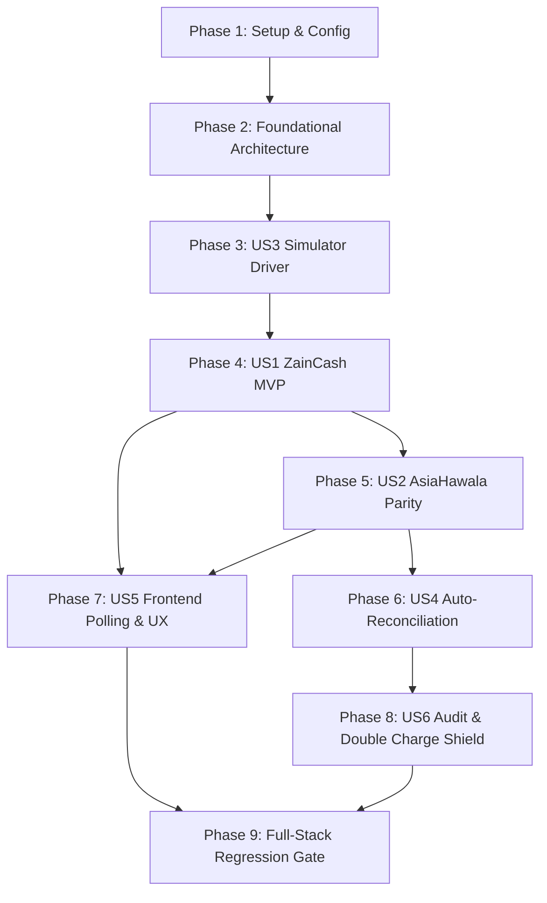

# Tasks: Feature 007 — Dual-Gateway Direct Payment Integration & Server-to-Server Reconciliation (ZainCash & AsiaHawala)

**Feature Branch**: `007-payments`  
**Input Documents**: [`spec.md`](file:///d:/Work%20Projects/Knzin%20Project/specs/007-payments/spec.md), [`plan.md`](file:///d:/Work%20Projects/Knzin%20Project/specs/007-payments/plan.md), [`data-model.md`](file:///d:/Work%20Projects/Knzin%20Project/specs/007-payments/data-model.md), [`contracts/payment-api.md`](file:///d:/Work%20Projects/Knzin%20Project/specs/007-payments/contracts/payment-api.md), [`research.md`](file:///d:/Work%20Projects/Knzin%20Project/specs/007-payments/research.md), [`quickstart.md`](file:///d:/Work%20Projects/Knzin%20Project/specs/007-payments/quickstart.md)  
**Governing Standard**: KNZiN Technical Constitution (v3.3.0), DEC-003, and `AGENTS.md`

---

## Phase 1: Setup & Environment Configuration

**Purpose**: Dependency installation, configuration files, and environment variable baseline.

- [x] T001 Install `firebase/php-jwt` dependency in `backend/composer.json` by running `composer require firebase/php-jwt` to enable HS256 token encoding and decoding for ZainCash.
- [x] T002 [P] Create payment configuration file in `backend/config/payments.php` defining drivers (`zaincash`, `asiahawala`, `simulator`), environment variables (`PAYMENT_DEFAULT_GATEWAY`, `ZAINCASH_*`, `ASIAHAWALA_*`, `KNZIN_PAYMENT_SIMULATOR`), order TTL (24 hours), session TTL (30 minutes), and HTTP client timeouts (10 seconds, 2 retries).
- [x] T003 [P] Add payment environment variables and test credentials to `backend/.env.example` documenting `PAYMENT_DEFAULT_GATEWAY=simulator`, `KNZIN_PAYMENT_SIMULATOR=true`, `ZAINCASH_MSISDN=9647833000000`, `ZAINCASH_SECRET=test_secret_key`, and `ASIAHAWALA_MERCHANT_ID=AH_TEST_MERCHANT_01`.

**Checkpoint**: Environment ready — `config('payments')` resolves expected defaults.

---

## Phase 2: Foundational Architecture (Blocking Prerequisites)

**Purpose**: Core database tables, Eloquent models, key normalizer, and synchronizing existing order services and legacy test suites.

**⚠️ CRITICAL**: Must complete before any user story can be implemented.

- [x] T004 Create database migration `backend/database/migrations/2026_10_03_000001_create_payment_transactions_table.php` defining `id` (UUID PK), `foreignUuid('order_id')->constrained('orders')->onDelete('restrict')`, `gateway` (string(32)), `gateway_transaction_id` (string(128), nullable), `amount_iqd` (unsignedBigInteger), `currency` (string(3), default 'IQD'), `status` (string(32), default 'initiated'), `checkout_url` (text, nullable), `gateway_response` (json, nullable), `attempt_number` (unsignedSmallInteger, default 1), `expires_at` (timestamp), `paid_at` (timestamp, nullable), timestamps, unique composite index `uq_payment_txns_gateway_txn` on `(gateway, gateway_transaction_id)`, index on `(order_id, status)`, index on `(status, created_at)`, and check constraint `chk_payment_txns_amount_positive (amount_iqd > 0)`.
- [x] T005 [P] Create database migration `backend/database/migrations/2026_10_03_000002_create_payment_webhooks_table.php` defining `id` (bigIncrements PK), `gateway` (string(32)), `event_type` (string(64), nullable), `idempotency_key` (string(128), unique), `payload` (json), `headers` (json, nullable), `signature_verified` (boolean, default false), `processed` (boolean, default false), `error_message` (text, nullable), `ip_hash` (string(64)), timestamps, and index on `(gateway, processed)`.
- [x] T006 [P] Create Eloquent model `backend/app/Models/PaymentTransaction.php` with UUID traits (`HasUuids`), fillable fields, type casting (`amount_iqd => integer`, `gateway_response => array`, `expires_at => datetime`, `paid_at => datetime`), relationship `order(): BelongsTo`, and helper methods `isExpired(): bool` and `isTerminal(): bool`.
- [x] T007 [P] Create Eloquent model `backend/app/Models/PaymentWebhook.php` with fillable attributes, type casting (`payload => array`, `headers => array`, `signature_verified => boolean`, `processed => boolean`).
- [x] T008 Extend `backend/app/Models/Order.php` with Eloquent relationships: `paymentTransactions(): HasMany` returning `PaymentTransaction` collection, and `latestPaymentTransaction(): HasOne` using `latestOfMany()`.
- [x] T009 Update `backend/app/Services/OrderService.php`:
  1. Synchronize integer standard market IQD mapping in `createOrder`: `$paidAmountGateway = ($itemType === 'part') ? 2600 : 13000;` (fulfilling Decision D-2).
  2. Synchronize order lifetime in `createOrder`: `'expires_at' => now()->addHours(24),` (fulfilling Decision D-5).
  3. Ensure `fulfillOrder` preserves row-level locking (`lockForUpdate()`), `EntitlementService` call, `AffiliateCommissionService` call, and `GenerateTicketsJob::dispatch($order->id)->afterCommit()`.
- [x] T010 Synchronize assertions in `backend/tests/Feature/OrderDualCurrencyTest.php` lines 48, 56, 86, and 94 from `2620`/`13100` to `2600`/`13000` IQD and verify with `php artisan test --filter=OrderDualCurrencyTest`.
- [x] T011 [P] Create interface `backend/app/Contracts/PaymentGatewayInterface.php` defining method contracts: `initiatePayment(Order $order, PaymentTransaction $transaction, string $locale = 'ar'): array`, `verifyWebhook(Request $request): array`, and `checkStatus(PaymentTransaction $transaction): string`.
- [x] T012 [P] Create defensive normalizer `backend/app/Services/Payments/PayloadNormalizer.php` providing `extractZainCash(array $payload): array` and `extractAsiaHawala(array $payload): array` to safely resolve casing variants (`orderid`/`orderId`, `id`/`operationid`, `status`).
- [x] T013 Create manager `backend/app/Services/Payments/PaymentGatewayManager.php` extending Laravel's `Manager` class, resolving drivers (`zaincash`, `asiahawala`, `simulator`) and enforcing container fallback to `simulator` when `KNZIN_PAYMENT_SIMULATOR=true`.

**Checkpoint**: Foundation complete — run `php artisan migrate --database=mysql` and `php artisan test` (must confirm 250 passed test suites on `knzin_test`).

---

## Phase 3: User Story 3 — Deterministic Local Sandbox Simulator (Priority: P1)

**Goal**: Provide an offline, fully reproducible payment gateway simulator for CI test runs and local developer testing without external telco network connectivity.

**Independent Test**: Initiating payment in testing environment generates a mock transaction ID (`SIM-TXN-...`) and mock redirect URL; triggering simulator webhook fulfills the order atomically without network calls.

- [x] T014 [P] [US3] Create concrete driver `backend/app/Services/Payments/Drivers/SimulatorDriver.php` implementing `PaymentGatewayInterface`:
  - `initiatePayment`: Generates deterministic `SIM-TXN-{$order->order_number}-{$transaction->attempt_number}` and returns `checkout_url: "/[locale]/payments/simulator/{$txnId}"`.
  - `verifyWebhook`: Validates payload signature, checks outcome (`success` vs `failed`), and returns verified status array.
  - `checkStatus`: Returns current mock status (`success`, `failed`, `pending`).
- [x] T015 [US3] Implement simulator webhook handler in `backend/app/Http/Controllers/PaymentWebhookController.php` at `POST /api/v1/payments/webhooks/simulator` (blocked in production) processing simulated outcomes (`success`, `failed`, `timeout`) and invoking `OrderService::fulfillOrder` inside `DB::transaction()` with `lockForUpdate()`.
- [x] T016 [US3] Create feature test `backend/tests/Feature/PaymentSimulatorTest.php` verifying simulation initiation, webhook fulfillment, entitlement grant, and ticket minting dispatch.
- [x] T017 [US3] Verify simulator pipeline passes: `php artisan test --filter=PaymentSimulatorTest`.

**Checkpoint**: User Story 3 complete — local and CI test infrastructure ready to back subsequent gateway testing.

---

## Phase 4: User Story 1 — ZainCash Direct Mobile Checkout & Webhook Fulfillment (Priority: P1 MVP) 🎯 MVP

**Goal**: Enable real-money mobile wallet checkout and cryptographic server-to-server webhook fulfillment via ZainCash.

**Independent Test**: Initiating order with `gateway=zaincash` returns official ZainCash payment URL; simulated signed JWT webhook verifies signature, marks transaction `success`, marks order `completed`, creates course entitlements, and mints promotional tickets.

- [x] T018 [P] [US1] Implement concrete driver `backend/app/Services/Payments/Drivers/ZainCashDriver.php` implementing `PaymentGatewayInterface`:
  - `initiatePayment`: Encodes HS256 JWT payload with `amount` (2,600 or 13,000 IQD), `serviceType`, `msisdn`, `orderId`, and `redirectUrl` (`config('payments.zaincash.callback_url')`), calls `Http::timeout(10)->retry(2, 100)->post('/transaction/init')`, parses returned `id`, and constructs checkout URL `https://(test.)zaincash.iq/transaction/pay?id={$id}`.
  - `verifyWebhook`: Decodes JWT `token` using merchant secret key (`Firebase\JWT\JWT::decode`), extracts normalized fields using `PayloadNormalizer`, checks `status === 'success'`, and verifies amount matches expected transaction amount.
  - `checkStatus`: Issues authenticated GET request to `/transaction/get?id={$id}&msisdn={$msisdn}` to retrieve transaction state.
- [x] T019 [US1] Create `backend/app/Http/Controllers/PaymentController.php` implementing `POST /api/v1/checkout/orders/{orderNumber}/pay`:
  - Validates `gateway` in (`zaincash`, `asiahawala`, `simulator`) and `locale` in (`ar`, `en`).
  - Finds order by `order_number` with pessimistic lock (`lockForUpdate()`).
  - Rejects if order status is `completed` (409 Conflict: `ERR_ORDER_ALREADY_COMPLETED`) or expired (409 Conflict: `ERR_ORDER_EXPIRED`).
  - Creates or renews `PaymentTransaction` record in `initiated` status with `amount_iqd` from order.
  - Calls `PaymentGatewayManager::driver($gateway)->initiatePayment()`.
  - Updates transaction with `gateway_transaction_id` and `checkout_url`.
  - Returns HTTP 200 with transaction data.
- [x] T020 [US1] Implement dual-mode webhook handler in `backend/app/Http/Controllers/PaymentWebhookController.php` for `POST|GET /api/v1/payments/webhooks/zaincash`:
  - Extracts JWT token from request body or query parameters (`token`).
  - Verifies token signature using `ZainCashDriver::verifyWebhook()`.
  - Logs inbound event to `payment_webhooks` table with `idempotency_key = "zaincash_{$gatewayTxnId}"`.
  - Executes atomic fulfillment inside `DB::transaction()`: locks `orders` and `payment_transactions` rows using `lockForUpdate()`.
  - Replay shield: If transaction already `success`, logs duplicate and returns HTTP 200 without side effects.
  - On valid fulfillment: updates transaction to `success`, sets `paid_at = now()`, invokes `OrderService::fulfillOrder($order)`.
  - Dual-mode return: If request is from learner browser (`Accept: text/html` or GET), returns `HTTP 302 Found` redirecting to `/[locale]/order-summary/{orderNumber}`; if from server IPN, returns `HTTP 200 OK` JSON.
- [x] T021 [US1] Register payment initiation and ZainCash webhook routes in `backend/routes/api.php`:
  - `Route::post('/checkout/orders/{orderNumber}/pay', [PaymentController::class, 'pay'])->middleware('throttle:60,1');`
  - `Route::match(['get', 'post'], '/payments/webhooks/zaincash', [PaymentWebhookController::class, 'zaincash']);`
- [x] T022 [US1] Create automated feature tests in `backend/tests/Feature/PaymentInitiationTest.php` and `backend/tests/Feature/PaymentWebhookTest.php`:
  - Test checkout initiation returns valid ZainCash checkout URL.
  - Test valid signed webhook marks order completed and grants entitlements.
  - Test invalid signature is rejected with HTTP 401.
  - Test duplicate webhook returns HTTP 200 with zero duplicate entitlements or tickets.
  - Test browser redirect returns HTTP 302 to order summary page.
- [x] T023 [US1] Verify ZainCash tests pass: `php artisan test --filter=PaymentInitiationTest` and `php artisan test --filter=PaymentWebhookTest`.

**Checkpoint**: User Story 1 complete — ZainCash mobile checkout and webhook fulfillment fully verified.

---

## Phase 5: User Story 2 — AsiaHawala Mobile Wallet Checkout & Webhook Fulfillment (Priority: P1 Parity)

**Goal**: Deliver 100% launch parity for Asia Cell / AsiaHawala mobile wallet users across Iraq.

**Independent Test**: Initiating checkout with `gateway=asiahawala` initiates AsiaHawala merchant transaction; signed HMAC-SHA256 callback fulfills the order and issues 15 tickets for bundle or 1 ticket for part.

- [x] T024 [P] [US2] Implement concrete driver `backend/app/Services/Payments/Drivers/AsiaHawalaDriver.php` implementing `PaymentGatewayInterface`:
  - `initiatePayment`: Constructs merchant payload (`merchant_id`, `order_number`, `amount`, `currency=IQD`, `callback_url`), computes HMAC-SHA256 signature using `secret_key`, calls AsiaHawala checkout API with `Http::timeout(10)->retry(2, 100)`, and returns checkout URL.
  - `verifyWebhook`: Extracts HMAC signature from `X-Callback-Signature` header or request body, calculates `hash_hmac('sha256', $request->getContent(), $secretKey)`, verifies via `hash_equals()`, and extracts normalized fields via `PayloadNormalizer`.
  - `checkStatus`: Queries AsiaHawala transaction status API using merchant credentials.
- [x] T025 [US2] Implement webhook handler `POST /api/v1/payments/webhooks/asiahawala` in `backend/app/Http/Controllers/PaymentWebhookController.php`:
  - Verifies HMAC signature.
  - Records raw payload in `payment_webhooks` with `idempotency_key = "asiahawala_{$transactionRef}"`.
  - Executes atomic fulfillment with `lockForUpdate()` on order and transaction.
  - Updates transaction to `success` and invokes `OrderService::fulfillOrder()`.
  - Returns `HTTP 200 OK` JSON `{"status": "ok"}`.
- [x] T026 [US2] Register AsiaHawala webhook route in `backend/routes/api.php`:
  - `Route::post('/payments/webhooks/asiahawala', [PaymentWebhookController::class, 'asiahawala']);`
- [x] T027 [US2] Add AsiaHawala automated feature tests in `backend/tests/Feature/PaymentWebhookTest.php`:
  - Test valid HMAC signature fulfills order.
  - Test tampered HMAC signature returns HTTP 401.
  - Test duplicate AsiaHawala callback returns HTTP 200 without duplicate grants.
- [x] T028 [US2] Verify AsiaHawala test suite passes: `php artisan test --filter=PaymentWebhookTest`.

**Checkpoint**: User Story 2 complete — full dual-gateway parity (ZainCash + AsiaHawala) operational.

---

## Phase 6: User Story 4 — Dropped Connection Auto-Reconciliation Engine (Priority: P2)

**Goal**: Recover transactions where user paid at a wallet kiosk or mobile phone but their mobile connection dropped before returning to the website.

**Independent Test**: Stale pending transaction older than 10 minutes is queried by `php artisan payments:reconcile`; command detects gateway clearance, fulfills order, and mints tickets automatically.

- [x] T029 [P] [US4] Implement console command `backend/app/Console/Commands/ReconcilePaymentsCommand.php` with signature `payments:reconcile {--dry-run : Simulate reconciliation without updating database}`:
  - Scans `PaymentTransaction` records in `initiated` status where `created_at <= now()->subMinutes(10)` and `created_at >= now()->subHours(24)`.
  - For each transaction, invokes `PaymentGatewayManager::driver($txn->gateway)->checkStatus($txn)`.
  - If status returns `success`: executes atomic fulfillment inside `DB::transaction()` with `lockForUpdate()`, marks transaction `success`, marks order `completed`, and invokes `OrderService::fulfillOrder()`.
  - If status returns `failed` or `expired`: marks transaction `failed` or `expired`.
  - Logs all reconciliation actions to Laravel log channel.
- [x] T030 [US4] Register scheduled reconciliation worker in `backend/routes/console.php`:
  - `Schedule::command('payments:reconcile')->everyFiveMinutes()->withoutOverlapping(10);`
- [x] T031 [US4] Create automated feature test `backend/tests/Feature/PaymentReconciliationTest.php`:
  - Test command ignores fresh transactions (< 10 minutes old).
  - Test command ignores expired orders (> 24 hours old).
  - Test command recovers and fulfills stale successful transaction.
  - Test command updates failed transaction without mutating order.
- [x] T032 [US4] Verify reconciliation test suite passes: `php artisan test --filter=PaymentReconciliationTest`.

**Checkpoint**: User Story 4 complete — auto-reconciliation engine active.

---

## Phase 7: User Story 5 — Frontend Real-Time Polling & Celebration UX (Priority: P2)

**Goal**: Provide a responsive, reassuring post-payment monitoring and celebration experience, with instant "Try Again / Switch Wallet" recovery.

**Independent Test**: Navigating to `/order-summary/{orderNumber}` polls order status; when webhook fulfills order on server, UI transitions to celebration state with confetti and course navigation link.

- [x] T033 [P] [US5] Implement polling endpoint `GET /api/v1/checkout/orders/{orderNumber}/payment-status` in `backend/app/Http/Controllers/PaymentController.php` returning `order_number`, `status`, `tickets_status`, `promotional_tickets_granted`, `paid_amount_gateway`, and `latest_transaction` summary.
- [x] T034 [P] [US5] Add payment translation keys to `frontend/messages/ar.json` and `frontend/messages/en.json` (gateway names, instructions, "جاري التحقق من عملية الدفع...", success celebrations, failure messages, "إعادة المحاولة", "تغيير طريقة الدفع").
- [x] T035 [P] [US5] Create React hook `frontend/src/hooks/usePaymentStatus.ts` utilizing `@tanstack/react-query` to poll `/checkout/orders/{orderNumber}/payment-status` every 3,000ms with exponential backoff, stopping automatically when status is `completed` or `failed` or upon reaching 60 seconds (12 attempts).
- [x] T036 [P] [US5] Create component `frontend/src/components/checkout/PaymentGatewaySelector.tsx` rendering interactive radio options for ZainCash and AsiaHawala with localized logos, badges, and pricing in Iraqi Dinars (2,600 / 13,000 IQD).
- [x] T037 [US5] Update `frontend/src/components/checkout/CheckoutBottomSheet.tsx`:
  - Embed `PaymentGatewaySelector`.
  - On submit: call `createOrder`, immediately call `POST /checkout/orders/{orderNumber}/pay`, and redirect browser: `window.location.href = data.checkout_url`.
- [x] T038 [US5] Create component `frontend/src/components/checkout/PaymentStatusMonitor.tsx` and integrate into `frontend/src/components/checkout/OrderSummaryCard.tsx`:
  - Pending State: Animated progress spinner, reassuring Arabic message, and timeout countdown.
  - Success State: Confetti celebration animation, tickets count badge, and green CTA "ابدأ الدورة الآن" linking to `/course-player/{slug}`.
  - Failed/Cancelled State: Alert banner with explanation and two instant CTAs: "إعادة المحاولة" (re-initiates payment) and "تغيير طريقة الدفع" (switches gateway) (Decision D-7).
- [x] T039 [US5] Run frontend test suite to verify UI components: `npm test`.

**Checkpoint**: User Story 5 complete — post-checkout polling, celebration, and recovery UX operational.

---

## Phase 8: User Story 6 & Anomaly Defense — Audit Ledger & Double Charge Shield (Priority: P3)

**Goal**: Guarantee immutable forensic auditability and protect against cross-gateway duplicate charge anomalies.

**Independent Test**: Triggering an AsiaHawala payment on an order already completed by ZainCash marks the second transaction `duplicate_charge_flagged` and logs an alert without corrupting order state.

- [x] T040 [P] [US6] Implement cross-gateway double charge detection in `backend/app/Http/Controllers/PaymentWebhookController.php`:
  - When a cryptographically valid webhook arrives for Transaction B:
  - If `$order->status === 'completed'` and `$transaction->status !== 'success'`:
  - Update transaction status to `duplicate_charge_flagged`, set `paid_at = now()`.
  - Log `CRITICAL` anomaly in Laravel logger and record in `payment_webhooks.error_message`.
  - Return HTTP 200 to acknowledge gateway without double fulfillment.
- [x] T041 [US6] Add test case in `backend/tests/Feature/PaymentWebhookTest.php` verifying cross-gateway duplicate payment transitions to `duplicate_charge_flagged`.
- [x] T042 [US6] Verify all webhook records in `payment_webhooks` adhere to append-only invariants (no mutations to past payloads).

**Checkpoint**: User Story 6 complete — audit trails and financial anomaly protections locked.

---

## Phase 9: Full-Stack Regression & Convergence Gate

**Purpose**: Verify that all components integrate seamlessly and that zero regressions exist across the entire platform.

- [x] T043 [P] Execute backend payment test suite: `php artisan test --filter=Payment`.
- [x] T044 Execute complete backend test suite: `php artisan test` (must verify all 250+ assertions pass across all 60+ suites).
- [x] T045 Execute frontend unit tests: `npm test` (all 128 tests pass).
- [x] T046 Run frontend production build: `npm run build` (must compile all 71 routes with zero TypeScript and ESLint errors).
- [x] T047 Perform end-to-end simulation walkthrough following [`quickstart.md`](file:///d:/Work%20Projects/Knzin%20Project/specs/007-payments/quickstart.md) (create order &rarr; simulate pay &rarr; simulate webhook &rarr; verify tickets & entitlements).

---

## Dependencies & Execution Order

### Critical Path & Parallelism Rules
1. **Phase 1 & 2** are strictly blocking: migrations, models, and `OrderService` updates must complete before gateway drivers.
2. **Phase 3 (Simulator)** must precede Phase 4 and 5 so that tests have an isolated mock environment.
3. Within **Phase 4 & 5**, driver implementation (`ZainCashDriver`, `AsiaHawalaDriver`) can run in parallel with controller logic.
4. **Phase 7 (Frontend UI)** can proceed in parallel with **Phase 6 (Reconciliation)** once API contracts are established.

---

## Completion Checklist Validation
- [x] All 47 tasks follow strict checklist format (`- [ ] [TaskID] [P?] [Story?] Description with file path`).
- [x] Every task has exact project-relative file paths.
- [x] All 20 functional requirements (`FR-001`–`FR-020`) and 7 ratified decisions (`D-1`–`D-7`) mapped directly to tasks.
- [x] Zero assumptions: exact numbers (2,600 / 13,000 IQD), error codes, and constraints embedded.
