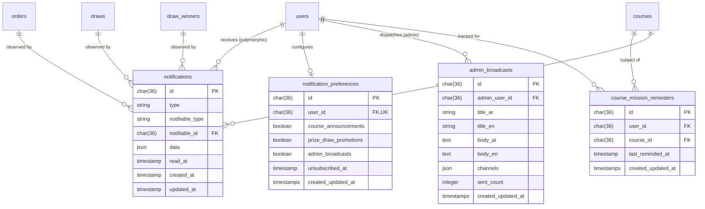

# Phase 1 Data Model: Feature 009 — Notifications (الإشعارات)

**Feature**: [spec.md](file:///d:/Work%20Projects/Knzin%20Project/specs/009-notifications/spec.md)  
**Date**: 2026-10-04  
**Branch**: `009-notifications`  
**Status**: APPROVED

---

## 1. Schema Overview & Relational Topology

Feature 009 utilizes the standard Laravel Database Notification architecture extended for UUID primary keys, coupled with a dedicated `notification_preferences` table, an `admin_broadcasts` audit table, a dedicated `course_mission_reminders` tracking table, and a recovery tracking timestamp on `orders`.



---

## 2. Table Specifications

### 2.1 Table: `notifications` (Standard Laravel Database Notifications)

* **Purpose**: Authoritative persistent storage for in-app notifications targeted to individual users.
* **Engine**: InnoDB (MySQL 8+ / MariaDB)

| Column Name | Type | Modifiers | Description |
| :--- | :--- | :--- | :--- |
| `id` | `CHAR(36)` | `PRIMARY KEY` | Deterministic UUIDv5 or random UUIDv4 identifier. |
| `type` | `VARCHAR(255)` | `NOT NULL` | FQCN of the notification class (e.g. `App\Notifications\OrderConfirmationNotification`). |
| `notifiable_type` | `VARCHAR(255)` | `NOT NULL` | Morph class (`App\Models\User`). |
| `notifiable_id` | `CHAR(36)` | `NOT NULL` | Foreign UUID referencing `users.id`. |
| `data` | `JSON` | `NOT NULL` | Structured notification payload (schema below). |
| `read_at` | `TIMESTAMP` | `NULLABLE` | Timestamp when user marked notification as read. |
| `created_at` | `TIMESTAMP` | `NOT NULL` | Timestamp when notification was committed. |
| `updated_at` | `TIMESTAMP` | `NOT NULL` | Timestamp of last update. |

#### `notifications.data` JSON Schema

```json
{
  "category": "transactional|course_announcements|prize_draw_promotions|admin_broadcasts",
  "title_ar": "تم استلام طلبك بنجاح",
  "title_en": "Your order has been received successfully",
  "body_ar": "تم تأكيد طلبك رقم KNZ-948171 وحجز 5 تذاكر ترويجية.",
  "body_en": "Your order #KNZ-948171 has been confirmed with 5 promotional tickets.",
  "action_type": "navigate|refresh_course",
  "action_url": "/lessons/electrical-wiring",
  "entity_type": "order|draw|course|winner",
  "entity_id": "9d020d20-43aa-448f-9a99-0f2c4189e472",
  "metadata": {
    "course_slug": "electrical-wiring",
    "content_version": 2
  }
}
```

#### Indexes
* `PRIMARY KEY (id)`
* `INDEX idx_notifications_notifiable (notifiable_type, notifiable_id)`
* `INDEX idx_notifications_unread (notifiable_type, notifiable_id, read_at)` — Optimized for badge calculation (`WHERE read_at IS NULL`).
* `INDEX idx_notifications_prune (read_at)` — Optimized for 60-day cleanup range scan.

---

### 2.2 Table: `notification_preferences`

* **Purpose**: Records per-user opt-in/opt-out status for the three approved marketing categories.
* **Rule**: Transactional notifications are strictly mandatory and never checked against this table.
* **Scope**: Disabling a category suppresses **both In-App and Email** communications for that category.

| Column Name | Type | Modifiers | Default | Description |
| :--- | :--- | :--- | :--- | :--- |
| `id` | `CHAR(36)` | `PRIMARY KEY` | — | UUIDv4 identifier. |
| `user_id` | `CHAR(36)` | `NOT NULL, UNIQUE` | — | Foreign key referencing `users.id` with `ON DELETE CASCADE`. |
| `course_announcements` | `BOOLEAN` | `NOT NULL` | `true` | Opt-in toggle for new course publications. |
| `prize_draw_promotions` | `BOOLEAN` | `NOT NULL` | `true` | Opt-in toggle for new prize & draw releases. |
| `admin_broadcasts` | `BOOLEAN` | `NOT NULL` | `true` | Opt-in toggle for platform-wide announcements. |
| `unsubscribed_at` | `TIMESTAMP` | `NULLABLE` | `null` | Timestamp when global email unsubscribe was activated. |
| `created_at` | `TIMESTAMP` | `NOT NULL` | — | Record creation timestamp. |
| `updated_at` | `TIMESTAMP` | `NOT NULL` | — | Record last modified timestamp. |

#### Indexes
* `PRIMARY KEY (id)`
* `UNIQUE KEY uq_notification_preferences_user (user_id)`

---

### 2.3 Table: `admin_broadcasts`

* **Purpose**: Audit record and dispatch ledger for platform-wide announcements sent by authorized administrators (`manage_platform_settings`).
* **Audience**: Platform-wide (all active registered users who have `admin_broadcasts` enabled and are not globally unsubscribed). No speculative audience segmentation.

| Column Name | Type | Modifiers | Description |
| :--- | :--- | :--- | :--- |
| `id` | `CHAR(36)` | `PRIMARY KEY` | UUIDv4 identifier. |
| `admin_user_id` | `CHAR(36)` | `NOT NULL` | Foreign key referencing `users.id` (administrator who initiated broadcast). |
| `title_ar` | `VARCHAR(255)` | `NOT NULL` | Localized Arabic announcement title. |
| `title_en` | `VARCHAR(255)` | `NOT NULL` | Localized English announcement title. |
| `body_ar` | `TEXT` | `NOT NULL` | Localized Arabic announcement text. |
| `body_en` | `TEXT` | `NOT NULL` | Localized English announcement text. |
| `channels` | `JSON` | `NOT NULL` | Selected delivery channels (e.g. `["in_app", "email"]`). |
| `sent_count` | `INTEGER` | `DEFAULT 0` | Total number of recipient notifications successfully queued. |
| `created_at` | `TIMESTAMP` | `NOT NULL` | Dispatch timestamp. |
| `updated_at` | `TIMESTAMP` | `NOT NULL` | Record modification timestamp. |

#### Indexes
* `PRIMARY KEY (id)`
* `INDEX idx_admin_broadcasts_admin (admin_user_id)`
* `INDEX idx_admin_broadcasts_created (created_at)`

---

### 2.4 Table: `course_mission_reminders`

* **Purpose**: Tracks mission reminder dispatch timestamps per user per course. Preserves financial/entitlement table purity by isolating reminder state from `course_entitlements`.

| Column Name | Type | Modifiers | Description |
| :--- | :--- | :--- | :--- |
| `id` | `CHAR(36)` | `PRIMARY KEY` | UUIDv4 identifier. |
| `user_id` | `CHAR(36)` | `NOT NULL` | Foreign key referencing `users.id` with `ON DELETE CASCADE`. |
| `course_id` | `CHAR(36)` | `NOT NULL` | Foreign key referencing `courses.id` with `ON DELETE CASCADE`. |
| `last_reminded_at` | `TIMESTAMP` | `NOT NULL` | Timestamp of the most recently dispatched mission reminder. |
| `created_at` | `TIMESTAMP` | `NOT NULL` | Record creation timestamp. |
| `updated_at` | `TIMESTAMP` | `NOT NULL` | Record last updated timestamp. |

#### Indexes
* `PRIMARY KEY (id)`
* `UNIQUE KEY uq_mission_reminders_user_course (user_id, course_id)`
* `INDEX idx_mission_reminders_cooldown (last_reminded_at)`

---

### 2.5 Supporting Column Modifications on `orders` and `courses`

* **Table `orders`**:
  * Add column: `recovery_notification_sent_at` (`TIMESTAMP NULLABLE DEFAULT NULL`)
  * **Rule**: Evaluated by `notifications:evaluate-abandoned-orders`. When order is `status = 'pending'`, `created_at <= now() - 2h`, and `recovery_notification_sent_at IS NULL`, the email is dispatched and this timestamp is stamped atomically. Enforces **maximum 1 recovery email** per pending order.

* **Table `courses`**:
  * Add column: `content_version` (`UNSIGNED INTEGER NOT NULL DEFAULT 1`)
  * **Rule**: Incremented monotonically inside the mutation transaction whenever an authorized Admin Dashboard mutation produces a verified learner-facing change (`wasChanged()` on course/part content, media, or sequence). Serves as the repository-backed logical update identity for learner-facing update notifications.

---

## 3. Data Integrity & Retention Rules

### 3.1 60-Day Read Pruning Invariant
* **Rule**: Read notifications (`read_at IS NOT NULL`) are purged exactly 60 days after `read_at`.
* **SQL Query**:
  ```sql
  DELETE FROM notifications 
  WHERE read_at IS NOT NULL 
    AND read_at <= NOW() - INTERVAL 60 DAY;
  ```
* **Unread Invariant**: Notifications where `read_at IS NULL` are NEVER deleted by automated pruning.

### 3.2 IDOR & Isolation Invariant
* Every user query is strictly scoped through the authenticated user instance:
  ```php
  $request->user()->notifications()->paginate(15);
  $request->user()->unreadNotifications()->count();
  ```
* A user can never view or update another user's notifications. Attempting to access an ID belonging to another user returns `404 Not Found`.

### 3.3 Hardware-Level Idempotency via Deterministic UUIDs and Concurrency Safety
* For discrete domain events, the notification `id` primary key is derived via deterministic UUIDv5 (`Str::uuid5(Str::NAMESPACE_OID, "{$domain_prefix}:{$entity_id}:{$user_id}")`).
* If a worker crashes, retries, or receives duplicate events concurrently, the underlying database unique constraint rejects duplicate insertion. The container-bound `App\Channels\DatabaseChannel` safely catches the `QueryException` (SQLSTATE 23000 / duplicate key 1062) and returns the existing persisted notification record without crashing or failing the job, guaranteeing exactly one persisted notification without unhandled errors.
