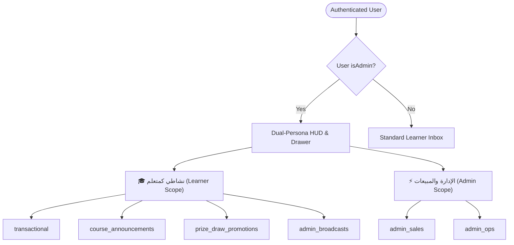
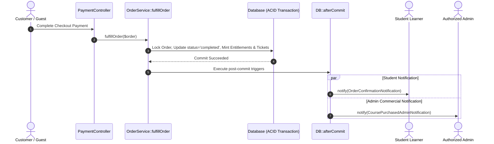

# Phase 1 Data Model: Feature 010 — Admin Course Sales Notifications & Dual-Persona Notification Center

**Date**: 2026-10-07  
**Feature**: `010-admin-sales-notifications`  
**Status**: Completed

---

## 1. Entity Definitions & Schemas

### 1.1 `CoursePurchasedAdminNotification` (`notifications` record)

Stored within the brownfield Laravel polymorphic `notifications` table:

| Field | Type | Nullable | Description & Constraints |
| :--- | :--- | :--- | :--- |
| `id` | UUID (v5) | NO | Deterministic ID generated from namespace `course_purchased:{$order->id}:{$admin->id}` for idempotency. |
| `type` | String | NO | Fully qualified class name: `App\Notifications\CoursePurchasedAdminNotification`. |
| `notifiable_type` | String | NO | Authoritative recipient entity: `App\Models\User`. |
| `notifiable_id` | UUID | NO | Foreign UUID referencing `users.id` of the recipient administrator. |
| `data` | JSON | NO | Serialized notification payload adhering to the contract schema below. |
| `read_at` | Timestamp | YES | Null when unread; set to timestamp when administrator marks as read. |
| `created_at` | Timestamp | NO | Timestamp when order was fulfilled and notification was dispatched. |
| `updated_at` | Timestamp | NO | Laravel model timestamp. |

#### `data` JSON Schema Definition:
```json
{
  "category": "admin_sales",
  "title_ar": "🛒 عملية شراء جديدة: دورة التحليل المالي المتقدم",
  "title_en": "🛒 New Course Sale: Advanced Financial Analysis",
  "body_ar": "قام المتدرب أحمد العراقي بشراء دورة التحليل المالي المتقدم بقيمة $150.00 (طلب رقم #ORD-2026-0042).",
  "body_en": "Learner Ahmed Al-Iraqi purchased Advanced Financial Analysis for $150.00 (Order #ORD-2026-0042).",
  "action_type": "navigate",
  "action_url": "/orders/a0000000-0000-0000-0000-000000000001",
  "entity_type": "order",
  "entity_id": "a0000000-0000-0000-0000-000000000001",
  "metadata": {
    "order_number": "ORD-2026-0042",
    "course_slug": "advanced-financial-analysis",
    "course_title": "التحليل المالي المتقدم",
    "total_amount_cents": 15000,
    "currency": "USD",
    "buyer_name": "أحمد العراقي",
    "buyer_code": "LRN-789012"
  }
}
```

---

### 1.2 Notification Scopes & Category Classification

Notifications are partitioned into two operational personas:



| Scope | Member Categories | Recipient Audience | Description |
| :--- | :--- | :--- | :--- |
| **`learner`** | `transactional`, `course_announcements`, `prize_draw_promotions`, `admin_broadcasts` | All Users & Learners | Personal learning activities, tickets issued, course mission updates, and promotional sweepstakes. |
| **`admin`** | `admin_sales`, `admin_ops` | Active Admins only | Commercial revenue alerts, course purchases, affiliate payout requests, and cross-admin operational alerts. |
| **`all`** | All categories | Default fallback | Full chronological list across all scopes (used for legacy or non-scoped queries). |

---

### 1.3 Scoped Unread Count Summary

Payload returned by `GET /api/notifications/unread-count`:

| Key | Type | Description |
| :--- | :--- | :--- |
| `unread_count` | Integer | Total count of all unread notifications for the user across all categories. |
| `learner_unread_count` | Integer | Total count of unread notifications matching the `learner` scope. |
| `admin_unread_count` | Integer | Total count of unread notifications matching the `admin` scope (0 for non-admins). |

---

## 2. State Machine & Event Lifecycle

### 2.1 Course Purchase Notification Trigger


### 2.2 Scoped Read State Transitions
- **Single Item Read**: `PATCH /api/notifications/{id}/read`
  - Sets `read_at = now()`.
  - Decrements total `unread_count` and the corresponding scoped count (`learner_unread_count` or `admin_unread_count`).
- **Bulk Scoped Read**: `POST /api/notifications/mark-all-read?scope={admin|learner}`
  - Updates `read_at = now()` exclusively for unread records in that scope.
  - Decrements the specific scoped counter to `0` and adjusts total `unread_count`.
