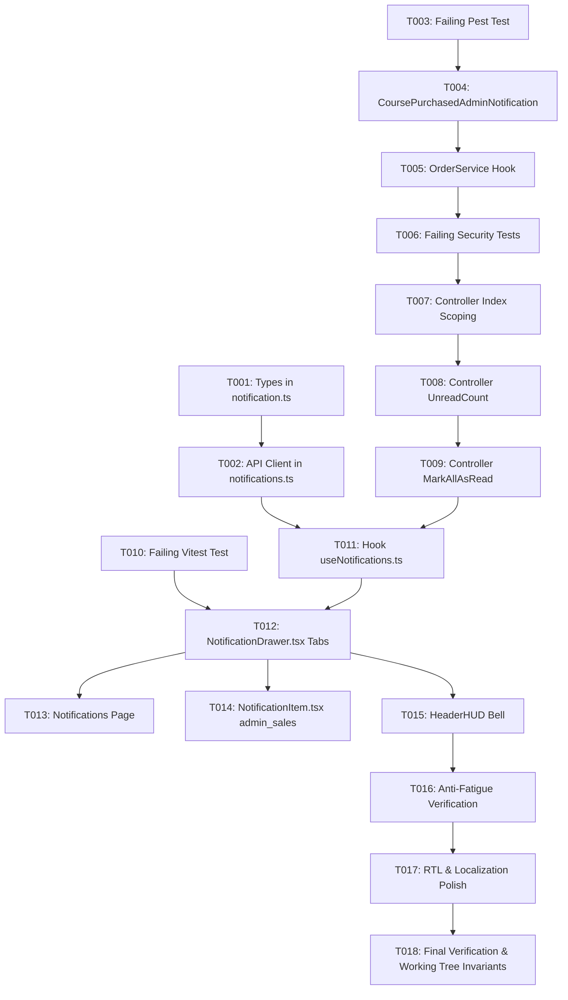

# Tasks: Feature 010 — Admin Course Sales Notifications & Dual-Persona Notification Center

**Feature**: `010-admin-sales-notifications`  
**Status**: Ready for Implementation  
**Specification**: [specs/010-admin-sales-notifications/spec.md](file:///d:/Work%20Projects/Knzin%20Project/specs/010-admin-sales-notifications/spec.md)  
**Implementation Plan**: [specs/010-admin-sales-notifications/plan.md](file:///d:/Work%20Projects/Knzin%20Project/specs/010-admin-sales-notifications/plan.md)

---

## Phase 1: Setup & Foundational Shared Contracts

**Purpose**: Core types and API client signatures that unblock frontend and backend development.

- [X] T001 [P] Extend `NotificationCategory` and `UnreadCountResponse` in `frontend/src/types/notification.ts` (FR-004, FR-007)
- [X] T002 [P] Add optional `scope` parameter to `fetchNotifications` and `markAllNotificationsAsRead` in `frontend/src/lib/api/notifications.ts` (FR-005, FR-008)

**Checkpoint**: Shared contracts compiled and ready for user story execution.

---

## Phase 2: User Story 1 (Priority: P1) — Real-Time Admin Course Purchase Alerts 🎯 MVP

**Goal**: Deliver real-time in-app and email notifications to eligible administrators whenever a course purchase order is fulfilled.

**Independent Test**: Complete a course order in testing/staging and assert that an `admin_sales` notification is stored in `notifications` for active administrators with `manage_platform_settings` or `settle_affiliate_payout`, an email is queued, and the transaction succeeds even if notifications fail.

### Tests for User Story 1
- [X] T003 [US1] Create backend Pest test file `backend/tests/Feature/AdminSalesNotificationTest.php` with initial failing assertions for post-commit dispatch, capability filtering, and failure isolation.

### Implementation for User Story 1
- [X] T004 [US1] Create `backend/app/Notifications/CoursePurchasedAdminNotification.php` implementing `ShouldQueue` with `['database', 'mail']` delivery channels, deterministic UUIDv5, localized ar/en strings, and `/orders/{$order->id}` action link (FR-001, FR-004, FR-012).
- [X] T005 [US1] In `backend/app/Services/OrderService.php::fulfillOrder`, add the post-commit admin query inside `DB::afterCommit()` targeting active admins with `manage_platform_settings` or `settle_affiliate_payout`, shielded with `try...catch (\Throwable $e)` and `Log::error` (FR-002, FR-003).

**Checkpoint**: User Story 1 is fully functional and verifiable via `php artisan test tests/Feature/AdminSalesNotificationTest.php`.

---

## Phase 3: User Story 4 (Priority: P2) — Secure Scope-Gated API & Controller

**Goal**: Protect admin notifications with strict authorization gates (HTTP 403 for non-admins), provide scoped query filtering, and calculate scoped unread count breakdowns.

**Independent Test**: Issue `GET /api/notifications?scope=admin` with a standard learner token and assert HTTP 403 Forbidden. Issue `GET /api/notifications/unread-count` and assert `{ unread_count, learner_unread_count, admin_unread_count }`.

### Tests for User Story 4
- [X] T006 [US4] Add Pest tests in `backend/tests/Feature/AdminSalesNotificationTest.php` asserting HTTP 403 on unauthorized `scope=admin` access, accurate scoped counts, and scoped `mark-all-read`.

### Implementation for User Story 4
- [X] T007 [US4] In `backend/app/Http/Controllers/NotificationController.php::index`, add `?scope=all|learner|admin` filtering using `whereIn`/`whereNotIn` on `data->category`, and enforce `$request->user()->isAdmin()` returning HTTP 403 Forbidden (`ERR_UNAUTHORIZED_SCOPE`) on unauthorized access (FR-005, FR-006).
- [X] T008 [US4] In `backend/app/Http/Controllers/NotificationController.php::unreadCount`, compute and return `unread_count`, `learner_unread_count`, and `admin_unread_count` (FR-007).
- [X] T009 [US4] In `backend/app/Http/Controllers/NotificationController.php::markAllAsRead`, support optional `?scope` parameter to mark only notifications in the active scope as read (FR-008).

**Checkpoint**: User Stories 1 and 4 backend endpoints are fully secured, scoped, and passing all Pest assertions.

---

## Phase 4: User Story 2 (Priority: P1) — Dual-Persona Notification Drawer & Page Navigation

**Goal**: Provide a clean dual-persona UI separating personal learner notifications from administrative sales alerts in `NotificationDrawer` and `/notifications` page for users with `isAdmin === true`.

**Independent Test**: Log in as an administrator who has course enrollments, open the drawer, and verify that "My Activity" and "Admin & Sales" tabs appear with independent unread badges and isolated lists. Log in as a regular student and verify admin tabs are completely hidden.

### Tests for User Story 2
- [X] T010 [US2] Create test suite `frontend/src/tests/NotificationDualPersonaInvariants.test.ts` verifying dual-persona tab rendering for admins, omission for non-admins, and scoped badge display.

### Implementation for User Story 2
- [X] T011 [US2] Update `frontend/src/hooks/useNotifications.ts` to accept `scope: 'all' | 'learner' | 'admin'`, manage isolated query keys (`['notifications', scope, page, perPage, filter]`), and optimistically update scoped unread counts on read actions (FR-005, FR-007).
- [X] T012 [US2] In `frontend/src/components/notifications/NotificationDrawer.tsx`, conditionally render top-level segmented pills ("My Activity" with `learner_unread_count` vs "Admin & Sales" with `admin_unread_count`) when `isAdmin === true`, wire sub-filters, and connect "Mark all as read" to the active tab (FR-009).
- [X] T013 [US2] In `frontend/src/app/[locale]/notifications/page.tsx`, mirror the dual-persona segmented tabs and scoped unread counters for the full-page view (FR-009).
- [X] T014 [US2] In `frontend/src/components/notifications/NotificationItem.tsx`, add category metadata for `'admin_sales'` (emerald commercial badge, `TrendingUp` icon, localized title/body, and navigation to `/orders/{orderId}`) (FR-004).
- [X] T015 [US2] In `frontend/src/components/layout/HeaderHUD.tsx`, ensure `NotificationBell` displays the combined total `unread_count` (FR-010).

**Checkpoint**: User Story 2 is fully functional on frontend and verified via `npm test src/tests/NotificationDualPersonaInvariants.test.ts`.

---

## Phase 5: User Story 3 (Priority: P2) & Polish — Anti-Fatigue Verification & RTL Integrity

**Goal**: Guarantee zero inbox spam from self-actions, ensure bidirectional (RTL/LTR) formatting integrity, and confirm zero regressions.

- [X] T016 [US3] Verify that administrative operations in the admin portal (editing courses, saving drafts) utilize `FeedbackDialog` and `AdminActivityLog` without creating self-spam records in the notification inbox (FR-011).
- [X] T017 Polish bidirectional layout: Verify `<bdi>` wrappers on all mixed Arabic/English titles, currency amounts, and order numbers across `NotificationDrawer` and `NotificationItem`.
- [X] T018 Run full test verification suite (`php artisan test` + `npm test` + `npx tsc --noEmit`) and verify uncommitted working tree guest ticket files remain completely preserved.

---

## Dependencies & Execution Order

### Parallel Execution Opportunities
- **Backend & Frontend Foundation**: T001/T002 (Frontend types) can run in parallel with T003/T004 (Backend notification class).
- **Component Styling & Page**: T013 (Full page) and T014 (Item styling) can proceed in parallel once T012 (Drawer tabs) is established.

---

## Implementation Strategy: MVP First

1. **Step 1 (MVP)**: Implement Phase 1, Phase 2, and Phase 3 (Backend notification dispatch, order hook, and scoped API).
   - *Validation*: Run `php artisan test tests/Feature/Notifications/AdminSalesNotificationTest.php`.
2. **Step 2**: Implement Phase 4 (Frontend dual-persona drawer, page, item styling, and React Query hook).
   - *Validation*: Run `npm test src/tests/NotificationDualPersonaInvariants.test.tsx` and manual browser inspection.
3. **Step 3**: Execute Phase 5 (Anti-fatigue check, RTL polish, full suite verification).
